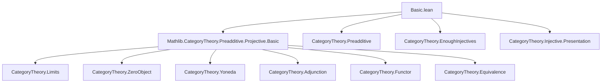
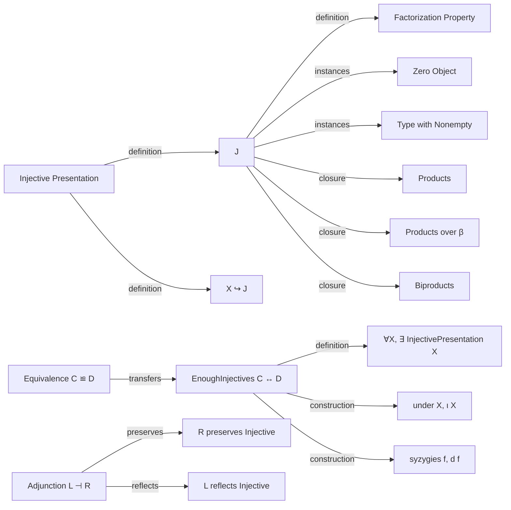

Here is the structured technical brief extracted from the provided Lean 4 file `Basic.lean`:

---

### **1. Key Definitions & Theorems**

| Name | Type / Signature | Purpose |
|------|------------------|---------|
| `Injective (J : C)` | `Prop` | Defines injectivity: every morphism into `J` factors through any monomorphism. |
| `Injective.factors` | `∀ {X Y : C} (g : X ⟶ J) (f : X ⟶ Y) [Mono f], ∃ h : Y ⟶ J, f ≫ h = g` | Core property of injective objects. |
| `isInjective` | `ObjectProperty C` | The predicate “is injective” as an object property. |
| `InjectivePresentation (X : C)` | `Structure` | A monomorphism `X ↪ J` where `J` is injective. |
| `EnoughInjectives` | `Prop` | Every object admits an injective presentation. |
| `factorThru` | `[Injective J] → (X ⟶ J) → (X ⟶ Y) [Mono] → Y ⟶ J` | The factorization morphism guaranteed by injectivity. |
| `comp_factorThru` | `f ≫ factorThru g f = g` | Universal property of `factorThru`. |
| `zero_injective` | `[HasZeroObject C] → Injective (0 : C)` | Zero object is injective. |
| `of_iso` / `iso_iff` | `P ≅ Q → Injective P → Injective Q` | Injectivity is preserved under isomorphism. |
| `Type.injective` | `[Nonempty X] → Injective X` | Nonempty types are injective in `Type`. |
| `Type.enoughInjectives` | `EnoughInjectives (Type u₁)` | `Type` has enough injectives (via `WithBot`). |
| `prod_injective`, `pi_injective`, `biprod_injective`, `biproduct_injective` | Instances | Products, coproducts, biproducts preserve injectivity. |
| `injective_of_projective_op`, `projective_of_injective_op` | `Injective J ↔ Projective (op J)` | Duality between injective and projective objects. |
| `injective_iff_preservesEpimorphisms_yoneda_obj` | `Injective J ↔ (yoneda.obj J).PreservesEpimorphisms` | Yoneda characterization of injectivity. |
| `injective_of_adjoint` | `[L ⊣ R] [L.PreservesMonomorphisms] [Injective J] → Injective (R.obj J)` | Right adjoints preserve injectivity. |
| `map_injective`, `injective_of_map_injective` | Functors reflect/preserve injectivity under full/faithful + mono-preserving assumptions. |
| `mapInjectivePresentation`, `injectivePresentationOfMap` | Construct injective presentations via adjunctions. |
| `EnoughInjectives.of_adjunction` | `[L ⊣ R] [L.PreservesMonomorphisms] [L.ReflectsMonomorphisms] [EnoughInjectives D] → EnoughInjectives C` | Transfer enough injectives along adjunctions. |
| `enoughInjectives_iff` | Equivalence of categories preserves/enough injectives. |
| `under`, `ι`, `syzygies`, `d` | Under `EnoughInjectives`, constructs canonical injective presentations and differentials. |

---

### **2. Naming Conventions**

- **Prefixes**:
  - `isInjective`: predicate naming for object properties.
  - `factorThru`, `comp_factorThru`: factorization-related functions/lemmas.
  - `under`, `ι`, `d`, `syzygies`: canonical constructions under `EnoughInjectives`.
- **Suffixes**:
  - `_injective`: for instances proving injectivity.
  - `_op`, `_unop`: for dual constructions via opposite category.
  - `_of_`: for implications or constructions from other data (e.g., `injective_of_adjoint`, `enoughInjectives_of_enoughProjectives_op`).
- **Adjectives**:
  - `enoughInjectives`, `enoughProjectives`: class names for existence properties.
  - `injectivePresentation`, `presentation`: for structured data (monos into injectives).

---

### **3. Tactic Stack**

Frequently used tactics in proofs:
- `infer_instance`: to synthesize typeclass instances (`Injective`, `Mono`, etc.).
- `simp only [...]`: for targeted simplification using lemmas like `comp_factorThru`, `prod.lift_fst`, etc.
- `rw [...]`: rewriting using equations like `assoc`, `comp_id`, `inv_hom_id`.
- `ext`: extensionality for products, biproducts, `Pi` types.
- `cases'`, `obtain ⟨h, h_eq⟩`: destruct existential quantifiers.
- `exact`, `refine ⟨...⟩`: construct witnesses for existential goals.
- `by tauto`, `by aesop`: for trivial logical reasoning.
- `split_ifs`, `classical`: for case analysis in `Type`-valued constructions.
- `haveI : PreservesLimitsOfSize.{0, 0} G := ...`: to add local instances for adjunction properties.

---

### **4. Proof Logic**

- **Inductive/Constructive Style**: Most proofs are *constructive* in the sense of providing explicit factorizations or presentations.
- **Common Pattern**:
  1. Use `Injective.factors` to get existence of a factor.
  2. Extract the witness via `.choose` (classical choice).
  3. Prove equality using `comp_factorThru` and category axioms (`assoc`, `id_left`, etc.).
- **Duality**: Many results are dualized via `op`, `unop`, and `Iso` symmetry (e.g., `injective_iff_projective_op`).
- **Adjunctions**: Proofs often use hom-adjunction naturality (`homEquiv`) and unit/counit identities.
- **Zero Object & Type**: Special cases handled separately (e.g., `zero_injective`, `Type.injective`).
- **Enough Injectives**: Use `exists_presentation` to pick canonical presentations; rely on `choose`/`choose_spec` for definitional properties.

---

### **5. Imports**

- `Mathlib.CategoryTheory.Preadditive.Projective.Basic`: imports projective object theory (dual to injective).
- Standard category theory infrastructure:
  - `CategoryTheory.Limits`
  - `CategoryTheory.ZeroObject`
  - `CategoryTheory.Yoneda`
  - `CategoryTheory.Adjunction`
  - `CategoryTheory.Functor`
  - `CategoryTheory.Equivalence`
  - `CategoryTheory.Preadditive` (via projective import)

---

### **6. Mermaid Diagrams**

#### **Dependency Graph (Top-Level)**

#### **Overview of Theory Flow**

---

Let me know if you'd like a formalized dependency graph (e.g., `.lean` file-level), or a visualization of the `InjectivePresentation` construction pipeline.
