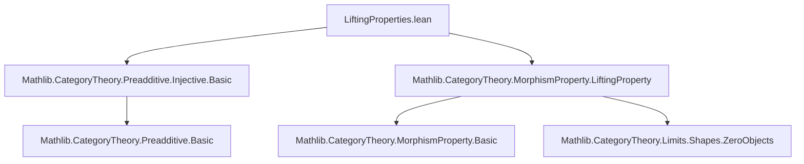

**Technical Brief: `LiftingProperties.lean`**

---

### 1. **Key Definitions & Theorems**

| Name | Type / Signature | Purpose |
|------|------------------|---------|
| `HasLiftingProperty` | `MorphismProperty.HasLiftingProperty : (A ⟶ B) → (I ⟶ Z) → Prop` | Expresses the right lifting property of a morphism `p : I ⟶ Z` against `i : A ⟶ B`. |
| `Injective` | `CategoryTheory.Injective : C → Prop` | Standard definition: `I` is injective iff for all monos `i : A ⟶ B`, every `f : A ⟶ I` factors through `i`. |
| `rlp` | `MorphismProperty.rlp : MorphismProperty C → (I ⟶ Z) → Prop` | Right lifting property of a morphism against a class of morphisms (here, monomorphisms). |
| `hasLiftingProperty_of_isZero` | `{i : A ⟶ B} [Mono i] [Injective I] → (p : I ⟶ Z) → IsZero Z → HasLiftingProperty i p` | Shows that any map from an injective object to a zero object has the lifting property against monos. |
| `injective_iff_rlp_monomorphisms_of_isZero` | `{p : I ⟶ Z} → IsZero Z → (Injective I ↔ (monomorphisms C).rlp p)` | Equivalence between injectivity of `I` and `p` having the RLP against all monos, when target of `p` is zero. |
| `injective_iff_rlp_monomorphisms_zero` | `[HasZeroMorphisms C] [HasZeroObject C] → (Injective I ↔ (monomorphisms C).rlp (0 : I ⟶ 0))` | Specialization of the above to the unique map `I ⟶ 0`. This is the main characterization. |

---

### 2. **Naming Conventions**

- **Prefixes / Suffixes**:
  - `hasLiftingProperty_of_…`: Constructs a `HasLiftingProperty` instance using auxiliary assumptions (e.g., `isZero`, `Injective`).
  - `injective_iff_rlp_…`: Characterizations of injectivity via lifting properties.
  - `MorphismProperty.monomorphisms`: Standard naming for the class of monos as a morphism property.
  - `isZero_zero`: Standard Lean/LeanMathlib convention: `isZero_zero C` proves `IsZero (0 : C)`.

- **Suffixes**:
  - `_of_isZero`: Derives a lifting property from the target being zero.
  - `_zero`: Refers specifically to the canonical map `I ⟶ 0`.

---

### 3. **Tactic Stack**

- `aesop`: Used implicitly (e.g., in `⟨by aesop⟩` or `by simp` + `aesop`-like simplifications).
- `simp`: Heavily used for simplifying zero morphism diagrams (`by simp` in `CommSq` proofs and factorization).
- `obtain rfl := …`: Pattern matching on equality derived from `IsZero` (e.g., uniqueness of maps into/ out of zero objects).
- `constructor`: For bi-implication proofs (`↔`).
- `intro` / `exact`: Standard natural deduction style.

No heavy automation like `ring`, `linarith`, or `interval_cases` — the proofs are mostly structural and diagrammatic.

---

### 4. **Proof Logic**

- **Structure**:
  1. **Lifting from injectivity + zero target**:
     - Use injectivity to factor `f : A ⟶ I` along mono `i : A ⟶ B`.
     - Use `IsZero Z` to force uniqueness of the lift (since all maps to a zero object are equal).
  2. **Injectivity from RLP against monos (for maps to zero)**:
     - Assume RLP for `p : I ⟶ 0`.
     - Given mono `i : A ⟶ B` and `f : A ⟶ I`, construct a commutative square with `p`.
     - Apply RLP to get a lift.
     - Use `IsZero Z` (here `Z = 0`) to verify the lift works (again via uniqueness).
  3. **Specialization to `I ⟶ 0`**:
     - Use `hZ.eq_of_tgt p 0` to reduce to the zero object case.

- **Key logical flow**:
  > *Induction-free*; relies on diagram chasing, universal properties of zero objects, and the definition of injectivity as a factorization condition.

---

### 5. **Imports**

| Import | Role |
|--------|------|
| `Mathlib.CategoryTheory.Preadditive.Injective.Basic` | Defines `Injective` and basic facts (e.g., factorization through monos). |
| `Mathlib.CategoryTheory.MorphismProperty.LiftingProperty` | Defines `HasLiftingProperty`, `rlp`, and morphism property machinery. |
| `Limits`, `ZeroObject`, `HasZeroMorphisms` | Provides tools for zero objects, zero morphisms, and limits (used implicitly via `CommSq`, `IsZero`). |

---

### 6. **Dependency & Theory Overview (Mermaid Diagrams)**

#### **Dependency Graph (Module Level)**



#### **Conceptual Overview (Theory Flow)**

```mermaid
graph LR
  A[Injective Object I] -->|definition| B[Factorization through monos]
  C[Zero Object 0] -->|universal property| D[Unique maps I ⟶ 0]
  B & D --> E[RLP of I ⟶ 0 against monos]
  E -->|main thm| F[Injective I ↔ (monos C).rlp (0 : I ⟶ 0)]
```

---

### 7. **Summary**

This module formalizes a classical homological algebra fact:  
> An object $I$ is injective **iff** the unique morphism $I \to 0$ has the right lifting property with respect to all monomorphisms.

It leverages Lean’s morphism property framework (`MorphismProperty.rlp`) and zero-object properties to give a concise, diagrammatic proof. The key insight is that maps into a zero object are automatically “trivial”, so lifting reduces to factorization — exactly the injectivity condition.

--- 

Let me know if you'd like a formalized version of the Mermaid diagrams or a proof sketch in natural language.
