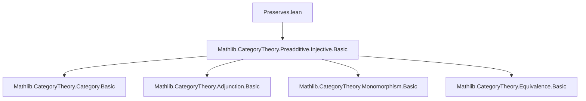
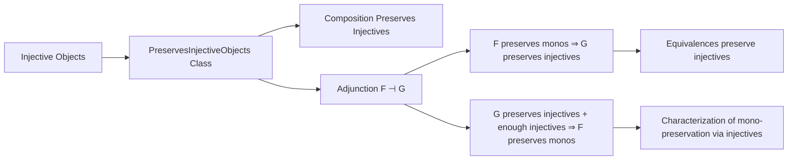

### Technical Brief: `Preserves.lean`

---

#### **1. Key Definitions & Theorems**

| Name | Type / Signature | Purpose |
|------|------------------|---------|
| `Functor.PreservesInjectiveObjects` | `class (F : C ⥤ D) : Prop` | Typeclass stating that `F` maps injective objects in `C` to injective objects in `D`. |
| `Functor.injective_obj` | `instance` | Automatically derives `Injective (F.obj X)` from `Injective X` and `F.PreservesInjectiveObjects`. |
| `Functor.injective_obj_of_injective` | `theorem` | Explicit variant of `injective_obj`, taking `h : Injective X` as an argument. |
| `Functor.preservesInjectiveObjects_comp` | `instance` | Shows that composition of functors preserving injectives also preserves injectives. |
| `Functor.preservesInjectiveObjects_of_adjunction_of_preservesMonomorphisms` | `theorem` | If `F ⊣ G` and `F` preserves monos, then `G` preserves injectives. |
| `Functor.preservesInjectiveObjects_of_isEquivalence` | `instance` | Any equivalence of categories preserves injectives (via adjunction + monos). |
| `Functor.preservesMonomorphisms_of_adjunction_of_preservesInjectiveObjects` | `theorem` | Converse: if `F ⊣ G`, `G` preserves injectives, and `D` has enough injectives, then `F` preserves monos. |

---

#### **2. Naming Conventions**

- **Prefixes**:
  - `preservesInjectiveObjects_`: for theorems/instances about preservation of injectives.
  - `injective_obj`: for lemmas/instances about mapping injective objects.
- **Suffixes**:
  - `_of_adjunction_of_...`: indicates reliance on an adjunction and additional hypotheses.
  - `_of_injective`: variant taking `Injective X` explicitly.
- **Class naming**: `PreservesInjectiveObjects` follows Lean’s convention of `Preserves[Property]Objects`.

---

#### **3. Tactic Stack**

Frequent tactics used in proofs:
- `simp` / `simp_rw`: simplification using category-theoretic identities (e.g., triangle identities, naturality).
- `exact`, `assumption`, `inferInstance`: for typeclass resolution.
- `suffices ... from ...`: to reduce goals via intermediate existential statements.
- `mono_of_mono_fac`: used to deduce monomorphism from factorization property.
- `have / suffices ... from`: for structured proof decomposition.

No heavy automation (e.g., `aesop`, `ring`, `linarith`) — proofs are mostly manual category-theoretic reasoning.

---

#### **4. Proof Logic**

- **Forward direction** (`F ⊣ G`, `F` mono-preserving ⇒ `G` injective-preserving):
  - Use adjunction to transport monomorphisms and injectivity via `adj.map_injective`.
- **Converse direction** (`F ⊣ G`, `G` injective-preserving + `D` has enough injectives ⇒ `F` mono-preserving):
  - Use factorization of `f : X → Y` through an injective object `I` in `D`.
  - Lift `F f` through `F(X) → I` using injectivity of `I` and preservation by `G`.
  - Apply triangle identities and naturality to construct the required factorization.
  - Conclude monomorphism via `mono_of_mono_fac`.

Induction is not used; proofs rely on universal properties (injectivity, adjunction, factorization).

---

#### **5. Imports**

- `Mathlib.CategoryTheory.Preadditive.Injective.Basic`: core definitions and lemmas about injective objects and monomorphisms in preadditive categories.

> Note: Although the file is in the `CategoryTheory` namespace, it does **not** assume preadditivity of the categories — the import name is historical; `Injective` is defined more generally in `CategoryTheory.Category.Basic`.

---

#### **6. Mermaid Diagrams**

##### **Dependency Graph (Module-Level)**

##### **Conceptual Overview of Theory Flow**

---

#### **7. Summary**

This module formalizes the interplay between injective objects and adjoint functors. It introduces a typeclass for preservation of injectives and proves:

- **Forward direction**: Right adjoints preserve injectives if the left adjoint preserves monos.
- **Converse direction**: Under enough injectives, left adjoints preserve monos if the right adjoint preserves injectives.

The results are foundational for homological algebra in categorical settings, especially when analyzing derived functors or injective resolutions.

--- 

Let me know if you'd like a formalization roadmap or suggestions for extending this theory (e.g., to projectives, flabby sheaves, or model structures).
