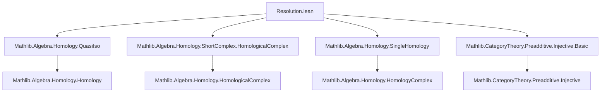

### Technical Brief: `Resolution.lean` — Injective Resolutions in Homological Algebra

---

#### **1. Key Definitions & Theorems**

| Name | Type / Structure | Purpose |
|------|------------------|---------|
| `InjectiveResolution Z` | `Structure` | Bundles an `ℕ`-indexed cochain complex of injective objects in `C`, together with a quasi-isomorphism from the single-object complex `Z → 0 → ⋯` to it. |
| `HasInjectiveResolution Z` | `Class Prop` | Asserts existence of *some* injective resolution of `Z`. |
| `HasInjectiveResolutions` | `Class Prop` | Asserts that *every* object in `C` admits an injective resolution. |
| `cocomplex_exactAt_succ n` | `lemma` | Shows that the resolution complex is exact at degree `n+1`, via quasi-isomorphism property. |
| `exact_succ n` | `lemma` | Reformulates exactness at `n+1` as short complex exactness. |
| `ι_f_succ n` | `@[simp] theorem` | States that the resolution map is zero in positive degrees. |
| `ι_f_zero_comp_complex_d` | `@[reassoc] theorem` | Encodes that the degree-0 component of `ι` composes to zero with the first differential. |
| `complex_d_comp n` | `theorem` | Verifies that the differential squares to zero (i.e., `d² = 0`). |
| `kernelFork` | `def` | Constructs the kernel fork of `d⁰ : I⁰ → I¹` using `ι⁰`. |
| `isLimitKernelFork` | `def` | Proves this kernel fork is universal — i.e., `Z ≅ ker(d⁰)`. |
| `Mono (I.ι.f n)` | `instance` | Shows each component of `ι` is monic (monic in degree 0 via limit property; zero morphisms are mono in additive categories). |
| `self [Injective Z]` | `def` | Trivial injective resolution: `Z` in degree 0, zero elsewhere. |
| `Hom f` | `structure` | Morphism between resolutions lifting a map `f : Z → Z'`. |
| `ι_comp_hom` | `lemma` | Commutativity of the lifting diagram: `ι ≫ φ = (single₀ C).map f ≫ ι'`. |

---

#### **2. Naming Conventions**

- **Prefixes**:
  - `ι_`: components of the resolution map `ι`.
  - `cocomplex_`: properties of the underlying cochain complex.
  - `exact_`, `exactAt_`: exactness-related lemmas.
  - `kernelFork`, `isLimitKernelFork`: kernel-related constructions.
- **Suffixes**:
  - `_succ`: statements indexed by `n + 1`.
  - `_f_zero`, `_f_succ`: degree-specific components of `ι.f`.
  - `_comp`: composition identities.
- **Structure fields**:
  - `cocomplex`, `ι`, `injective`, `quasiIso`, `hom`, `ι_f_zero_comp_hom_f_zero`.

---

#### **3. Tactic Stack**

Frequently used tactics in proofs:
- `rw`, `simp`, `simp only`, `simp_rw`: for rewriting and simplification using definitions and lemmas.
- `infer_instance`: to discharge typeclass goals (e.g., `Injective`, `HasHomology`, `QuasiIso`).
- `exact`, `refine`, `apply`: for constructing proofs term-by-term.
- `cases n`: induction on natural numbers.
- `cat_disch`: category-theoretic tactic (from `CategoryTheory`) to discharge diagram-chasing goals.
- `mono_of_isLimit_fork`, `cancel_epi`, `isoOfQuasiIsoAt`: specialized homological algebra lemmas.

---

#### **4. Proof Logic**

- **Inductive structure**: Proofs often proceed by induction on `n : ℕ`, especially for exactness and differential identities.
- **Diagram chasing**: Many lemmas (e.g., `cocomplex_exactAt_succ`, `ι_f_zero_comp_complex_d`) rely on:
  - Quasi-isomorphism criterion (`quasiIsoAt_iff_exactAt`)
  - Properties of `single₀` complexes (e.g., `isZero_single_obj_X`, `singleObjHomologySelfIso`)
  - Kernel/universal property arguments (`isLimitKernelFork`, `kernelFork`)
- **Isomorphism chaining**: Use of `isoOfQuasiIsoAt`, `isoHomologyπ₀`, and `singleObjCyclesSelfIso` to relate homology, cycles, and cohomology objects.
- **Additive/categorical reasoning**: Leverages `Preadditive`, `HasZeroMorphisms`, and `Limits` to reason about monos, epis, kernels, and exactness.

---

#### **5. Imports & Dependencies**

| Module | Role |
|--------|------|
| `Mathlib.Algebra.Homology.QuasiIso` | Defines quasi-isomorphisms and their properties. |
| `Mathlib.Algebra.Homology.ShortComplex.HomologicalComplex` | Provides `ShortComplex`, `HomologicalComplex`, and exactness machinery. |
| `Mathlib.Algebra.Homology.SingleHomology` | Tools for homology of single-degree complexes (e.g., `cyclesIsKernel`, `isoHomologyπ₀`). |
| `Mathlib.CategoryTheory.Preadditive.Injective.Basic` | Injective objects, basic properties, and `Injective` typeclass. |

**Key typeclasses assumed**:
- `[Category C]`, `[HasZeroObject C]`, `[HasZeroMorphisms C]`
- `[Preadditive C]` (implicit via `HomologicalComplex` usage)
- `[HasLimits C]` (for kernels, etc.)

---

#### **6. Mermaid Diagrams**

##### **Dependency Graph (Module-Level)**



##### **Overview of Injective Resolution Construction**

```mermaid
graph LR
  Z[Object Z] -->|ι⁰| I0[I⁰]
  I0 -->|d⁰| I1[I¹]
  I1 -->|d¹| I2[I²]
  I2 -->|d²| ⋯

  Z -.->|quasi-iso ι| I[Cochain complex I•]
  style Z fill:#f9f,stroke:#333
  style I fill:#bbf,stroke:#333

  subgraph Resolution
    I0; I1; I2; ⋯
  end

  subgraph Source
    Z
  end

  ι[ι : Z ⇒ I•] -->|quasiIso| Resolution
```

##### **Morphism Between Resolutions**

```mermaid
graph TD
  Z[Z] -->|f| Z'[Z']
  ιZ[ι_Z : Z ⇒ I•] -->|ι_Z'| ιZ'[Z' ⇒ I'•]
  I0[I⁰] -->|φ⁰| I'0[I'⁰]
  I1[I¹] -->|φ¹| I'1[I'¹]
  I2[I²] -->|φ²| I'2[I'²]
  
  Z -->|ιZ.f 0| I0
  Z' -->|ιZ'.f 0| I'0
  I0 -->|d⁰| I1
  I'0 -->|d'⁰| I'1

  ιZ.f 0 .->|comm| ιZ'.f 0
  φ⁰ .->|comm| d⁰, d'⁰
```

---

#### **7. Summary**

This file formalizes the foundational theory of **injective resolutions** in an abstract abelian (or at least preadditive with zero morphisms and limits) category `C`. It defines:
- The *data* of an injective resolution (`InjectiveResolution`),
- The *existence* typeclass (`HasInjectiveResolution`, `HasInjectiveResolutions`),
- Key structural properties (exactness, monicity of `ι`, `d² = 0`),
- Morphisms between resolutions (`Hom`),
- And the trivial resolution for injective objects (`self`).

It serves as a prerequisite for derived functors, cohomology, and spectral sequences in `Mathlib`.
