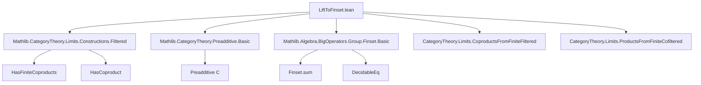
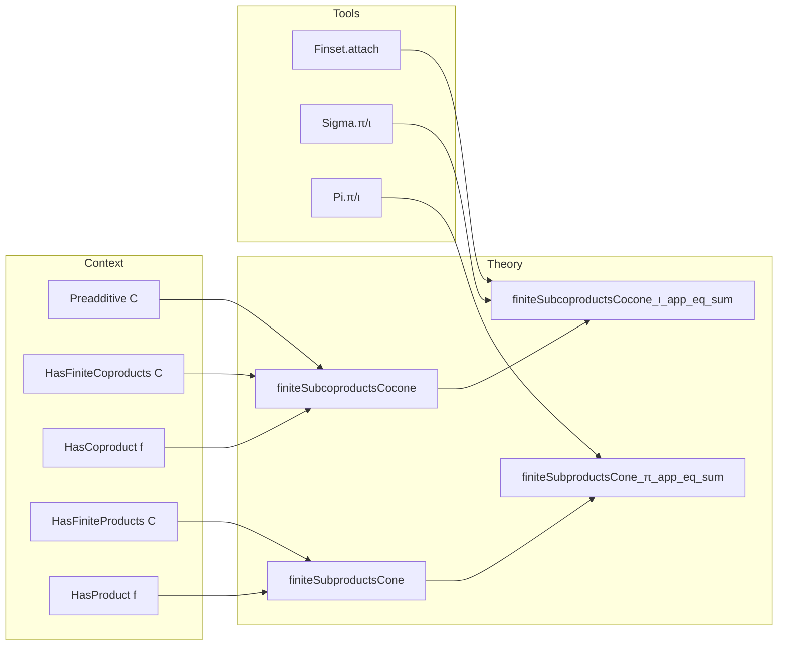

**Technical Brief: `LiftToFinset.lean`**

---

### 1. Key Definitions & Theorems

| Name | Type / Signature | Purpose |
|------|------------------|---------|
| `finiteSubcoproductsCocone` | `Cocone f` (for `f : α → C`) | Canonical cocone over diagram of finite subcoproducts; cocone point = coproduct of `f`. |
| `finiteSubproductsCone` | `Cone f` (for `f : α → C`) | Canonical cone over diagram of finite subproducts; cone point = product of `f`. |
| `finiteSubcoproductsCocone_ι_app_eq_sum` | `(finiteSubcoproductsCocone f).ι.app S = ∑ a ∈ S.attach, π_a ≫ ι_a` | Describes the leg of the finite-subcoproduct cocone as a finite sum of projections followed by inclusions (in preadditive setting). |
| `finiteSubproductsCone_π_app_eq_sum` | `(finiteSubproductsCone f).π.app S = ∑ a ∈ S.unop.attach, π_a ≫ ι_a` | Dual statement: describes the leg of the finite-subproduct cone as a finite sum of projections followed by inclusions. |

> **Notation**:  
> - `S.attach` = `{ a ∈ S // a.1 = a }` (subtype of elements of `S`).  
> - `Sigma.π _ a` = projection from finite coproduct `⊔_{x ∈ S} f x` to component `f a.1`.  
> - `Sigma.ι _ a.1.as` = inclusion of `f a.1` into the full coproduct `⊔_{x : α} f x`.  
> - `Pi.π`, `Pi.ι` are the dual projections/inclusions for products.

---

### 2. Naming Conventions

- **Prefixes**:
  - `finiteSubcoproductsCocone_` / `finiteSubproductsCone_`: denote constructions from finite sub-(co)products.
  - `liftToFinsetObj_obj`: object part of the `liftToFinset` construction (used internally).
- **Suffixes**:
  - `_app`: component at an object (e.g., `ι.app S`).
  - `_pt`: underlying object of (co)cone (e.g., `finiteSubcoproductsCocone_pt`).
- **Category-theoretic terms**:
  - `ι`, `π`: canonical injections/projections for (co)products.
  - `attach`, `unop`: for handling finite subsets in discrete category.

---

### 3. Tactic Stack

- `dsimp only [...]`: simplifies definitions using explicit unfolding of `liftToFinsetObj_obj`, `finiteSubcoproductsCocone_pt`, etc.
- `ext v`: extensionality for morphisms (using `Preadditive` structure).
- `simp only [...]`: simplifies using `Preadditive` lemmas (`comp_sum`, `sum_comp`, `assoc`), and (co)limit universal properties (`colimit.ι_desc`, `limit.lift_π`).
- `rw [Finset.sum_eq_single v]`: reduces sum over finite set to single term.
- `simp`, `rw [...]`, `zero_comp`, `comp_zero`: handle zero morphisms and composition with zero.

---

### 4. Proof Logic

- **Structure**: Both proofs follow a *standard pattern*:
  1. **Unfold definitions** (`dsimp only [...]`) to expose the concrete morphism.
  2. **Apply extensionality** (`ext v`) to reduce to equality of components.
  3. **Simplify** using `Preadditive` and (co)limit properties.
  4. **Reduce sum** using `Finset.sum_eq_single v`, requiring:
     - Base case: identity contribution at `v`.
     - Off-diagonal: zero contribution when `b ≠ v` (via `ι_π_of_ne` / `ι_π_of_ne_assoc`).
     - Trivial simplifications.

- **Key idea**: In a preadditive category, the inclusion of a finite subcoproduct into the total coproduct factors as a sum of inclusions of individual components — and dually for products.

---

### 5. Imports

| Module | Role |
|--------|------|
| `Mathlib.CategoryTheory.Limits.Constructions.Filtered` | Provides filtered colimit constructions (used for coproducts as filtered colimits of finite subcoproducts). |
| `Mathlib.CategoryTheory.Preadditive.Basic` | Supplies `Preadditive C`, `comp_sum`, `sum_comp`, zero morphism properties. |
| `Mathlib.Algebra.BigOperators.Group.Finset.Basic` | Enables finite sums over `Finset`, including `Finset.sum_eq_single`. |

---

### 8. Theory Dependency & Overview

#### Mermaid Diagram: Dependency Graph

#### Mermaid Diagram: Overview of File Structure

#### Summary

This file formalizes the *finite approximation* of (co)products in preadditive categories:  
- The coproduct (resp. product) is the colimit (resp. limit) of its finite subcoproducts (resp. subproducts).  
- In the preadditive setting, the structure maps of the (co)cone are given explicitly as finite sums of canonical injections/projections.  
- These results are foundational for developing homological algebra and derived functors in preadditive settings (e.g., abelian categories, additive functors).
