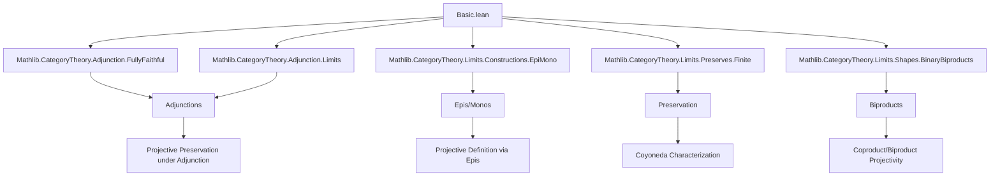

### Technical Brief: Projective Objects and Enough Projectives in Lean 4 (Mathlib)

---

#### **1. Key Definitions & Theorems**

| Name | Type / Signature | Purpose |
|------|------------------|---------|
| `Projective (P : C)` | `Class` | Defines that object `P` is *projective*: every morphism `P ⟶ X` factors through any epimorphism `E ⟶ X`. |
| `isProjective` | `ObjectProperty C` | The object property corresponding to `Projective`. |
| `ProjectivePresentation (X : C)` | `Structure` | A projective presentation of `X`: a pair `(p, f)` where `p` is projective and `f : p ⟶ X` is an epimorphism. |
| `EnoughProjectives` | `Class` | States that every object in `C` has a projective presentation. |
| `Projective.over (X : C)` | `def` | Arbitrarily chosen projective object over `X`, assuming `EnoughProjectives C`. |
| `Projective.π (X : C)` | `def` | The canonical epimorphism `over X ⟶ X`. |
| `Projective.syzygies (f : X ⟶ Y)` | `def` | Arbitrarily chosen projective object over `kernel f`. |
| `Projective.d (f : X ⟶ Y)` | `abbrev` | The morphism `π (kernel f) ≫ kernel.ι f : syzygies f ⟶ X`. |
| `Projective.factorThru {P X E} [Projective P]` | `def` | The chosen factorization `P ⟶ E` of `f : P ⟶ X` through epi `e : E ⟶ X`. |
| `Limits.IsZero.projective` | `lemma` | Zero object is projective. |
| `Projective.of_iso` / `iso_iff` | `lemma` | Projectivity is preserved under isomorphism. |
| `Projective.instance Type` | `instance` | Axiom of choice ⇒ all types are projective in `Type`. |
| `Projective.Type.enoughProjectives` | `instance` | `Type` has enough projectives. |
| `Projective.instance binary_coproduct` / `coproduct` / `biproduct` | `instance` | Coproducts/biproducts of projectives are projective. |
| `Projective.projective_iff_preservesEpimorphisms_coyoneda_obj` | `theorem` | `P` is projective iff `coyoneda.obj (op P)` preserves epimorphisms. |
| `Adjunction.map_projective` | `theorem` | Left adjoint preserves projectivity if right adjoint preserves epis. |
| `Adjunction.projective_of_map_projective` | `theorem` | If `F` is full & faithful and `F(P)` is projective, then `P` is projective. |
| `Functor.projective_of_map_projective` | `theorem` | If `F` is full, faithful, and preserves epis, and `F(P)` is projective, then `P` is projective. |
| `Equivalence.map_projective_iff` | `theorem` | Equivalence preserves and reflects projectivity. |
| `Equivalence.enoughProjectives_iff` | `theorem` | Equivalent categories have enough projectives iff the other does. |

---

#### **2. Naming Conventions**

- **Prefixes**:
  - `isProjective`: object property version.
  - `projective_`: e.g., `projective_over`, `projectivePresentationOfMapProjectivePresentation`.
  - `factorThru`: chosen factorization.
  - `syzygies`, `d`: homological algebra terminology (syzygy = kernel of projective cover).
  - `over`, `π`: standard notation for projective cover and its structure map.

- **Suffixes**:
  - `_projective`: instance or lemma about projectivity.
  - `_epi`: proof that a morphism is an epimorphism.
  - `_presentation`: for structures/instances about projective presentations.

- **Pattern**:
  - `Projective.X` for definitions/instances in the `Projective` namespace.
  - `X.projective` for typeclass instances (via `attribute [instance]`).

---

#### **3. Tactic Stack**

| Tactic | Usage |
|--------|-------|
| `cat_disch` | Discharges categorical diagrammatic goals (e.g., verifying commutativity). |
| `simp` / `simp_rw` | Simplification using `factorThru_comp`, naturality, etc. |
| `rcases` / `obtain` | Extract witnesses from `Nonempty` or `∃` (e.g., from `EnoughProjectives.presentation`). |
| `rw` / `exact` | Rewrite using naturality squares or definitions. |
| `intro` / `constructor` | Build proofs of `∀`, `∃`, `∧`, `↔`, `Class`/`Structure`. |
| `convert` / `congr'` | For equality of morphisms via universal properties (e.g., coproducts). |
| `funext` / `ext` | Extensionality for morphisms (especially in `Type`). |
| `aesop` | Not used here — this file is mostly manual diagrammatic reasoning. |

---

#### **4. Proof Logic**

- **Inductive/constructive style**: Definitions use choice (`Nonempty.some`) under `EnoughProjectives`, making them noncomputable.
- **Factorization via `factors`**: Core argument pattern: use `Projective.factors` to get `⟨f', hf'⟩`, then define `factorThru` as `f'`.
- **Diagram chasing**: Proofs of projectivity for coproducts/biproducts use universal properties and `factorThru`.
- **Adjunctions**: Use unit/counit identities and preservation properties (`PreservesEpimorphisms`, `LeftAdjoint.preservesColimits`).
- **Equivalences**: Reduce to adjunctions (`Equivalence.toAdjunction`) and apply previous theorems.
- **Coyoneda characterization**: Relates projectivity to preservation of epis via Yoneda embedding.

---

#### **5. Imports**

| Module | Purpose |
|--------|---------|
| `Mathlib.CategoryTheory.Adjunction.FullyFaithful` | Fully faithful functors, unit/counit properties. |
| `Mathlib.CategoryTheory.Adjunction.Limits` | Adjunctions preserve/reflect limits/colimits. |
| `Mathlib.CategoryTheory.Limits.Constructions.EpiMono` | Epimorphisms, monomorphisms, factorization. |
| `Mathlib.CategoryTheory.Limits.Preserves.Finite` | Preservation of finite limits/colimits. |
| `Mathlib.CategoryTheory.Limits.Shapes.BinaryBiproducts` | Biproducts, biproduct universal properties. |

---

#### **6. Mermaid Diagrams**

##### **Dependency Graph (Top-Level)**



##### **Overview of Theory Flow**

```mermaid
flowchart LR
  Start[Projective Object Definition] --> Defs[ProjectivePresentation / EnoughProjectives]
  Defs --> Instances[Instances: 0, Type, Coproducts, Biproducts]
  Instances --> Thms[Key Theorems]
  Thms --> Adj[Adjunctions: map_projective, reflect]
  Thms --> Equiv[Equivalences: enoughProjectives_iff]
  Thms --> Coyoneda[Coyoneda ⇔ preserves epis]
  Adj --> Homological[Syzygies, d, exactness (ab. cat.)]
```

---

#### **7. Summary**

This module formalizes the foundational theory of projective objects and categories with enough projectives in a general category `C`. It includes:

- A categorical definition of projectivity via factorization through epis.
- Construction of *arbitrary* projective presentations using choice (`EnoughProjectives`).
- Closure properties: zero object, coproducts, biproducts, types (AC).
- Interaction with adjunctions and equivalences: projectivity is preserved and reflected.
- Homological constructions: syzygies and the morphism `d : syzygies f ⟶ X`.

The formalization is heavily diagrammatic and relies on universal properties, with minimal automation — typical of advanced category theory in Lean.

--- 

Let me know if you'd like a formalized dependency graph (e.g., `.lean` file-level) or a tactic trace for a specific proof.
