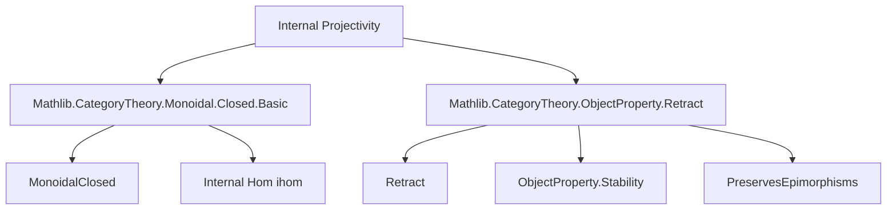
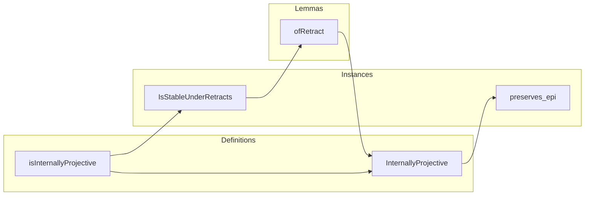

**Technical Brief: Internal Projectivity in Monoidal Closed Categories**

---

### 1. **Key Definitions & Theorems**

| Name | Type / Signature | Purpose |
|------|------------------|---------|
| `isInternallyProjective` | `ObjectProperty C := fun P ↦ (ihom P).PreservesEpimorphisms` | Defines the *property* of being internally projective: the internal hom functor `P ⟶ -` preserves epimorphisms. |
| `InternallyProjective (P : C)` | `abbrev := isInternallyProjective.Is P` | A *class* (instance) stating that `P` is internally projective. |
| `InternallyProjective.preserves_epi` | `instance : (ihom P).PreservesEpimorphisms` | Extracts the preservation-of-epis property from the class. |
| `isInternallyProjective.IsStableUnderRetracts` | `instance` | Shows the property is stable under retracts via categorical retraction of functors. |
| `InternallyProjective.ofRetract` | `lemma {X Y : C} (r : Retract Y X) [InternallyProjective X] : InternallyProjective Y` | Proves that retracts of internally projective objects are internally projective. |

---

### 2. **Naming Conventions**

- **Prefix `is_`**: Used for *properties* (`isInternallyProjective : ObjectProperty C`).
- **Suffix `Is`**: Used to lift a property to a class (`InternallyProjective`).
- **Suffix `_prop_of_`**: Used in instances to extract propositional content (e.g., `prop_of_is`, `prop_of_retract`).
- **`of_` prefix in lemmas**: Indicates construction of a new instance from structural data (e.g., `ofRetract`, `of_retract`).
- **`ihom`**: Standard notation for internal hom in `MonoidalClosed` categories.

---

### 3. **Tactic Stack**

- `aesop`: Used implicitly in instance proofs (e.g., `IsStableUnderRetracts`).
- `simp_rw`: Likely used in `ofRetract` to rewrite `ihom Y` via retraction data.
- `ring`: Not present — algebraic simplification not needed here.
- `cases`, `exact`, `refine`: Implicit in Lean’s instance resolution and `⟨...⟩` constructor syntax.
- `op.map`: Used to lift retractions to functor categories (via `r.op.map internalHom`).

---

### 4. **Proof Logic**

- **Core idea**: Internal projectivity is defined via preservation of epis by the internal hom functor.
- **Stability under retracts**:
  1. Given a retraction `r : Retract Y X`, construct a functorial retraction `ihom Y ⇉ ihom X`.
  2. Use `preservesEpimorphisms.ofRetract`, which states: if `F ⇉ G` is a retraction of functors and `G` preserves epis, then so does `F`.
  3. Apply this to `ihom Y` and `ihom X`, using the assumption `[InternallyProjective X]` (i.e., `ihom X` preserves epis).
- **`ofRetract` lemma**:
  - Uses `prop_of_retract` (a propositional elimination principle for `IsStableUnderRetracts`) to extract the property for `Y`.
  - Leverages the fact that `InternallyProjective` is a propositional predicate (i.e., at most one instance per object).

---

### 5. **Imports & Dependencies**

| Import | Role |
|--------|------|
| `Mathlib.CategoryTheory.Monoidal.Closed.Basic` | Provides `MonoidalClosed`, `ihom`, internal hom functorality, and basic properties. |
| `Mathlib.CategoryTheory.ObjectProperty.Retract` | Supplies `ObjectProperty.IsStableUnderRetracts`, `Retract`, and `preservesEpimorphisms.ofRetract`. |

These imports define the ambient categorical structure and the general principle for stability under retracts.

---

### 6. **Mermaid Diagrams**

#### **Dependency Graph (Module-Level)**



#### **Conceptual Overview (File Structure)**



#### **Retract Stability Proof Sketch**

```mermaid
flowchart LR
  R[Retract Y X] --> F[Functorial Retraction: ihom Y ⇉ ihom X]
  F --> P1[(ihom X) preserves epis]
  P1 --> P2[(ihom Y) preserves epis]
  P2 --> L[InternallyProjective Y]
  R -->|via r.op.map internalHom| F
```

---

### 7. **Theoretical Context**

- **Purpose**: Generalizes projectivity from module theory to monoidal closed categories.
- **Application**: Central to the *solid theory* of *light condensed abelian groups*, especially in derived contexts (e.g., analytic stacks).
- **Categorical flavor**: Works in a very general setting — no abelian or additive assumptions required; only monoidal closed structure.

--- 

*End of Technical Brief.*
