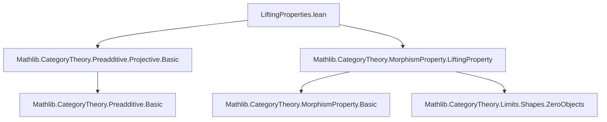
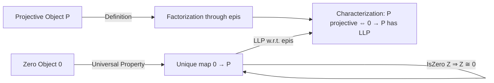

**Technical Brief: `LiftingProperties.lean`**

---

### 1. KEY DEFINITIONS & THEOREMS

| Name | Type / Signature | Purpose |
|------|------------------|---------|
| `hasLiftingProperty_of_isZero` | `{Z P X Y : C} → (i : Z ⟶ P) → (p : X ⟶ Y) → [Epi p] → [Projective P] → IsZero Z → HasLiftingProperty i p` | Constructs a lift for any morphism `i : Z → P` when `Z` is zero and `P` is projective, using the universal property of the zero object and projectivity. |
| `Projective.hasLiftingProperty_of_isZero` | Instance | Specialization of the above lemma to the unique morphism `0 ⟶ P`, yielding `HasLiftingProperty (0 : 0 ⟶ P) p` for any epi `p`. |
| `projective_iff_llp_epimorphisms_of_isZero` | `{P Z : C} → (i : Z ⟶ P) → IsZero Z → Projective P ↔ (epimorphisms C).llp i` | Equates projectivity of `P` with the left lifting property (LLP) of `i` against all epimorphisms, under the assumption that `Z` is zero. |
| `projective_iff_llp_epimorphisms_zero` | `[HasZeroMorphisms C] → [HasZeroObject C] → Projective P ↔ (epimorphisms C).llp (0 : 0 ⟶ P)` | Main theorem: characterizes projective objects via the LLP of the canonical morphism `0 → P` against all epimorphisms. |

---

### 2. NAMING CONVENTIONS

- **Prefixes**:
  - `hasLiftingProperty_of_`: Lemma constructing a lifting property from additional structure (e.g., `isZero`, `Projective`).
  - `projective_iff_llp_`: Biconditional linking projectivity with left lifting properties.
- **Suffixes**:
  - `_of_isZero`: Indicates the source object is zero.
  - `_zero`: Indicates the morphism is the canonical `0 ⟶ P`.
- **MorphismProperty usage**:
  - `MorphismProperty.epimorphisms C`: A predicate classifying epimorphisms in `C`.
  - `.llp i`: Left lifting property of `i` against that class.

---

### 3. TACTIC STACK

- `intro`: Standard for introducing hypotheses and goals.
- `obtain rfl := ...`: To eliminate `IsZero Z` via uniqueness of morphisms from zero.
- `constructor`: For biconditional proofs (↔-elimination/introduction).
- `simp`, `simp_rw`: Used minimally; mainly `by simp` in `CommSq` verification and lift factorization.
- `exact`: To close goals by applying known lemmas or hypotheses.
- `⟨...⟩`: For constructing dependent pairs (e.g., lifts as morphisms with factorization proofs).

No heavy automation (e.g., `aesop`, `ring`, `linarith`) is used—proofs are largely structural and categorical.

---

### 4. PROOF LOGIC

- **Structure**:
  1. **Zero-object case**: Use `IsZero Z` to reduce `Z` to the zero object, then apply projectivity to construct a lift.
  2. **Biconditional**:
     - *⇒* (projective ⇒ LLP): Given `i : Z → P` with `Z ≅ 0`, use projectivity of `P` to lift any commutative square with epi on the right.
     - *⇐* (LLP ⇒ projective): Assume `i : 0 → P` has LLP w.r.t. all epis; for any epi `p : X ↠ Y` and map `f : P → Y`, form a square `0 → P → Y`, `0 → X`, lift it, and verify the lift factors `f` through `p`.
- **Key categorical reasoning**:
  - Uniqueness of maps from zero objects (`hZ.eq_of_src _ _`).
  - Factorization through epimorphisms via projectivity.
  - Identification of `CommSq 0 (0 : Z ⟶ P) p f` using `by simp`.

---

### 5. IMPORTS

| Module | Purpose |
|--------|---------|
| `Mathlib.CategoryTheory.Preadditive.Projective.Basic` | Defines projective objects and basic properties (e.g., factorization through epis). |
| `Mathlib.CategoryTheory.MorphismProperty.LiftingProperty` | Provides `HasLiftingProperty`, `llp`, and morphism property infrastructure. |

> **Note**: The file assumes `C` is a preadditive category with zero object and zero morphisms (via `HasZeroObject` and `HasZeroMorphisms`), though the latter is only needed for the biconditional.

---

### 6. MERMAID DIAGRAMS

#### Dependency Graph (Module-Level)



#### Overview of Theoretical Flow



#### Proof Structure (for `projective_iff_llp_epimorphisms_zero`)

```mermaid
flowchart LR
  A[Goal: Projective P ↔ (epi).llp (0 → P)] --> B[⇒: Projective ⇒ LLP]
  A --> C[⇐: LLP ⇒ Projective]
  B --> D[Use IsZero 0 to reduce to 0 → P]
  B --> E[Apply projectivity to lift any square]
  C --> F[Assume LLP for 0 → P]
  C --> G[Given epi p: X ↠ Y and f: P → Y]
  G --> H[Form square 0 ⇒ P → Y, 0 → X]
  H --> I[Apply LLP to get lift ℓ: 0 → X]
  I --> J[Verify ℓ factors f through p]
```

--- 

This file formalizes a foundational bridge between homological algebra (projective objects) and categorical logic (lifting properties), enabling future development (e.g., model structures, derived functors).
