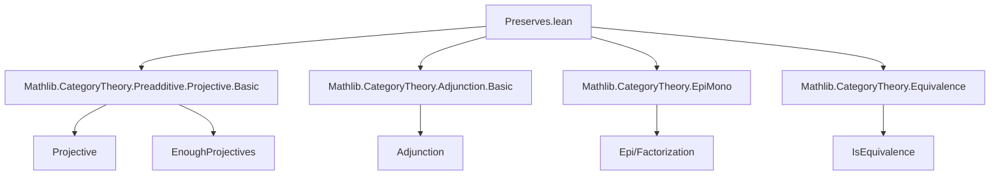

**Technical Brief: `Preserves.lean` — Preservation of Projective Objects in Category Theory**

---

### 1. KEY DEFINITIONS & THEOREMS

| Name | Type / Signature | Purpose |
|------|------------------|---------|
| `Functor.PreservesProjectiveObjects` | `class (F : C ⥤ D) : Prop` | Typeclass stating that `F` maps projective objects in `C` to projective objects in `D`. |
| `Functor.projective_obj` | `[F.PreservesProjectiveObjects] → Projective X → Projective (F.obj X)` | Instance deriving `Projective (F.obj X)` from `Projective X`. |
| `Functor.projective_obj_of_projective` | `(h : Projective X) → Projective (F.obj X)` | Explicit-argument variant of `projective_obj`. |
| `Functor.preservesProjectiveObjects_comp` | `[F.PreservesProjectiveObjects] → [G.PreservesProjectiveObjects] → (F ⋙ G).PreservesProjectiveObjects` | Composition of functors preserves projective objects. |
| `Functor.preservesProjectiveObjects_of_adjunction_of_preservesEpimorphisms` | `{F ⊣ G} → [G.PreservesEpimorphisms] → F.PreservesProjectiveObjects` | If `F ⊣ G` and `G` preserves epimorphisms, then `F` preserves projectives. |
| `Functor.preservesProjectiveObjects_of_isEquivalence` | `[IsEquivalence F] → F.PreservesProjectiveObjects` | Equivalences preserve projective objects (via adjunction + epimorphism preservation). |
| `Functor.preservesEpimorphisms_of_adjunction_of_preservesProjectiveObjects` | `[EnoughProjectives C] → {F ⊣ G} → [F.PreservesProjectiveObjects] → G.PreservesEpimorphisms` | Converse: if `F ⊣ G`, `F` preserves projectives, and `C` has enough projectives, then `G` preserves epimorphisms. |

---

### 2. NAMING CONVENTIONS

- **Prefixes**:
  - `preservesProjectiveObjects_`: for theorems establishing that a functor preserves projective objects.
  - `projective_obj`: for lemmas/instances about mapping projective objects via a functor.
- **Suffixes**:
  - `_of_projective`: variant taking `Projective X` as an explicit argument.
  - `_of_adjunction_of_…`: for results derived from an adjunction with additional assumptions (e.g., epimorphism/projective preservation).
  - `_comp`: for composition closure properties.

---

### 3. TACTIC STACK

- **Core tactics**: `rw`, `simp`, `simp_rw`, `exact`, `refine`, `suffices … from`, `cases`
- **Category-theoretic automation**:
  - `adj.map_projective` (from `Preadditive.Projective.Basic`)
  - `Projective.π`, `Projective.over`, `Projective.factorThru` (projective cover machinery)
  - `epi_of_epi_fac` (epimorphism factorization lemma)
- **Typeclass inference**: `inferInstance`, implicit arguments via `[...]`

---

### 4. PROOF LOGIC

- **Forward direction** (`F ⊣ G`, `G` preserves epis ⇒ `F` preserves projectives):
  - Directly uses `adj.map_projective`, a standard result in homological algebra.
- **Converse direction** (`F ⊣ G`, `F` preserves projectives, `C` has enough projectives ⇒ `G` preserves epis):
  - Uses *projective covers*:
    - Constructs a factorization through a projective cover of `G.obj Y`.
    - Applies unit/counit identities and naturality.
    - Reduces to showing an epimorphism factorization, concluding via `epi_of_epi_fac`.
  - Relies critically on `EnoughProjectives C` to obtain projective covers.

---

### 5. IMPORTS & DEPENDENCIES

- **Primary dependency**:
  ```lean
  Mathlib.CategoryTheory.Preadditive.Projective.Basic
  ```
  - Provides `Projective`, `Projective.π`, `Projective.over`, `Projective.factorThru`, `adj.map_projective`, `epi_of_epi_fac`, `EnoughProjectives`.

- **Implicit dependencies** (via `CategoryTheory` namespace):
  - `Mathlib.CategoryTheory.Adjunction.Basic` (for `⊣`, `unit`, `counit`)
  - `Mathlib.CategoryTheory.EpiMono` (for `epi_of_epi_fac`, `epi` reasoning)
  - `Mathlib.CategoryTheory.Equivalence` (for `IsEquivalence`, `asEquivalence.toAdjunction`)

---

### 6. MERMAID DIAGRAMS

#### Dependency Graph (Module-Level)



#### Overview of Theory Flow

```mermaid
flowchart LR
  A[Functor Preserves Projective Objects<br>(class)] --> B[Preservation under composition]
  A --> C[If F ⊣ G & G preserves epis ⇒ F preserves projectives]
  A --> D[If F is equivalence ⇒ F preserves projectives]
  A --> E[If F ⊣ G, F preserves projectives & C has enough projectives ⇒ G preserves epis]
  C --> F[Standard homological algebra]
  E --> G[Uses projective covers & unit/counit]
```

---

### 7. SUMMARY

This file formalizes the categorical interplay between adjunctions, projective objects, and epimorphism preservation. It introduces a typeclass for preservation of projectives and proves:

- **Forward direction**: classical result — left adjoint preserves projectives if right adjoint preserves epis.
- **Converse direction**: new (to this formalization) under the assumption of enough projectives — right adjoint preserves epis if left adjoint preserves projectives.

The proofs leverage projective covers and standard adjunction calculus, demonstrating Lean’s capacity for homological algebra in general categories.
