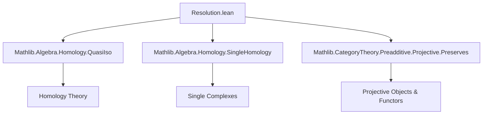
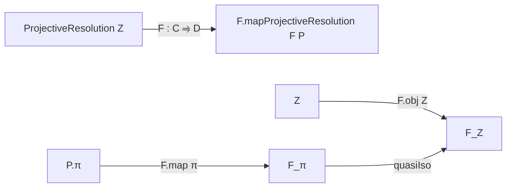

### Technical Brief: `Resolution.lean` — Projective Resolutions in Lean 4

---

#### **1. Key Definitions & Theorems**

| Name | Type / Structure | Purpose |
|------|------------------|---------|
| `ProjectiveResolution Z` | `structure` | Bundles an `ℕ`-indexed chain complex of projective objects in `C`, together with a quasi-isomorphism to the single-object complex supported at `Z` in degree `0`. |
| `HasProjectiveResolution Z` | `class Prop` | Asserts existence of a projective resolution for `Z`. |
| `HasProjectiveResolutions` | `class Prop` | Asserts that *every* object in `C` admits a projective resolution. |
| `complex_exactAt_succ` | `lemma` | Shows that the complex is exact at degree `n+1`, via quasi-isomorphism criterion. |
| `exact_succ` | `lemma` | Derives exactness of the short complex segment `X_{n+2} → X_{n+1} → X_n`. |
| `π_f_succ` | `@[simp] theorem` | States that the resolution map is zero in positive degrees. |
| `complex_d_comp_π_f_zero` | `@[reassoc] theorem` | Encodes that `d₁₀ ≫ π₀ = 0`. |
| `complex_d_succ_comp` | `theorem` | Standard chain complex condition: `d² = 0`. |
| `cokernelCofork` | `noncomputable def` | The canonical cokernel cofork induced by `d₁₀` and `π₀`. |
| `isColimitCokernelCofork` | `noncomputable def` | Shows that `Z` is the colimit of this cofork — i.e., `Z ≅ coker(d₁₀)`. |
| `π_epi` | `instance` | `π.f n` is an epimorphism for all `n`. |
| `self` | `noncomputable def` | Trivial projective resolution of a projective object `Z`. |
| `Hom.f` | `structure` | Morphism between resolutions lifting a base map `f : Z → Z'`. |
| `mapProjectiveResolution` | `noncomputable def` | Functorial pushforward of a projective resolution along an additive functor preserving projectives and homology. |

---

#### **2. Naming Conventions**

- **Prefixes**:
  - `complex_`: properties of the underlying chain complex (`complex_exactAt_succ`, `complex_d_comp_π_f_zero`, `complex_d_succ_comp`)
  - `π_`: properties of the resolution map (`π_f_succ`, `π_epi`)
  - `isColimit_`: colimit-related constructions (`isColimitCokernelCofork`)
  - `cokernel_`: cokernel cofork constructions (`cokernelCofork`)
- **Suffixes**:
  - `_succ`: statements indexed by `n+1` or successor positions (`complex_exactAt_succ`, `exact_succ`)
  - `_f_zero`: degree-0 component of maps (`π_f_succ`, `hom_f_zero_comp_π_f_zero`)
  - `_comp`: composition identities (`complex_d_comp_π_f_zero`, `complex_d_succ_comp`)
- **Structure fields**:
  - `complex`, `π`, `projective`, `quasiIso`, `hom`, `hom_f_zero_comp_π_f_zero`

---

#### **3. Tactic Stack**

Frequent tactics used in proofs and instance synthesis:

| Tactic | Usage |
|--------|-------|
| `rw` | Rewriting definitions (e.g., quasi-isomorphism criteria, homology isomorphisms) |
| `simp` / `simp only` | Simplifying using `@[simp]` lemmas, especially for `single₀`, `π.f`, `d² = 0` |
| `infer_instance` | Solving typeclass goals (e.g., `Projective`, `HasHomology`, `QuasiIso`) |
| `cases n` | Induction on natural numbers (e.g., proving `π.f n` epi) |
| `cat_disch` | Category-theoretic diagram chasing (used in `hom_comp_π`) |
| `dsimp`, `convert`, `refine`, `exact` | Fine-grained proof construction |
| `cancel_mono`, `Iso.hom_inv_id`, `assoc`, `comp_id`, `id_comp` | Rewriting using categorical identities |
| `Iso.refl_inv`, `Iso.inv_hom_id` | Handling inverses of isomorphisms |

---

#### **4. Proof Logic**

- **Inductive/structural reasoning** on natural numbers (`n : ℕ`) is common, especially for degree-wise properties.
- **Quasi-isomorphism criteria** (`quasiIsoAt_iff_exactAt'`) are used to deduce exactness of the complex.
- **Colimit universal properties** are leveraged to identify `Z` with the cokernel of `d₁₀`.
- **Functoriality** is established via `mapHomologicalComplex`, `singleMapHomologicalComplex`, and typeclass inference (`PreservesProjectiveObjects`, `PreservesHomology`).
- **Diagram chasing** is abstracted via `cat_disch` and `Iso` manipulations (e.g., `isoHomologyι₀`, `singleObjHomologySelfIso`).
- **Trivial resolution** (`self`) uses case analysis on `n` and `IsZero.projective`.

---

#### **5. Imports & Dependencies**

| Import | Role |
|--------|------|
| `Mathlib.Algebra.Homology.QuasiIso` | Quasi-isomorphisms, homology isomorphisms |
| `Mathlib.Algebra.Homology.SingleHomology` | Single-object chain complexes and their homology |
| `Mathlib.CategoryTheory.Preadditive.Projective.Preserves` | Projective objects and preservation under functors |

**Core theory dependencies**:
- Homological algebra in preadditive categories
- Chain complexes, homology, exactness
- Projective objects and resolutions
- Functoriality of homological constructions

---

#### **6. Mermaid Diagrams**

##### **Dependency Graph (Module-Level)**



##### **Conceptual Overview of `ProjectiveResolution`**

```mermaid
graph LR
  Z[Object Z : C] -->|resolution| P[ProjectiveResolution Z]
  P -->|complex| X[ChainComplex C ℕ]
  X -->|projective| Pn[∀n, Projective (X n)]
  X -->|d²=0| D[Chain Complex Structure]
  P -->|π| Z0[Single₀ C Z]
  X -->|π| Z0
  Z0 -->|quasiIso| H[QuasiIso π]
  H -->|induces| Iso[Isomorphism on homology]
```

##### **Functorial Mapping**



---

#### **7. Summary**

This file formalizes the foundational theory of **projective resolutions** in an abelian (or at least homological) category `C` with enough projectives. It defines:
- The structure of a projective resolution,
- Key exactness and epimorphism properties,
- The universal property of `Z` as a cokernel,
- Functorial behavior under additive functors preserving projectives and homology.

It serves as the backbone for derived functors (e.g., `LeftDerivedFunctor`) in Mathlib’s homological algebra pipeline.

--- 

Let me know if you'd like a formalized dependency graph (e.g., `.lean` file-level), or a comparison with injective resolutions.
