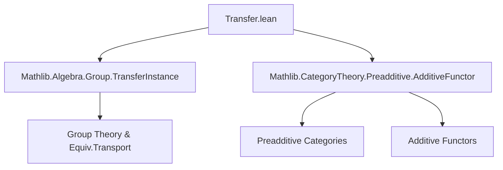
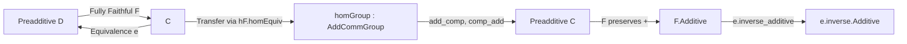
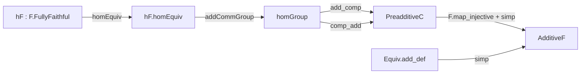

**Technical Brief: `Transfer.lean` — Pulling Back Preadditive Structures Along Fully Faithful Functors**

---

### 1. **Key Definitions & Theorems**

| Name | Type / Signature | Purpose |
|------|------------------|---------|
| `Preadditive.ofFullyFaithful` | `hF : F.FullyFaithful → Preadditive C` | Constructs a preadditive structure on `C` using the fully faithful functor `F : C ⥤ D` and the preadditivity of `D`. |
| `Preadditive.add_comp` | `∀ P Q R, f f' : hom C P Q, g : hom C Q R, F.map (f + f') = F.map f + F.map f'` (via injectivity) | Verifies left distributivity of composition over addition in `C`. |
| `Preadditive.comp_add` | `∀ P Q R, f : hom C P Q, g g' : hom C Q R, F.map (g + g') = F.map g + F.map g'` (via injectivity) | Verifies right distributivity of composition over addition in `C`. |
| `Functor.FullyFaithful.additive_ofFullyFaithful` | `F.Additive` (under induced `Preadditive C`) | Shows that `F` becomes an additive functor when `C` is equipped with the transferred preadditive structure. |
| `Equivalence.additive_inverse_of_FullyFaithful` | `e.inverse.Additive` (for equivalence `e : C ≌ D`) | Shows that the inverse equivalence functor is additive, using that the forward functor is additive and fully faithful. |

---

### 2. **Naming Conventions**

- **Prefixes**:
  - `ofFullyFaithful`: Indicates construction *from* a fully faithful functor.
  - `additive_ofFullyFaithful`: Property *of* the induced structure.
- **Suffixes**:
  - `add_comp`, `comp_add`: Reflect distributivity of composition over addition (left/right).
- **Structure fields**:
  - `homGroup`: Uses `hF.homEquiv.addCommGroup`, i.e., transport of abelian group structure along hom-equivalence.
  - `map_add` (in `Additive`): Proved via `simp [Equiv.add_def]`.

---

### 3. **Tactic Stack**

- `simp [Equiv.add_def]`: Central tactic for simplifying addition in transported structures.
- `hF.map_injective`: Used to lift equalities in `D` back to `C` (injectivity of `F` on homs).
- `by simp [Equiv.add_def]`: Repeatedly used in proofs of `add_comp` and `comp_add`.
- `letI : Preadditive C := ...`: Local instance introduction for typeclass inference.

No heavy automation (e.g., `aesop`, `ring`, `linarith`) is used—proofs are mostly direct and rely on properties of equivalences and injectivity.

---

### 4. **Proof Logic**

- **Core idea**: Use the fully faithfulness of `F` to *transport* the abelian group structure on $\mathrm{Hom}_D(FX, FY)$ to $\mathrm{Hom}_C(X, Y)$, and verify preadditivity axioms by mapping forward and using properties in `D`.
- **Structure of proofs**:
  1. Define `homGroup` via `hF.homEquiv.addCommGroup`.
  2. For `add_comp`, compute `F(f + f') ∘ g` in `D`, use additivity of `F` on morphisms (as a functor), then apply injectivity to conclude equality in `C`.
  3. Similarly for `comp_add`.
  4. For `additive_ofFullyFaithful`, show `F(f + g) = F(f) + F(g)` using `Equiv.add_def`.
  5. For equivalences, use that `e.inverse` is additive because `e.functor` is additive and equivalences have additive inverses.

Induction or case analysis is *not* used—proofs are structural and rely on universal properties of equivalences and injectivity.

---

### 5. **Imports**

| Import | Role |
|--------|------|
| `Mathlib.Algebra.Group.TransferInstance` | Provides `homEquiv.addCommGroup`, i.e., transport of additive structure along equivalences. |
| `Mathlib.CategoryTheory.Preadditive.AdditiveFunctor` | Defines `Preadditive`, `Additive`, and related lemmas (e.g., `additive_ofFullyFaithful` likely depends on `Additive` typeclass). |
| `Limits` (via `open Limits`) | May provide background on products/coproducts, though not directly used in this snippet. |

---

### 6. **Mermaid Diagrams**

#### **Dependency Graph (Module Level)**

#### **Overview of Theory Flow**

#### **Key Logical Dependencies**

---

### 7. **Summary**

This file formalizes a standard categorical fact: *a fully faithful functor into a preadditive category endows the domain with a canonical preadditive structure, making the functor additive*. The construction is minimal and elegant—leveraging hom-equivalence and injectivity—without requiring limits or colimits. It sets up the foundation for further development (e.g., additive equivalences, derived categories, or homological algebra in transferred settings).
