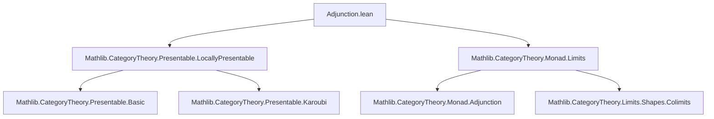
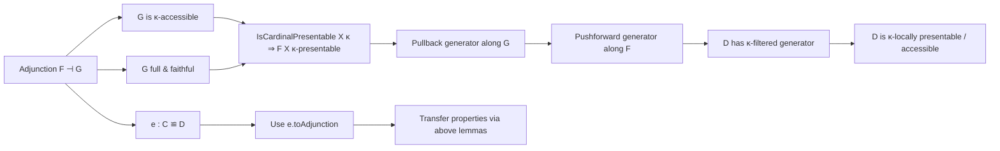

### Technical Brief: `Adjunction.lean` — Presentable Objects and Adjunctions

---

#### **1. Key Definitions & Theorems**

| Name | Type / Signature | Purpose |
|------|------------------|---------|
| `isCardinalPresentable_leftAdjoint_obj` | `∀ {X : C}, IsCardinalPresentable X κ → G.IsCardinalAccessible κ → IsCardinalPresentable (F.obj X) κ` | Shows that if $G$ is $\kappa$-accessible and $X$ is $\kappa$-presentable, then $F(X)$ is $\kappa$-presentable. Core technical lemma. |
| `isCardinalFilteredGenerator` | `∀ {P : ObjectProperty C}, P.IsCardinalFilteredGenerator κ → [G.Full][G.Faithful][G.IsCardinalAccessible] → (P.map F).IsCardinalFilteredGenerator κ` | Propagates a $\kappa$-filtered generator along a fully faithful, accessible right adjoint. |
| `hasCardinalFilteredGenerator` | `[HasCardinalFilteredGenerator C κ] → [G.IsCardinalAccessible] → [G.Full] → [G.Faithful] → HasCardinalFilteredGenerator D κ` | Lifts existence of a $\kappa$-filtered generator from $C$ to $D$ under the same hypotheses. |
| `isCardinalLocallyPresentable` | `[IsCardinalLocallyPresentable C κ] → [G.IsCardinalAccessible] → [G.Full] → [G.Faithful] → IsCardinalLocallyPresentable D κ` | Shows $D$ is $\kappa$-locally presentable if $C$ is, under the stated conditions. |
| `isCardinalAccessibleCategory` | `[IsCardinalAccessibleCategory C κ] → [G.IsCardinalAccessible] → [G.Full] → [G.Faithful] → IsCardinalAccessibleCategory D κ` | Analogous for $\kappa$-accessible categories. |
| `hasCardinalFilteredGenerator` (for `Equivalence`) | `[HasCardinalFilteredGenerator C κ] → HasCardinalFilteredGenerator D κ` | Special case when $e : C ≌ D$ is an equivalence (via its underlying adjunction). |
| `isLocallyPresentable`, `isAccessibleCategory` (for `Equivalence`) | `[IsLocallyPresentable C] → IsLocallyPresentable D`, etc. | Transfer of (non-cardinalified) local presentability / accessibility along equivalences. |

---

#### **2. Naming Conventions**

- **Prefixes**:
  - `isCardinal...`: predicates about $\kappa$-presentability / accessibility / generators.
  - `hasCardinal...`: existence of such structure (e.g., `HasCardinalFilteredGenerator`).
  - `...Generator`: properties of collections of objects (e.g., `IsCardinalFilteredGenerator`).
- **Suffixes**:
  - `_obj`: applied to objects (e.g., `leftAdjoint_obj`).
  - `_of_...`: derived from a hypothesis (e.g., `isCardinalPresentable_of_iso`, `hasColimits_of_reflective`).
- **Adjectives**:
  - `Full`, `Faithful`, `Accessible`, `Preserved`, `Filtered`, `Colimit`.

---

#### **3. Tactic Stack**

The proofs rely heavily on:

- `rw [...]`: rewriting using characterizations like `isCardinalPresentable_iff`, `isCardinalAccessible_iff`.
- `exact ...` / `intro ...`: standard intro/apply.
- `have h := ...; rw ... at h`: intermediate lemma extraction.
- `obtain ⟨...⟩ := ...`: destructuring existential or product hypotheses.
- `inferInstance`: filling typeclass arguments.
- `Functor.isCardinalAccessible_of_natIso`: leveraging natural isomorphisms to transfer accessibility.
- `isColimitOfPreserves`: used to show colimits are preserved under $F$.
- `locallySmall_of_faithful`: to construct `LocallySmall` instance.

No heavy automation (e.g., `aesop`, `ring`, `norm_cast`) appears — proofs are largely *manual category-theoretic reasoning*.

---

#### **4. Proof Logic**

- **Structure**:
  1. **Reduction to known characterizations** (e.g., via `isCardinalPresentable_iff_isCardinalAccessible_uliftCoyoneda_obj`).
  2. **Use of adjunction data**:
     - `Adjunction.compUliftCoyonedaIso` provides a natural isomorphism $G \circ \mathcal{U}_X \cong \mathcal{U}_{F(X)}$, used to transfer accessibility.
     - `counit.app Y` is used as a split epimorphism to reflect colimits / generators.
  3. **Lifting properties along $F$**:
     - Generators: pull back along $G$, apply $P$-generator property, push forward via $F$.
     - Colimits: use that $F$ preserves colimits of shape $J$ if $G$ reflects them and $G$ preserves them (via `isColimitOfPreserves`).
  4. **Equivalence case**: reduce to adjunction case via `e.toAdjunction`.

- **Induction / recursion**: Not used — all arguments are *direct* and *structural*.

---

#### **5. Imports & Dependencies**

| Module | Role |
|--------|------|
| `Mathlib.CategoryTheory.Presentable.LocallyPresentable` | Defines `IsCardinalPresentable`, `IsCardinalFilteredGenerator`, `IsCardinalLocallyPresentable`, etc. |
| `Mathlib.CategoryTheory.Monad.Limits` | Provides tools for limits/colimits in Eilenberg-Moore categories — possibly used indirectly via `Reflective`/`hasColimits_of_reflective`. |
| `Limits`, `Opposite` (via `open`) | Standard limits/colimits infrastructure and opposite category machinery. |

---

#### **6. Mermaid Diagrams**

##### **Dependency Graph (Module-Level)**

##### **Conceptual Flow (Theorem Dependencies)**

##### **Overview of Theory Scope**

This file formalizes **transfer of local presentability and accessibility along adjunctions and equivalences** in the setting of *cardinal-indexed presentability* (i.e., $\kappa$-presentable objects for regular $\kappa$). It builds on:

- The characterization of $\kappa$-presentable objects via $\kappa$-accessible hom-functors (`uliftCoyoneda`).
- The interplay between *reflective subcategories* (via fully faithful right adjoints) and colimit generation.
- The fact that equivalences are particular adjunctions where both functors are fully faithful and essentially surjective.

It serves as a foundational step for larger developments in *locally presentable categories*, *accessible functors*, and *model structures* where stability under equivalences and adjunctions is essential.

--- 

Let me know if you'd like a formalized dependency graph (e.g., for `leanproject`), or a summary of missing lemmas (e.g., dual statements for left adjoints preserving *copresentable* objects).
