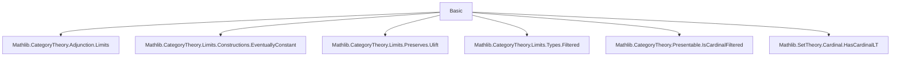
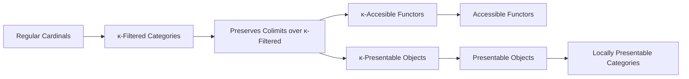

Here is the structured technical brief extracted from `Basic.lean`:

---

### **1. Key Definitions & Theorems**

| Name | Type / Signature | Purpose |
|------|------------------|---------|
| `Functor.IsCardinalAccessible F κ` | `Prop` | $F : C \to D$ is **$\kappa$-accessible** if it preserves colimits over all $\kappa$-filtered diagrams $J$. |
| `Functor.IsAccessible F` | `Prop` | $F$ is **accessible** if it is $\kappa$-accessible for *some* regular cardinal $\kappa$. |
| `IsCardinalPresentable X κ` | `Prop` | $X \in C$ is **$\kappa$-presentable** iff the hom-functor $\hom(X, -) \cong \mathord{\mathrm{coyoneda}}(\mathrm{op}\,X)$ is $\kappa$-accessible. |
| `IsPresentable X` | `Prop` | $X$ is **presentable** iff it is $\kappa$-presentable for some regular $\kappa$. |
| `isCardinalPresentable C κ` | `ObjectProperty C` | Unary predicate on objects of $C$ expressing $\kappa$-presentability. |
| `HasCardinalFilteredColimits C κ` | `Prop` | $C$ has all colimits indexed by $\kappa$-filtered diagrams. |

**Key Lemmas:**
- `preservesColimitsOfShape_of_isCardinalAccessible`: Instantiates preservation of colimits for $\kappa$-filtered shapes.
- `isCardinalAccessible_of_le`: Monotonicity in $\kappa$: if $F$ is $\kappa$-accessible and $\kappa \le \kappa'$, then $F$ is $\kappa'$-accessible.
- `isCardinalPresentable_of_le`, `isCardinalPresentable_monotone`: Monotonicity for objects.
- `isCardinalPresentable_of_iso`: $\kappa$-presentability is invariant under isomorphism.
- `isCardinalPresentable_of_equivalence`, `isCardinalPresentable_of_isEquivalence`: Invariance under categorical equivalence.
- `IsCardinalPresentable.exists_hom_of_isColimit`: Characterization of $\kappa$-presentable objects via factorization through finite stages in filtered colimits.
- `IsCardinalPresentable.exists_eq_of_isColimit`, `exists_eq_of_isColimit'`: Equality-up-to-merging in filtered colimits.

---

### **2. Naming Conventions**

- **Prefixes:**
  - `isCardinalAccessible`, `isCardinalPresentable`, `isPresentable`: Predicate naming for properties.
  - `preservesColimitsOfShape_of_...`: Lemmas deriving preservation from assumptions.
- **Suffixes:**
  - `_of_le`, `_of_iso`, `_of_equivalence`, `_of_isEquivalence`: Indicate how the property transfers along structure.
  - `_iff`: Biconditional lemmas.
- **Typeclass names:**
  - `IsCardinalAccessible`, `IsAccessible`, `IsCardinalPresentable`, `IsPresentable`, `HasCardinalFilteredColimits`: All end in `...able` or `...Limits`.

---

### **3. Tactic Stack**

Frequent tactics used:
- `infer_instance`: To discharge typeclass goals.
- `intro`, `intro h`, `intro f`, etc.: Standard intro-style reasoning.
- `have := ...`: Intermediate lemma extraction.
- `exact`, `refine`, `apply`: Goal-directed proof construction.
- `dsimp`, `simp [Adjunction.homEquiv_unit]`: Simplification using definitional equalities and adjunction data.
- `ext ⟨g⟩`, `ext`: Extensionality for morphisms/objects.
- `iteInduction`: For constructing facts about suprema of regular cardinals.
- `rw [isCardinalPresentable_iff]`: Rewriting using definitional equivalences.

---

### **4. Proof Logic**

- **Inductive structure**: Most proofs follow a pattern:
  1. **Unfold definitions** (e.g., `coyoneda.obj (op X)`).
  2. **Apply assumptions** (e.g., `preservesColimitsOfShape_of_isCardinalAccessible`).
  3. **Use structural properties**:
     - Filteredness of $J$ (`isFiltered_of_isCardinalFiltered`).
     - Essential smallness via `equivSmallModel`.
     - Natural isomorphisms (`preservesColimitsOfShape_of_natIso`).
     - Reflection of colimits (`isColimitOfReflects`, `isColimitOfPreserves`).
  4. **Transfer along equivalences** (e.g., using `uliftFunctor`, `equivSmallModel`, `adjunction.homEquiv`).
- **Key logical flow**:
  - For object-level properties: reduce to functor-level via `coyoneda`.
  - For monotonicity: use `IsCardinalFiltered.of_le`.
  - For closure under isomorphism/equivalence: use `natIso`/`adjunction.homEquiv` to transport colimit preservation.

---

### **5. Imports**

| Module | Purpose |
|--------|---------|
| `Mathlib.CategoryTheory.Adjunction.Limits` | Colimits, adjunctions, preservation. |
| `Mathlib.CategoryTheory.Limits.Constructions.EventuallyConstant` | Eventually constant cocones (used in `const`-functor case). |
| `Mathlib.CategoryTheory.Limits.Preserves.Ulift` | Lifting colimits via `uliftFunctor`. |
| `Mathlib.CategoryTheory.Limits.Types.Filtered` | Filtered categories and their properties. |
| `Mathlib.CategoryTheory.Presentable.IsCardinalFiltered` | $\kappa$-filtered categories. |
| `Mathlib.SetTheory/Cardinal/HasCardinalLT` | Cardinal arithmetic, regular cardinals, suprema. |

---

### **6. Mermaid Diagrams**

#### **Dependency Graph (Module-Level)**



#### **Conceptual Overview (Theory Flow)**



#### **Object-Level Structure**

```mermaid
graph LR
  X[Object X] -->|coyoneda| F[Functor coyoneda(op X)]
  F -->|IsCardinalAccessible| κ[κ ∈ Cardinal]
  F -->|IsAccessible| ∃κ
  X -->|isCardinalPresentable| κ
  X -->|isPresentable| ∃κ
```

---

### **7. Summary**

This module formalizes the foundational theory of **$\kappa$-accessible functors and $\kappa$-presentable objects** in category theory, following Adámek–Rosický. It defines:
- $\kappa$-accessibility for functors (preservation of $\kappa$-filtered colimits),
- $\kappa$-presentability for objects (via hom-functor),
- Their closure properties (monotonicity, isomorphism invariance, equivalence invariance),
- Key characterizations (existence of factorizations in filtered colimits),
- And connects them to universe-level cardinal arithmetic (regular cardinals, suprema).

The formalization is **universe-polymorphic**, uses typeclasses for implicit arguments, and emphasizes **constructive reasoning** with explicit handling of essential smallness and universe lifting.

--- 

Let me know if you'd like a formalization roadmap or a plan for extending this to *locally presentable categories*.
