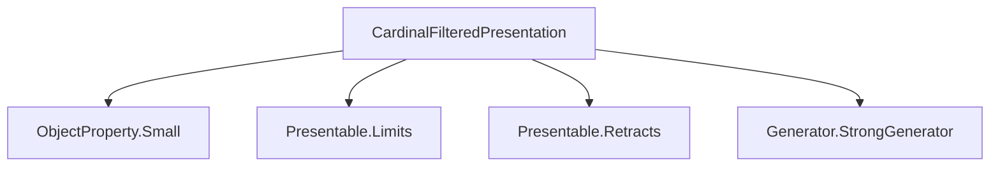
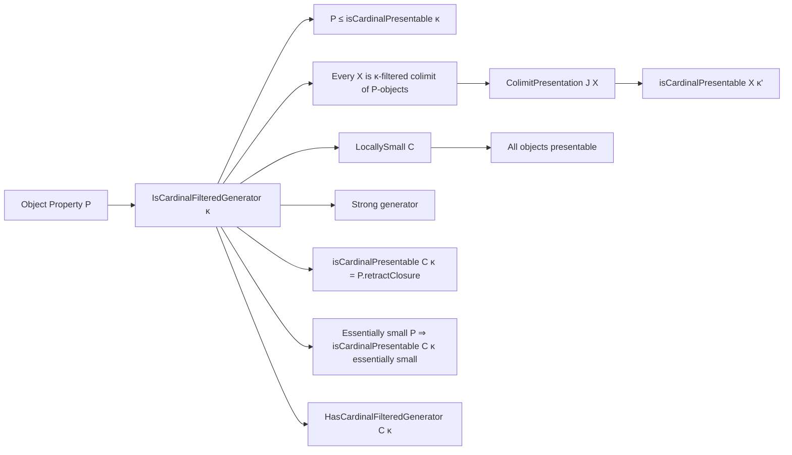
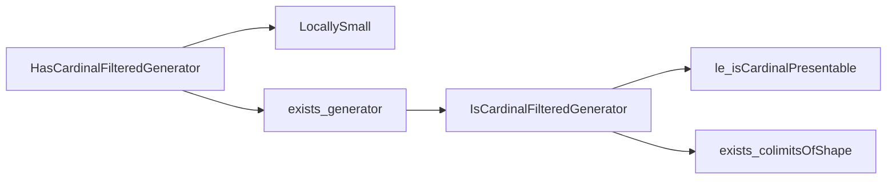

Here is the structured technical brief extracted from `CardinalFilteredPresentation.lean`:

---

### **1. Key Definitions & Theorems**

| Name | Type / Structure | Purpose |
|------|------------------|---------|
| `IsCardinalFilteredGenerator` | `structure` | Predicate on `P : ObjectProperty C` saying: (1) all `P`-objects are `κ`-presentable, and (2) every object of `C` is a `κ`-filtered colimit of `P`-objects. |
| `HasCardinalFilteredGenerator` | `class` | Asserts `C` is locally `w`-small and admits an essentially small `P` satisfying `P.IsCardinalFilteredGenerator κ`. |
| `isCardinalPresentable` (lemma) | `lemma` | If all objects in a diagram are `κ`-presentable and the indexing category has `κ`-small arrows, then its colimit is `κ'`-presentable for any regular `κ' ≥ κ`. |
| `ColimitOfShape.isCardinalPresentable` | `lemma` | Specialization of above to colimits of shape `J` where all diagram objects satisfy `P ≤ isCardinalPresentable κ`. |
| `presentable` | `lemma` | Under `LocallySmall C`, if `P.IsCardinalFilteredGenerator κ`, then every object of `C` is presentable (i.e., `κ'`-presentable for some regular `κ'`). |
| `isStrongGenerator` | `lemma` | If `P.IsCardinalFilteredGenerator κ`, then `P` is a strong generator. |
| `isPresentable_eq_retractClosure` | `lemma` | Under the generator condition, the object property of being `κ`-presentable coincides with the retract closure of `P`. |
| `essentiallySmall_isPresentable` | `lemma` | If `P` is essentially small and satisfies the generator condition, then so does `isCardinalPresentable C κ`. |
| `HasCardinalFilteredGenerator.exists_small_generator` | `lemma` | From an essentially small generator, extract a *small* generator (i.e., essentially small + essentially small ⇒ small up to iso). |

---

### **2. Naming Conventions**

- **Prefixes**:
  - `isCardinalPresentable`: property of objects (being `κ`-presentable).
  - `isCardinalFiltered`: property of categories (being `κ`-filtered).
  - `hasCardinalLT`: property of a category (all arrows have cardinality `< κ`).
- **Suffixes**:
  - `Generator`: indicates a generator-like condition (e.g., `IsCardinalFilteredGenerator`, `HasCardinalFilteredGenerator`).
  - `Closure`: indicates closure under a construction (e.g., `retractClosure`, `isoClosure`).
- **Prefixes for constructions**:
  - `colimitsOfShape`: colimits of diagrams whose objects satisfy `P`.
  - `ColimitPresentation`: structured colimit data (used internally for proofs).

---

### **3. Tactic Stack**

Frequently used tactics in proofs:
- `obtain ⟨…⟩`: destruct existential quantifiers.
- `simpa only [...] using …`: simplify using rewrite rules and apply a hypothesis.
- `rw [eq] at h` / `rw [eq]`: rewrite using equalities (often definitional or extensional).
- `exact …`: finish a goal directly.
- `inferInstance`: synthesize typeclass instances.
- `have h : … := …`: introduce intermediate facts.
- `apply …`: apply a lemma or implication.
- `cases h`: case analysis on hypotheses (e.g., on `h : ∃ …`).
- `refine ⟨…, …⟩`: construct structured objects (e.g., `structure` or `class` instances).
- `monotone` / `linarith`: used implicitly via `simpa` or `exact`.

No heavy automation (e.g., `aesop`, `ring`, `interval_case`) appears—proofs are mostly constructive and rely on categorical properties.

---

### **4. Proof Logic**

- **Induction / case analysis**: Rare; most arguments are direct constructions.
- **Existential witness extraction**: Central: `obtain ⟨J, _, _, hX⟩ := h.exists_colimitsOfShape X`.
- **Cardinal arithmetic**: Use of regularity and inequalities (`κ ≤ κ'`) to upgrade presentability.
- **Closure properties**: Use of monotonicity, retract closure, and iso closure to transfer properties.
- **Two-way implications**: Many lemmas are equivalences (`↔`), proven via `le_antisymm` or direct bi-implication.

Typical proof pattern:
1. Extract a colimit presentation from the generator condition.
2. Use presentability of diagram objects + regularity to deduce presentability of colimit.
3. Use retract/iso closure to relate `P` and `isCardinalPresentable C κ`.

---

### **5. Imports**

| Module | Purpose |
|--------|---------|
| `Mathlib.CategoryTheory.ObjectProperty.Small` | Definitions of small/essentially small object properties. |
| `Mathlib.CategoryTheory.Presentable.Limits` | Colimit presentations, presentability, filtered colimits. |
| `Mathlib.CategoryTheory.Presentable.Retracts` | Retract closures, iso closures. |
| `Mathlib.CategoryTheory.Generator.StrongGenerator` | Strong generators, existence criteria. |

These imports define the foundational categorical notions used (presentability, filtered colimits, generators).

---

### **6. Mermaid Diagrams**

#### **Dependency Graph (Module-Level)**

#### **Conceptual Overview (Theory Flow)**

#### **Class Hierarchy (Typeclass Structure)**

---

Let me know if you'd like a formal dependency graph (e.g., for `leanpkg` or `doc-gen`) or a summary of how this module fits into the broader `LocallyPresentableCategories.lean` theory.
