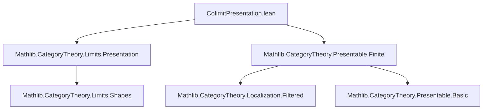

### Technical Brief: `ColimitPresentation.lean`

---

#### **1. Key Definitions & Theorems**

| Name | Type / Signature | Purpose |
|------|------------------|---------|
| `Total P` | `Type _` | Underlying type of the composite indexing category: $\Sigma j, I\,j$, equipped with a custom category structure. |
| `Total.Hom` | `Structure` | Morphisms in `Total P`: pairs `(base : j ⟶ j', hom : (P j).diag.obj i ⟶ (P j').diag.obj i')` satisfying a coherence condition `w`. |
| `Total.Hom.comp` | `def` | Composition in `Total P`, defined componentwise and verified to satisfy the coherence condition. |
| `Total.Hom.id` | `instance` | Identity morphisms in `Total P`. |
| `Total.exists_hom_of_hom` | `lemma` | Given $i : I\,j$, $u : j \to j'$, and $i$ finitely presentable, there exists $i' : I\,j'$ and a morphism $f : \text{Total.mk}\,j\,i \to \text{Total.mk}\,j'\,i'$ with $f.\text{base} = u$. |
| `IsFiltered (Total P)` | `instance` | Proves that if $J$ and all $I\,j$ are filtered and all objects in the presentations are finitely presentable, then `Total P` is filtered. |
| `bind P Q` | `def` | Given a colimit presentation $P : \text{ColimitPresentation}\,J\,X$ and for each $j$, a presentation $Q_j$ of $P.\text{diag}\,(j)$, constructs a refined colimit presentation of $X$ over `Total Q`. |
| `bind.isColimit.desc`, `bind.isColimit.fac`, `bind.isColimit.uniq` | `def` (fields) | Verify that `bind` indeed satisfies the universal property of a colimit. |

---

#### **2. Naming Conventions**

- **Prefixes**:
  - `Total.`: for constructions over the sigma-type indexing category.
  - `bind`: for the composition/refinement operation on presentations.
- **Suffixes**:
  - `.mk`: for constructors (e.g., `Total.mk`).
  - `.hom`, `.base`: for components of structured morphisms.
  - `.w`, `.w_assoc`: coherence conditions; `w_assoc` is a `reassoc` lemma.
- **Quantifier prefixes**:
  - `isColimit.`: for universal properties of colimits.
  - `ι.app`: for the colimit cocone components.

---

#### **3. Tactic Stack**

Frequently used tactics in proofs:

| Tactic | Role |
|--------|------|
| `simp` / `simp only` | Simplify using definitional equalities and lemmas like `Functor.map_comp`, `Category.assoc`. |
| `rw` / `rfl` | Rewrite using coherence conditions (`w`, `w_assoc`) or definitions. |
| `cat_disch` | In `Total.Hom.w`, discharge the naturality condition using category-theoretic reasoning. |
| `grind` | Used in `hom_small` to prove injectivity via `Function.Injective`. |
| `obtain ⟨…⟩ :=` | Extract witnesses from existential statements (e.g., from `IsFinitelyPresentable.exists_hom_of_isColimit`). |
| `refine` / `exact` | Construct terms with holes filled later. |
| `dsimp`, `simp at` | Simplify hypotheses. |
| `apply Total.Hom.ext` | Prove equality of morphisms in `Total P` using extensionality. |

---

#### **4. Proof Logic**

The logical flow follows a **structured induction + coherence verification** pattern:

1. **Category construction**:
   - Define `Total P` as $\Sigma j, I\,j$.
   - Define morphisms with coherence condition `w`.
   - Prove identity and composition laws using `simp` and `rw` on `w`.

2. **Filteredness**:
   - Use `IsFiltered` axioms on $J$ and $I\,j$.
   - Construct cocones using `IsFiltered.max`, `IsFiltered.coeq`, and `Total.exists_hom_of_hom`.
   - Use finite presentability to lift equalities in colimits.

3. **Colimit presentation refinement (`bind`)**:
   - Define the diagram over `Total Q`.
   - Define cocone legs via composition of cocones: $(Q j).\iota\,i \gg P.\iota\,j$.
   - Verify naturality using `u.w`.
   - Construct universal morphisms:
     - First using $P.\text{isColimit}.\text{desc}$,
     - Then inner desc using each $Q_j.\text{isColimit}.\text{desc}$.
   - Uniqueness follows by two-layered application of universal properties.

---

#### **5. Imports**

| Module | Purpose |
|--------|---------|
| `Mathlib.CategoryTheory.Limits.Presentation` | Core theory of colimit presentations. |
| `Mathlib.CategoryTheory.Presentable.Finite` | Finitely presentable objects and filtered categories. |

---

#### **6. Mermaid Diagrams**

##### **Dependency Graph (Module Level)**



##### **Overview of `bind` Construction**

```mermaid
graph LR
  P[ColimitPresentation J X] -->|diag j| D[j]
  Qj[Q j : ColimitPresentation (I j) (D[j])] -->|diag i| E[i]
  P -->|ι j| X
  Qj -->|ι i| D[j]
  subgraph Total Q
    S[Σ j, I j]
    S -->|base j→j'| T[j]
    S -->|hom| E[i']
  end
  bind[P Q] -->|diag| E[i]
  bind[P Q] -->|ι ⟨j,i⟩| X
```

##### **Filteredness Proof Sketch**

```mermaid
graph TD
  J[IsFiltered J] -->|max| A
  Ij[IsFiltered (I j)] -->|max| B
  FP[IsFinitelyPresentable] -->|exists_hom_of_isColimit| C
  C -->|Total.exists_hom_of_hom| D[∃ f : k → l]
  D -->|cocone_objs| E[Total P]
  E -->|IsFiltered| F[IsFiltered (Total P)]
```

---

#### **7. Summary**

This file formalizes the **composition of colimit presentations** in a locally small category $C$. It constructs a new indexing category `Total P` from a family of presentations over a filtered base, proves it is filtered under finite presentability assumptions, and defines a refined colimit presentation `bind` that refines a given presentation by substituting each component with its own presentation. The proofs rely heavily on properties of finitely presentable objects and filtered colimits, and use standard Lean tactics for category theory (`cat_disch`, `simp`, `rw`, `grind`).
