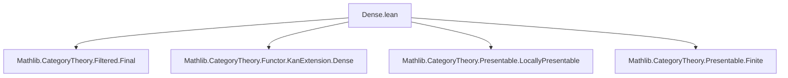

**Technical Brief: `Dense.lean` — κ-Presentable Objects Form a Dense Subcategory**

---

### **1. Key Definitions & Theorems**

| Name | Type / Signature | Purpose |
|------|------------------|---------|
| `isCardinalPresentable C κ` | `ObjectProperty C` | Full subcategory of **κ-presentable objects** in `C`. |
| `isCardinalFiltered J κ` | `Prop` | `J` is *κ-filtered*: every diagram of shape `< κ` has a cocone under a diagram of shape `< κ`. |
| `IsCardinalAccessibleCategory C κ` | `Class` | `C` is *κ-accessible*: cocomplete, κ-filtered colimits commute with κ-presentable objects, and has a small set of κ-presentable generators. |
| `isCardinalFilteredGenerator_isCardinalPresentable` | `[IsCardinalAccessibleCategory C κ] → (isCardinalPresentable C κ).IsCardinalFilteredGenerator κ` | Shows that κ-presentable objects form a **κ-filtered generator**, i.e., every object is a κ-filtered colimit of κ-presentable ones. |
| `final_toCostructuredArrow` | `[IsCardinalAccessibleCategory C κ] → p.toCostructuredArrow.Final` | The costructured arrow category `(ι ↓ X)` (for `ι : (κ-presentable) ↪ C`) is **final**, hence colimit-preserving. |
| `IsDense` instance | `[IsCardinalAccessibleCategory C κ] → (ι : (isCardinalPresentable C κ) ⥤ C).IsDense` | The inclusion `ι` of κ-presentable objects is a **dense functor**, i.e., every `X ∈ C` is the canonical colimit of `ι`-shaped diagram. |
| `IsCardinalFiltered (CostructuredArrow ι X) κ` | `[IsCardinalAccessibleCategory C κ] → ...` | The comma category `(ι ↓ X)` is κ-filtered, so the colimit expressing density is κ-filtered. |
| `isFinitelyAccessible` variants | `[IsFinitelyAccessibleCategory C]` | Special case for **finitely accessible** categories (`κ = ℵ₀`), using `isFinitelyPresentable`. |

---

### **2. Naming Conventions**

- **Prefixes**:
  - `isCardinalPresentable`: object property for κ-presentable objects.
  - `isCardinalFiltered`: property of categories/diagrams.
  - `isDense`, `Final`: categorical properties.
  - `toCostructuredArrow`: canonical functor from comma category to `J`.
- **Suffixes**:
  - `_iff`: equivalence with another characterization.
  - `_of_`: construction from a witness (e.g., `of_final`, `of_isColimit`).
  - `exists_...`: existence of colimits or mediating morphisms.
- **Module-level**:
  - `ObjectProperty.*`: reusable object-level properties (e.g., `isFinitelyPresentable`, `isCardinalPresentable`).
  - `CostructuredArrow`: comma category `(F ↓ X)` for `F : D ⥤ C`.

---

### **3. Tactic Stack**

| Tactic | Usage Frequency | Purpose |
|--------|-----------------|---------|
| `obtain ⟨...⟩` | High | Extract witnesses from existential hypotheses (e.g., colimit data). |
| `rw [...]` | High | Rewrite using definitional equalities or lemmas (e.g., `← isCardinalFiltered_aleph0_iff`). |
| `infer_instance` | Medium | Solve class constraints automatically (e.g., `IsFiltered`, `EssentiallySmall`). |
| `cat_disch` | Medium | Category-theoretic discharge tactic (used in `final_toCostructuredArrow`). |
| `exact`, `refine`, `apply` | Medium | Construct proofs term-by-term. |
| `Functor.final_iff_of_isFiltered` | Low | Bridge between finality and filteredness criteria. |
| `IsColimit.ofIsoColimit`, `Cocones.ext` | Low | Manipulate colimit data via isomorphisms and extensionality. |

---

### **4. Proof Logic**

The proof proceeds in three main stages:

1. **Generator Property**  
   From `IsCardinalAccessibleCategory`, use `HasCardinalFilteredGenerator.exists_generator` to get a κ-filtered generator `P`. Show that the κ-presentable objects contain this generator and are closed under iso-closure ⇒ they form a κ-filtered generator.

2. **Density via Finality**  
   For any `X : C`, use the generator property to get a diagram `p : J ⥤ C` of κ-presentable objects with colimit `X`. Consider the costructured arrow functor `p.toCostructuredArrow : (J ↓ X) ⥤ C`. Show it is **final** using:
   - κ-filteredness of `J`
   - Universal property of colimits: for any `f : ι K → X`, factor through some `p j`
   - For parallel arrows, use κ-filteredness to equalize.

   Finality ⇒ colimit of `p` is same as colimit of `(ι ↓ X) ⥤ C`, i.e., `X` is the colimit of κ-presentable objects over the comma category.

3. **κ-Filteredness of Comma Category**  
   Since `p.toCostructuredArrow` is final and `J` is κ-filtered, conclude `(ι ↓ X)` is κ-filtered (via `IsCardinalFiltered.of_final`).

For finitely accessible categories, specialize to `κ = ℵ₀`, using `isFinitelyPresentable = isCardinalPresentable ℵ₀`.

---

### **5. Imports & Dependencies**

| Import | Role |
|--------|------|
| `Mathlib.CategoryTheory.Filtered.Final` | Final functors, characterization of finality. |
| `Mathlib.CategoryTheory.Functor.KanExtension.Dense` | Dense functors, left Kan extensions, density lemma. |
| `Mathlib.CategoryTheory.Presentable.LocallyPresentable` | Accessible & locally presentable categories (context). |
| `Mathlib.CategoryTheory.Presentable.Finite` | Finitely presentable objects, `ℵ₀`-filteredness. |

---

### **6. Mermaid Diagrams**

#### **Dependency Graph (Module-Level)**



#### **Theoretical Overview (Conceptual Flow)**

```mermaid
flowchart LR
  A[IsCardinalAccessibleCategory C κ] --> B[Has κ-filtered generator P]
  B --> C[κ-presentable objects contain P]
  C --> D[κ-presentable objects form κ-filtered generator]
  D --> E[For any X, ∃ p: J ⥤ C, colim p ≅ X, J κ-filtered]
  E --> F[Costructured arrow (ι ↓ X) is final]
  F --> G[ι is dense]
  G --> H[(ι ↓ X) is κ-filtered]
  H --> I[X ≅ colim (ι ↓ X) → C]
```

#### **Specialization to Finitely Accessible**

```mermaid
flowchart LR
  A[IsFinitelyAccessibleCategory C] --> B[= IsCardinalAccessibleCategory C ℵ₀]
  B --> C[ι = isFinitelyPresentable.ι]
  C --> D[ι is dense]
  C --> E[(ι ↓ X) is filtered]
```

---

### **7. Summary**

This file establishes a foundational result in accessible category theory:  
> In a **κ-accessible** category `C`, the inclusion of **κ-presentable objects** is a **dense functor**, and the colimit expressing density is **κ-filtered**.

This is the categorical analog of expressing any algebraic structure (e.g., group, module) as a filtered colimit of its finitely presented substructures — a key tool for local presentability, model structures, and homotopy theory.

The formalization leverages:
- `Final` functors to reduce density to colimit preservation,
- `IsCardinalFiltered` to control size of diagrams,
- `ObjectProperty.isoClosure` to relate generators and presentable objects.

The `IsFinitelyAccessibleCategory` section shows the classical case `κ = ℵ₀`, where filtered colimits replace κ-filtered ones.

--- 

Let me know if you'd like a **proof sketch in natural deduction style**, or a **dependency graph of definitions/lemmas** within this file.
