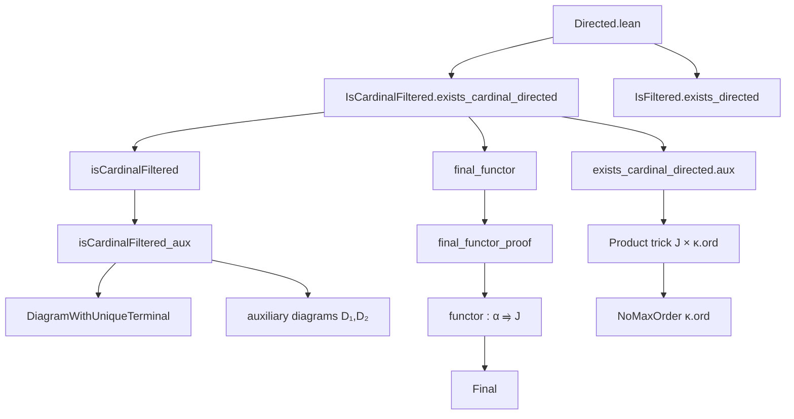
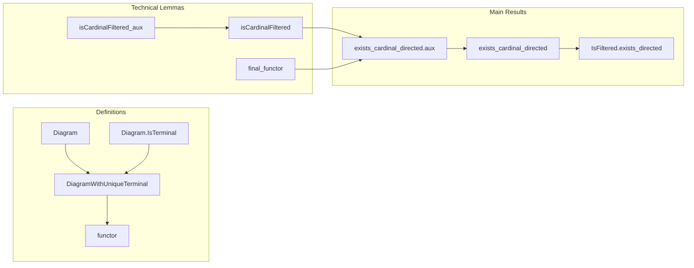

Here is the **technical metadata** extracted from the `Directed.lean` file, following your specifications:

---

### 1. **Key Definitions & Theorems**

| Name | Type / Signature | Purpose |
|------|------------------|---------|
| `Diagram` | `structure` | A `κ`-bounded diagram in `J`: data of morphisms (`W : MorphismProperty J`) and objects (`P : ObjectProperty J`) both of cardinality `< κ`. |
| `Diagram.IsTerminal` | `structure` | Defines when an object `e : J` is terminal *within* a diagram `D`, i.e., `𝟙 e ∈ D.W`, and for all `j ∈ D.P`, there's a unique `j ⟶ e` in `D.W`, compatible with composition. |
| `DiagramWithUniqueTerminal` | `structure` | A diagram with a *unique* terminal object (`top : J`) and proof that it's terminal and unique. |
| `Diagram.single` | `Diagram J κ` | Diagram consisting of a single object `j : J` and its identity morphism. |
| `DiagramWithUniqueTerminal.single` | `DiagramWithUniqueTerminal J κ` | Diagram with unique terminal object at `j`. |
| `Diagram.iSup` | `Diagram J κ` | Union of a `κ`-indexed family of diagrams (indexed by `ι` with `HasCardinalLT ι κ`). |
| `Diagram.sup` | `Diagram J κ` | Union of two diagrams. |
| `functorMap` | `D₁ ≤ D₂ → D₁.top ⟶ D₂.top` | Maps between terminal objects induced by inclusion of diagrams. |
| `functor` | `DiagramWithUniqueTerminal J κ ⥤ J` | The functor sending a diagram with unique terminal object to its terminal object. |
| `isCardinalFiltered_aux` | `lemma` | Key technical lemma: under assumption `hJ`, any `κ`-bounded family of diagrams with unique terminal objects has a cocone over them satisfying certain compatibility. |
| `isCardinalFiltered` | `lemma` | Proves `DiagramWithUniqueTerminal J κ` is `κ`-filtered (assuming `hJ`). |
| `final_functor` | `lemma` | Shows `functor : DiagramWithUniqueTerminal J κ ⥤ J` is final (i.e., cofinal). |
| `exists_cardinal_directed.aux` | `lemma` | Main intermediate result: existence of a final functor from a `κ`-directed poset (under `hJ`). |
| `exists_cardinal_directed` | `lemma` | General case: for any `κ`-filtered `J`, there exists a final functor from a `κ`-directed poset. |
| `IsFiltered.exists_directed` | `lemma` | Classical Deligne result: for filtered `J`, there exists a final functor from a directed poset. |

---

### 2. **Naming Conventions**

- **Prefixes**:
  - `is_`: predicates (e.g., `IsTerminal`, `IsCardinalFiltered`)
  - `functor_`: constructions related to functors (e.g., `functorMap`)
  - `D₁`, `D₂`, `D₃`, `D₄`: auxiliary diagram constructions in proofs
  - `h_`: hypotheses (e.g., `hJ`, `hι`, `hW`, `hP`)
  - `prop_`: properties (e.g., `prop_id`, `prop`)
- **Suffixes**:
  - `_terminal`: terminal object-related (e.g., `IsTerminal`, `uniq_terminal`)
  - `_single`: single-object diagrams
  - `_sup`, `_iSup`: unions of diagrams
  - `_aux`: auxiliary lemmas
- **Structure fields**:
  - `toDiagram`, `top`, `isTerminal`, `uniq_terminal`
  - `W`, `P`, `src`, `tgt`, `hW`, `hP`

---

### 3. **Tactic Stack**

Frequently used tactics in this file:

| Tactic | Role |
|--------|------|
| `aesop` | Automated reasoning for subsingleton/extensionality goals |
| `simp` / `simp only` | Simplification with definitional equalities and lemmas |
| `rw` | Rewriting using equalities |
| `exact`, `refine`, `obtain`, `cases` | Proof construction and destructuring |
| `subsingleton` | Solving goals where type has at most one element |
| `ext` | Extensionality for structures/sums/products |
| `rfl` | Reflexivity for definitional equalities |
| `obtain ⟨...⟩` / `have h : ...` | Introducing intermediate facts |
| `funext`, `ext` | Extensionality for functions/structures |
| `convert` / `congr_arg` | Congruence reasoning |
| `have h : ... := ...` + `exact h` | Modular proof steps |
| `rw [assoc]`, `reassoc` | Rewriting associativity using `reassoc` attribute |

---

### 4. **Proof Logic**

The logical flow follows a **constructive category-theoretic strategy**:

1. **Reduction to special case (`hJ`)**:
   - Assume no object `m ∈ J` is “final up to isomorphism” (i.e., `∀ e, ∃ m, e ⟶ m, IsEmpty (m ⟶ e)`).
   - Construct `α := DiagramWithUniqueTerminal J κ`, a poset of `κ`-bounded diagrams with unique terminal object.

2. **Poset structure**:
   - Define `≤` by inclusion of `W` and `P`.
   - Prove antisymmetry, transitivity, reflexivity.

3. **Functor construction**:
   - Define `functor : α ⥤ J`, `D ↦ D.top`, `D₁ ≤ D₂ ↦ D₂.isTerminal.lift D₁.top`.
   - Prove functoriality using `comm` property.

4. **`κ`-filteredness of `α`**:
   - Use `isCardinalFiltered_aux`: given a `κ`-small family in `α`, construct a cocone over their terminals in `J`, then lift to a cocone in `α`.
   - Key step: define auxiliary diagrams `D₁`, `D₂`, `D₃`, `D₄` to encode required morphisms and ensure terminality.

5. **Finality of `functor`**:
   - Use `final_functor`: for any `j ∈ J`, `D : α`, and `f₁, f₂ : j ⟶ D.top`, find `D' ≥ D` and `m : J` such that `f₁, f₂` coequalize in `D'.top`.
   - Again, uses auxiliary diagrams `D₃`, `D₄`, and `hJ` to construct suitable `m₁`, `u`, and terminal object `hm₁`.

6. **General case**:
   - For arbitrary `κ`-filtered `J`, reduce to previous case via product with `κ.ord.ToType` (a `κ`-directed poset with no max).
   - Use `exists_cardinal_directed.aux` on `J × κ.ord.ToType`.

7. **Classical filtered case**:
   - Apply `IsCardinalFiltered.exists_cardinal_directed` with `κ = ℵ₀`, and use equivalence `IsFiltered ↔ IsCardinalFiltered ℵ₀`.

---

### 5. **Imports**

| Import | Purpose |
|--------|---------|
| `Mathlib.CategoryTheory.Filtered.Final` | Final functors and related lemmas |
| `Mathlib.CategoryTheory.Limits.Final` | Final objects and limits |
| `Mathlib.CategoryTheory.Limits.Shapes.Multiequalizer` | Multispan/cocone constructions |
| `Mathlib.CategoryTheory.MorphismProperty.HasCardinalLT` | Morphism properties bounded by cardinal |
| `Mathlib.CategoryTheory.ObjectProperty.HasCardinalLT` | Object properties bounded by cardinal |
| `Mathlib.CategoryTheory.Presentable.IsCardinalFiltered` | `κ`-filtered categories |
| `Mathlib.CategoryTheory.Products.Unitor` | Product unitors (for `Prod.fst`) |

---

### 6. **Mermaid Diagrams**

#### **Dependency Graph (High-Level)**

#### **Overview of File Structure**

---

Let me know if you'd like a **dependency graph of definitions** (e.g., which lemmas depend on which structures), or a **tactic usage heatmap** per lemma.
