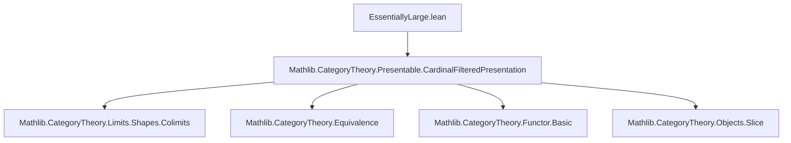

**Technical Brief: `EssentiallyLarge.lean`**

---

### 1. **Key Definitions & Theorems**

| Name | Type / Signature | Purpose |
|------|------------------|---------|
| `ObjectProperty.IsCardinalFilteredGenerator` | `P.IsCardinalFilteredGenerator κ` | A property of a subcategory `P ⊆ C` asserting that every object of `C` is a `κ`-filtered colimit of objects from `P`. |
| `ObjectProperty.EssentiallySmall` | `ObjectProperty.EssentiallySmall.{w} P` | `P` is essentially small: up to equivalence, its objects form a small type (in `Type w`). |
| `equivSmallModel.{w} P.FullSubcategory` | `equivSmallModel` | Equivalence between `P.FullSubcategory` and a small category (used to model `P` concretely). |
| `essentiallyLarge_top` | `ObjectProperty.EssentiallySmall.{w + 1} ⊤` | If `C` has a `κ`-filtered generator `P` that is essentially small, then the *top* property (i.e., all objects of `C`) is essentially small *in the next universe level* (`w + 1`). |
| `HasCardinalFilteredGenerator.exists_equivalence` | `∃ (J : Type (w + 1)) (_ : Category.{w} J), Nonempty (C ≌ J)` | Main theorem: If `C` has a `κ`-filtered generator (e.g., is locally `κ`-presentable or `κ`-accessible), then `C` is equivalent to a `w`-large category (objects in `Type (w+1)`, morphisms in `Type w`). |

---

### 2. **Naming Conventions**

- **Prefixes**:
  - `is_`: e.g., `IsCardinalFilteredGenerator`, `IsColimit`, `IsSmall`.
  - `essentiallyLarge_`: e.g., `essentiallyLarge_top`.
  - `ofObj`: constructs an `ObjectProperty` from a family of objects.
- **Suffixes**:
  - `_top`: denotes the maximal object property (`⊤`), i.e., all objects.
  - `_generator`: used for generator-related constructions.
  - `_fullSubcategory`: for full subcategories induced by object properties.
- **Functorial notation**:
  - `ι`, `e`, `φ`, `G`, `p`, `iso`: standard categorical notation for diagrams, equivalences, colimiting cocones, and isomorphisms.

---

### 3. **Tactic Stack**

- `refine`: to construct proofs with holes (`?_`) to be filled later.
- `obtain ⟨...⟩`: destructuring existential/dependent pairs.
- `let ... := ...`: local definitions (e.g., `e`, `ι`, `φ`, `G`, `i`).
- `rw [exists_equivalence_iff_of_locallySmall]`: rewriting using an equivalence criterion.
- `inferInstance`: to synthesize typeclass instances (e.g., `SmallCategory J`, `HasColimit`).
- `exact ...`: closing goals with a direct proof term.
- `hasColimit_of_iso`: derived from `iso` to transport colimit existence.
- `Functor.associator`, `Functor.isoWhiskerLeft`, `Functor.rightUnitor`, `≪≫`: manipulation of natural isomorphisms and whiskering.
- `IsColimit.precomposeHomEquiv`: used to transfer colimit cocones along isomorphisms.

---

### 4. **Proof Logic**

The proof proceeds in two main steps:

1. **`essentiallyLarge_top`**:
   - Start with a generator `P` that is essentially small and `κ`-filtered.
   - Use `equivSmallModel` to embed `P.FullSubcategory` into a small category.
   - Define a family `φ` of colimits over diagrams indexed by small categories `J` mapping into `C` via `P`.
   - Show that every object `X : C` is a retract (up to iso) of some `φ i`, using the assumption that `X` is a `κ$-filtered colimit of objects from `P`.
   - Construct an explicit witness `i : ι` and use the universal property of colimits to get the required iso.

2. **`HasCardinalFilteredGenerator.exists_equivalence`**:
   - Extract a generator `P` from `HasCardinalFilteredGenerator`.
   - Apply `essentiallyLarge_top` to get that `⊤` is essentially small in `Type (w+1)`.
   - Use `exists_equivalence_iff_of_locallySmall`, which states that a locally small category is equivalent to a category in a higher universe iff its object property `⊤` is essentially small there.

---

### 5. **Imports**

- `Mathlib.CategoryTheory.Presentable.CardinalFilteredPresentation`: Provides foundational definitions and results about `κ`-filtered generators, accessible/locally presentable categories.

---

### 6. **Mermaid Diagrams**

#### Dependency Graph (Module-Level)



#### Overview of Theoretical Flow

```mermaid
flowchart LR
  A[κ-Filtered Generator P] -->|essentially small| B[equivSmallModel P]
  B --> C[Family φ of colimits]
  C --> D[⊤ essentially small in Type (w+1)]
  D --> E[C ≌ J, J : Type (w+1)]
  A -->|HasCardinalFilteredGenerator| E
```

---

### 7. **Universe & Type Constraints**

- Universes: `w`, `v`, `u` with `C : Type u`, `Category.{v} C`.
- Regular cardinal `κ : Cardinal.{w}`.
- `LocallySmall.{w} C`: ensures morphism types are in `Type w`.
- `ObjectProperty.EssentiallySmall.{w} P`: generator objects live in `Type w`.
- Conclusion: `C ≌ J` where `J : Type (w + 1)`, `Category.{w} J`.

---

### 8. **Summary**

This file formalizes a foundational result in higher category theory: *any category with a `κ$-filtered generator (e.g., accessible or locally presentable categories) is equivalent to a $w$-large category*. The proof leverages:
- Small models for essentially small subcategories,
- Colimit preservation under equivalence,
- Universe lifting via `ObjectProperty.ofObj`.

It serves as a stepping stone for embedding accessible categories into concrete large categories (e.g., for set-theoretic foundations or model-categorical constructions).
