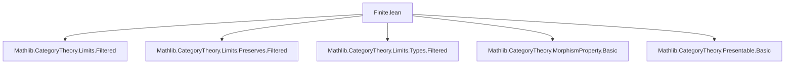

**Technical Brief: `Finite.lean` — Finitely Presentable Objects in Category Theory**

---

### 1. **Key Definitions & Theorems**

| Name | Type / Signature | Purpose |
|------|------------------|---------|
| `Functor.IsFinitelyAccessible` | `abbrev Functor.IsFinitelyAccessible (F : C ⥤ D) : Prop := IsCardinalAccessible.{w} F ℵ₀` | Defines a functor as *finitely accessible* iff it is `ℵ₀`-accessible (i.e., preserves `ℵ₀`-filtered colimits). |
| `Functor.IsFinitelyAccessible_iff_preservesFilteredColimitsOfSize` | `lemma` | Equivalence between finite accessibility and preservation of filtered colimits *of a given size* (`w`). |
| `Functor.isFinitelyAccessible_iff_preservesFilteredColimits` | `lemma` | Specialization of the above to *all* filtered colimits (size-agnostic). |
| `IsFinitelyPresentable` | `abbrev IsFinitelyPresentable (X : C) : Prop := IsCardinalPresentable.{w} X ℵ₀` | Defines an object as *finitely presentable* iff its hom-functor `Hom(X, -)` preserves filtered colimits. |
| `ObjectProperty.isFinitelyPresentable` | `def` | Encodes `IsFinitelyPresentable` as an `ObjectProperty`, enabling use in subcategory constructions. |
| `MorphismProperty.isFinitelyPresentable` | `def` | Defines a morphism `f : X ⟶ Y` as finitely presentable iff it is finitely presentable as an object in `Under X`. |
| `isFinitelyPresentable_iff_preservesFilteredColimitsOfSize` | `lemma` | Equivalence: `X` is finitely presentable ⇔ `coyoneda.obj (op X)` preserves filtered colimits of size `w`. |
| `isFinitelyPresentable_iff_preservesFilteredColimits` | `lemma` | Size-agnostic version of the above. |
| `IsFinitelyPresentable.exists_hom_of_isColimit` | `lemma` | Characterization: maps from a finitely presentable object into a filtered colimit factor through some component. |
| `IsFinitelyPresentable.exists_eq_of_isColimit` | `lemma` | Characterization: two parallel maps from a finitely presentable object into a filtered colimit become equal after extending along some transition map. |
| `IsFinitelyPresentable.exists_hom_of_isColimit_under` | `lemma` | Under-category version: factorization of morphisms under a fixed map `p : X ⟶ A` through a cocone. |
| `HasCardinalFilteredColimits_iff_hasFilteredColimitsOfSize` | `lemma` | Equivalence between having all `ℵ₀`-filtered colimits (cardinal-bounded) and having filtered colimits of size `w`. |
| `HasCardinalFilteredColimits_iff_hasFilteredColimits` | `lemma` | Size-agnostic version of the above. |

---

### 2. **Naming Conventions**

- **Prefixes**:
  - `isFinitelyPresentable` / `IsFinitelyPresentable`: predicate for objects/morphisms.
  - `isFinitelyAccessible` / `IsFinitelyAccessible`: predicate for functors.
- **Suffixes**:
  - `OfSize`: indicates a size-parametered version (e.g., `PreservesFilteredColimitsOfSize`).
  - No suffix (e.g., `PreservesFilteredColimits`) implies *unrestricted* (i.e., for all sizes).
- **Property-style naming**:
  - `ObjectProperty.isFinitelyPresentable`, `MorphismProperty.isFinitelyPresentable`: used to define subcategories and morphism classes.

---

### 3. **Tactic Stack**

- `simp only [...] at *`: heavily used to simplify goals using equivalence lemmas.
- `exact H`: after simplification, directly apply hypothesis.
- `rw [← ...]`: rewrite using equivalences to switch between definitions.
- `infer_instance`: to discharge typeclass constraints (e.g., `PreservesFilteredColimitsOfSize`).
- `let ... obtain ⟨...⟩ := ...`: destruct existential quantifiers from lemmas like `exists_hom_of_isColimit`.
- `congr($(hq).right)`: for equality proofs in under-categories.

---

### 4. **Proof Logic**

- **General pattern**:
  1. Reduce to known cardinal-filtered colimit equivalences via `isCardinalFiltered_aleph0_iff`.
  2. Use `coyoneda` embedding to translate object-level properties to functor-level ones.
  3. Apply standard filtered colimit factorization properties (e.g., `Types.jointly_surjective_of_isColimit`).
  4. For under-categories, construct auxiliary cocones and apply the base-case lemmas.

- **Inductive/structural style**: Not induction-based; relies on *universal properties* of filtered colimits and representability.

---

### 5. **Imports**

| Module | Purpose |
|--------|---------|
| `Mathlib.CategoryTheory.Limits.Filtered` | Basic theory of filtered diagrams and colimits. |
| `Mathlib.CategoryTheory.Limits.Preserves.Filtered` | Preservation of filtered colimits by functors. |
| `Mathlib.CategoryTheory.Limits.Types.Filtered` | Concrete filtered colimits in `Type`. |
| `Mathlib.CategoryTheory.MorphismProperty.Basic` | Framework for morphism properties (used for `MorphismProperty.isFinitelyPresentable`). |
| `Mathlib.CategoryTheory.Presentable.Basic` | General theory of `κ`-presentable objects and accessible functors. |

---

### 6. **Mermaid Diagrams**

#### **Dependency Graph (Module-Level)**



#### **Conceptual Overview (Theory Flow)**

```mermaid
flowchart LR
  subgraph Definitions
    D1[IsFinitelyPresentable X]
    D2[IsFinitelyAccessible F]
    D3[ObjectProperty.isFinitelyPresentable]
    D4[MorphismProperty.isFinitelyPresentable]
  end

  subgraph Equivalences
    E1[PreservesFilteredColimits (coyoneda.obj (op X))]
    E2[PreservesFilteredColimits F]
  end

  subgraph Characterizations
    C1[Factorization through finite stage]
    C2[Equality up to common extension]
    C3[Under-category factorization]
  end

  D1 -->|↔| E1
  D2 -->|↔| E2
  D1 --> C1
  D1 --> C2
  D1 --> C3
```

#### **Underlying Logical Structure**

- **Representability**: `IsFinitelyPresentable X ↔ Hom(X, -)` preserves filtered colimits.
- **Yoneda embedding**: Links object-level properties to functor-level preservation.
- **Filtered colimit factorization**: Core technical tool for proofs about finitely presentable objects.

---

### 7. **Summary**

This module formalizes the theory of *finitely presentable objects* and *finitely accessible functors* in a general category-theoretic setting. It leverages the existing `κ`-presentable framework (via `IsCardinalPresentable` and `IsCardinalAccessible`) and specializes to `κ = ℵ₀`. Key results include:

- Equivalence between finite presentability and preservation of filtered colimits (via coyoneda).
- Factorization properties of maps from finitely presentable objects into filtered colimits.
- Extension to morphisms via under-categories.
- Size-equivalence lemmas for filtered colimits.

The formalization is clean, modular, and aligns with standard categorical practice (e.g., “compact” = “finitely presentable”).

--- 

Let me know if you'd like a **proof sketch** of a specific lemma or a **dependency graph of definitions** at the term level.
