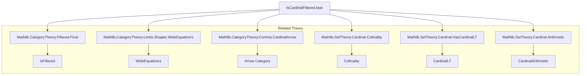
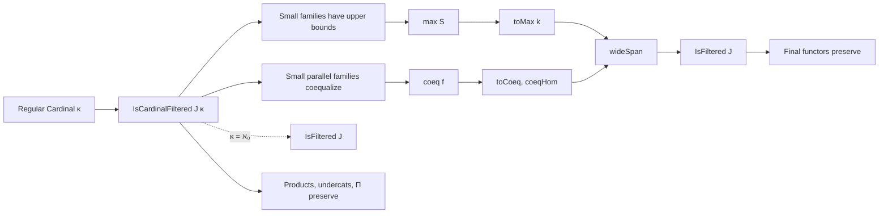

### Technical Brief: `IsCardinalFiltered.lean`

---

#### **1. Key Definitions & Theorems**

| Name | Type / Signature | Purpose |
|------|------------------|---------|
| `IsCardinalFiltered` | `class IsCardinalFiltered (J : Type u) [Category J] (κ : Cardinal) [Fact κ.IsRegular] : Prop` | Defines a category `J` as *κ-filtered*: every functor from a small category `A` with `Arrow A` of cardinality `< κ` admits a cocone. |
| `cocone` | `cocone {A} (F : A ⥤ J) (hA : HasCardinalLT (Arrow A) κ) : Cocone F` | Noncomputable choice of cocone for such functors in a `κ`-filtered category. |
| `max` | `max (S : K → J) (hS : HasCardinalLT K κ) : J` | A common target object for a family `S` of size `< κ`. |
| `toMax` | `toMax (k : K) : S k ⟶ max S hS` | Morphism from each `S k` to the `max` object. |
| `coeq` | `coeq (f : K → (j ⟶ j')) (hK : HasCardinalLT K κ) : J` | Object coequalizing a family of parallel morphisms `f` indexed by `K` of size `< κ`. |
| `coeqHom`, `toCoeq` | `coeqHom : j' ⟶ coeq f hK`, `toCoeq : j ⟶ coeq f hK` | Canonical morphisms into the coequalizer object. |
| `wideSpan` | `wideSpan {ι} {j} {k} (f : ∀ i, j ⟶ k i) (hι : HasCardinalLT ι κ) : ∃ m, …` | Generalized span property: any wide diagram (family of arrows from a fixed object) has a cocone. |
| `isFiltered_of_isCardinalFiltered` | `IsCardinalFiltered J κ → IsFiltered J` | Shows that `κ`-filtered implies filtered (for any regular `κ`). |
| `isCardinalFiltered_aleph0_iff` | `IsCardinalFiltered J ℵ₀ ↔ IsFiltered J` | Equivalence between ℵ₀-filtered and filtered categories. |
| `isCardinalFiltered_iff` | `IsCardinalFiltered J κ ↔ (∀ small family, ∃ common target) ∧ (∀ small family of parallel arrows, ∃ coequalizer)` | Concrete characterization: two universal properties (small families have upper bounds; small parallel families can be coequalized). |
| `IsCardinalFiltered.of_final` | `F.Final → IsCardinalFiltered J₁ κ → IsCardinalFiltered J₂ κ` | `κ`-filteredness descends along final functors (generalizing `IsFiltered.of_final`). |
| `isCardinalFiltered_preorder` | `Preorder J → (∀ small subset, ∃ upper bound) → IsCardinalFiltered J κ` | Preordered sets with small upper bounds are `κ`-filtered categories. |
| `instance κ.ord.ToType` | `IsCardinalFiltered κ.ord.ToType κ` | The ordinal category `κ.ord.ToType` is `κ`-filtered. |
| `instance Under j₀` | `IsCardinalFiltered (Under j₀) κ` | Undercategories inherit `κ`-filteredness. |
| `instance Prod`, `instance Pi` | `IsCardinalFiltered (J₁ × J₂) κ`, `IsCardinalFiltered (∀ i, J i) κ` | Products and pointwise functors preserve `κ`-filteredness. |

---

#### **2. Naming Conventions**

- **Prefixes**:
  - `isCardinalFiltered_`: for equivalences and properties of `IsCardinalFiltered`.
  - `isFiltered_of_`: implications from `κ`-filtered to filtered.
  - `of_`: structural inheritance (e.g., `of_final`, `of_equivalence`, `of_le`).
  - `max`, `coeq`, `toMax`, `toCoeq`, `coeqHom`: concrete constructions from the definition.
  - `wideSpan`: generalization of the span property.

- **Suffixes**:
  - `_iff`: logical equivalences.
  - `_aux₁`, `_aux₂`: intermediate lemmas in proofs of `isCardinalFiltered_iff`.
  - `_condition`: coherence conditions (e.g., `coeq_condition`).

- **Variable naming**:
  - `ι`, `K`, `S`, `f`, `j`, `k`, `l`, `m`: standard for indexing types and objects/morphisms.
  - `hι`, `hK`, `hS`, `hA`: hypotheses on cardinalities (`HasCardinalLT`).

---

#### **3. Tactic Stack**

Frequently used tactics in proofs:

| Tactic | Role |
|--------|------|
| `simp only [...]` | Simplify using definitional equalities and lemmas (e.g., `coeq_condition`, `reassoc_of%`). |
| `aesop` | Automated reasoning for simple goals (e.g., surjectivity, nonempty). |
| `grind` | Custom simplifier for category-theoretic coherence (likely defined in Mathlib). |
| `ext` | Extensionality for morphisms (e.g., in naturality proofs). |
| `obtain ⟨…⟩ := …` | Destructive existential/universal quantifiers. |
| `choose … using …` | Choice principle for families. |
| `rw [...]` | Rewrite using equivalences or lemmas. |
| `infer_instance` | Solve typeclass goals. |
| `simpa using …` | Simplify and apply a hypothesis. |
| `dsimp`, `simp` | Definitional simplification. |

---

#### **4. Proof Logic**

The logical flow of most proofs follows this pattern:

1. **Reduction to concrete properties**:
   - Use `isCardinalFiltered_iff` to reduce to verifying two universal properties (small families have upper bounds; small parallel families coequalize).
2. **Construction via `cocone`**:
   - Build cocones using `cocone`, `max`, `coeq`, and their morphisms.
3. **Verification of naturality/wide-span/coequalizing conditions**:
   - Use `coeq_condition`, `reassoc_of%`, and `naturality` lemmas.
4. **Inheritance lemmas**:
   - For final functors, products, undercategories, etc., decompose the diagram, apply `cocone` in components, and reassemble.
5. **Equivalence with filtered categories**:
   - Use `isCardinalFiltered_aleph0_iff` and `isFiltered_of_isCardinalFiltered` to connect with classical filtered category theory.

Induction is not used; instead, the proofs rely on:
- **Choice principles** (`Classical.arbitrary`, `choose`)
- **Cardinal arithmetic facts** (`lt_of_lt_of_le`, `cof_eq`, `aleph0_le`)
- **Universal properties** of cocones and coequalizers.

---

#### **5. Imports**

| Module | Purpose |
|--------|---------|
| `Mathlib.CategoryTheory.Filtered.Final` | Final functors and filtered categories. |
| `Mathlib.CategoryTheory.Limits.Shapes.WideEqualizers` | Wide equalizers (used in `wideSpan`). |
| `Mathlib.CategoryTheory.Comma.CardinalArrow` | Arrow categories and cardinality bounds. |
| `Mathlib.SetTheory.Cardinal.Cofinality` | Cofinality and regular cardinals. |
| `Mathlib.SetTheory.Cardinal.HasCardinalLT` | `HasCardinalLT` and related cardinal arithmetic. |
| `Mathlib.SetTheory.Cardinal.Arithmetic` | Basic cardinal arithmetic (e.g., `κ × κ = κ` for regular `κ`). |

---

#### **8. Mermaid Diagrams**

##### **Dependency Graph (Module-Level)**

##### **Overview of `IsCardinalFiltered` Theory**

---

### Summary

This module formalizes **κ-filtered categories**, a generalization of filtered categories parameterized by a regular cardinal `κ`. It provides:
- A clean categorical definition (`IsCardinalFiltered`)
- A concrete characterization (`isCardinalFiltered_iff`)
- A robust API (`max`, `coeq`, `wideSpan`, etc.)
- Preservation properties (final functors, products, undercategories)
- Equivalence with classical filtered categories at `κ = ℵ₀`.

It serves as a foundational tool for **locally presentable and accessible categories**, as referenced in Adámek–Rosický.
