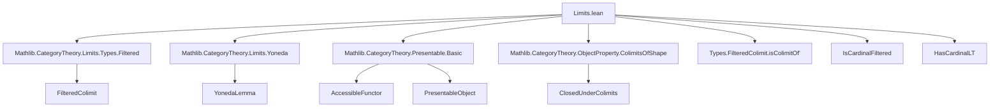

Here is the **technical metadata extraction** for the Lean 4 file `Limits.lean`, focusing on definitions, naming conventions, proof structure, and dependencies.

---

### **1. KEY DEFINITIONS & THEOREMS**

| Name | Type / Signature | Purpose |
|------|------------------|---------|
| `isColimitMapCocone` | `IsColimit (c.pt.mapCocone cX)` | Proves that the induced cocone `c.pt.mapCocone cX` is a colimit under filteredness and cardinality assumptions. |
| `isColimitMapCocone.surjective` | `∀ x : c.pt.obj cX.pt, ∃ j, x' , x = ...` | Surjectivity of the colimit cocone structure map. |
| `isColimitMapCocone.injective` | `∀ j x₁ x₂, ... → ∃ j', α, ...` | Injectivity up to eventual equality in the filtered diagram. |
| `isCardinalAccessible_of_isLimit` | `{F : K ⥤ C ⥤ Type w'} → IsLimit c → ... → c.pt.IsCardinalAccessible κ` | Shows that if all components of a limit cone are `κ`-accessible, then the limit object is `κ`-accessible. |
| `isCardinalPresentable_of_isColimit'` | `{Y : K ⥤ C} → IsColimit c → ... → IsCardinalPresentable c.pt κ` | Shows colimits of `κ`-presentable objects are `κ`-presentable, using Yoneda embedding. |
| `isCardinalPresentable_of_isColimit` | Same as above, but assumes `LocallySmall C`. | Simplified version of `isCardinalPresentable_of_isColimit'` for locally small categories. |
| `isClosedUnderColimitsOfShape_isCardinalPresentable` | `(isCardinalPresentable C κ).IsClosedUnderColimitsOfShape J` | Main theorem: `κ`-presentable objects are closed under colimits indexed by `J` when `HasCardinalLT (Arrow J) κ`. |

---

### **2. NAMING CONVENTIONS**

- **Prefixes**:
  - `isColimitMapCocone.*`: auxiliary lemmas for constructing `IsColimit`.
  - `isCardinalAccessible_*`, `isCardinalPresentable_*`: properties of objects/functors being `κ`-accessible or `κ`-presentable.
  - `preservesColimitOfShape_*`: preservation of certain colimits.
- **Suffixes**:
  - `_of_isLimit`, `_of_isColimit`: derived from limit/colimit assumptions.
  - `_iff_*`: characterizations via equivalences.
  - `_condition`, `_spec`: used in choice-based arguments (e.g., `H φ.choose_spec`).
- **Variables**:
  - `c`, `cX`, `F`, `X`, `Y`: standard cone/cocone and diagram variables.
  - `κ`: cardinal parameter for accessibility/presentability.
  - `hK`, `hJ`: cardinality constraints on indexing categories.

---

### **3. TACTIC STACK**

Frequent tactics used in proofs:

| Tactic | Usage |
|--------|-------|
| `obtain ⟨...⟩` / `rcases` | Extracting witnesses from existential hypotheses. |
| `have H := ...; let ... := H.choose` | Axiom of choice / dependent choice style reasoning. |
| `dsimp`, `simp`, `simp only [...]` | Simplification of typeclass instances, naturality, and evaluation. |
| `rw [...]` | Rewriting using naturality, functoriality, or universal properties. |
| `ext` | Extensionality for functions/natural transformations. |
| `apply ...` / `exact ...` | Applying lemmas or constructing terms directly. |
| `infer_instance` | Solving typeclass goals (e.g., `IsCardinalFiltered`, `IsRegular`). |
| `simpa [...] using ...` | Simplifying and applying a proof. |
| `refine ⟨...⟩` | Constructing structured objects (e.g., cones, cocones, natural transformations). |

---

### **4. PROOF LOGIC**

The logical flow follows a **cardinal-filtered colimit stability argument**, typical in accessible category theory:

1. **Setup**:
   - Assume `J` is `κ`-filtered (`IsCardinalFiltered J κ`) and indexing category `K` satisfies `HasCardinalLT (Arrow K) κ`.
   - Given a cone `c : Cone F` with `IsLimit c`, and a cocone `cX : Cocone X`, assume each `F k` preserves colimits of shape `J`.

2. **Goal**: Show `c.pt.mapCocone cX` is a colimit.

3. **Strategy**:
   - Use `Types.FilteredColimit.isColimitOf'`, which reduces to proving **surjectivity** and **injectivity** of the colimit cocone structure.
   - For **surjectivity**:
     - Lift an element `x` through the limit condition on `c.pt.obj Y`.
     - Use filteredness of `J` and cardinal bounds on `K` to find a common index `j₁` where elements stabilize.
   - For **injectivity**:
     - Use the same filteredness to identify a common extension where two elements become equal.

4. **Generalization**:
   - Apply this to Yoneda embedding to deduce closure of `κ`-presentable objects under colimits.

---

### **5. IMPORTS**

| Module | Purpose |
|--------|---------|
| `Mathlib.CategoryTheory.Limits.Types.Filtered` | Filtered categories and their colimits. |
| `Mathlib.CategoryTheory.Limits.Yoneda` | Yoneda embedding and its properties. |
| `Mathlib.CategoryTheory.Presentable.Basic` | Definitions of `κ`-accessible and `κ`-presentable objects/functors. |
| `Mathlib.CategoryTheory.ObjectProperty.ColimitsOfShape` | Closure properties under colimits of a given shape. |

---

### **6. DEPENDENCY & OVERVIEW DIAGRAM**

#### **Dependency Graph (Mermaid)**



#### **Overview Diagram (Mermaid)**

```mermaid
flowchart LR
  subgraph Setup
    J[κ-filtered J] --> H1
    K[HasCardinalLT (Arrow K) κ] --> H1
    F[K ⥤ C ⥤ Type] --> H1
    c[IsLimit c] --> H1
    cX[Cocone X] --> H1
    hF[∀ k, IsColimit ((F k).mapCocone cX)] --> H1
  end

  H1[isColimitMapCocone] --> H2[surjective]
  H1 --> H3[injective]
  H2 & H3 --> H4[IsColimit (c.pt.mapCocone cX)]

  H4 --> H5[isCardinalAccessible_of_isLimit]
  H5 --> H6[Preservation of accessibility under limits]

  H4 & Yoneda --> H7[isCardinalPresentable_of_isColimit']
  H7 --> H8[Preservation of presentability under colimits]

  H8 --> H9[isClosedUnderColimitsOfShape_isCardinalPresentable]
```

---

Let me know if you'd like a **formalized summary** of the main theorem in Lean syntax or a **proof sketch in natural language**.
