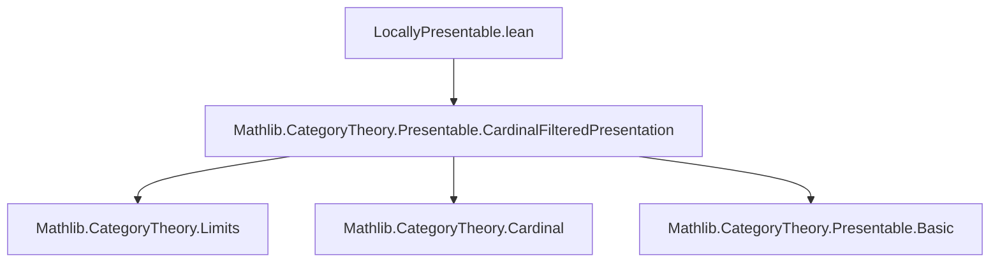
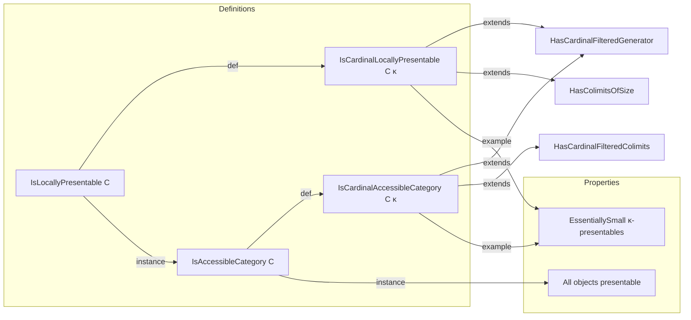

**Technical Brief: `LocallyPresentable.lean`**

---

### 1. **Key Definitions & Theorems**

| Name | Type | Purpose |
|------|------|---------|
| `IsCardinalLocallyPresentable C κ` | `Prop` | Defines a category `C` as *κ-locally presentable*: cocomplete + has a small family of κ-presentable objects generating `C` under κ-filtered colimits. Extends `HasCardinalFilteredGenerator` and `HasColimitsOfSize`. |
| `IsCardinalAccessibleCategory C κ` | `Prop` | Defines a category `C` as *κ-accessible*: has κ-filtered colimits + has a small family of κ-presentable objects generating `C` under κ-filtered colimits. Extends `HasCardinalFilteredGenerator` and `HasCardinalFilteredColimits`. |
| `IsLocallyFinitelyPresentable` | `abbrev` | Special case: `IsCardinalLocallyPresentable C ℵ₀`. |
| `IsFinitelyAccessibleCategory` | `abbrev` | Special case: `IsCardinalAccessibleCategory C ℵ₀`. |
| `IsLocallyPresentable C` | `class Prop` | Exists some regular `κ` such that `IsCardinalLocallyPresentable C κ`. |
| `IsAccessibleCategory C` | `class Prop` | Exists some regular `κ` such that `IsCardinalAccessibleCategory C κ`. |
| `IsPresentable X` (implicit via `IsCardinalPresentable`) | `ObjectProperty` | An object `X` is *presentable* if it preserves κ-filtered colimits for some κ. |
| `example (κ) [Fact κ.IsRegular] [IsCardinalLocallyPresentable C κ] : ObjectProperty.EssentiallySmall (isCardinalPresentable C κ)` | `Prop` | In a κ-locally presentable category, the collection of κ-presentable objects is essentially small. |
| `example (κ) [Fact κ.IsRegular] [IsCardinalAccessibleCategory C κ] : ObjectProperty.EssentiallySmall (isCardinalPresentable C κ)` | `Prop` | Same as above for accessible categories. |
| `instance [IsLocallyPresentable C] : IsAccessibleCategory C` | `instance` | Every locally presentable category is accessible. |
| `instance [IsAccessibleCategory C] (X : C) : IsPresentable X` | `instance` | In any accessible category, every object is presentable. |

---

### 2. **Naming Conventions**

- **Prefixes**:
  - `IsCardinal...`: Relativized to a specific regular cardinal `κ`.
  - `Is...`: Absolute notions (existence of *some* `κ`).
  - `Has...`: Structural properties (e.g., existence of colimits).
- **Suffixes**:
  - `...Generator`: Indicates existence of a generating family.
  - `...Colimits`: Indicates existence of certain colimits.
- **Abbreviations**:
  - `LocallyFinitelyPresentable`, `FinitelyAccessibleCategory`: Use `ℵ₀`.

---

### 3. **Tactic Stack**

- `inferInstance`: Used heavily to discharge typeclass goals (e.g., `inferInstance` in `example` and `instance` proofs).
- `obtain ⟨κ, hκ, h'⟩ := ...`: Pattern-matching existential quantifiers.
- `by` + `obtain` + `exact`: Minimal tactic scripts; mostly rely on typeclass inference.
- `aesop`, `ring`, `simp_rw`: Not present in this file — proof content is minimal, mostly typeclass inference and definitional unfolding.

---

### 4. **Proof Logic**

- **Structure**: Definitions are layered:
  1. First define *relative* notions (`IsCardinal...`) for a fixed `κ`.
  2. Then define *absolute* notions (`Is...`) via existence of such `κ`.
- **Proof style**:
  - Most proofs are one-liners or rely on `inferInstance`.
  - Existential elimination (`obtain ⟨κ, _, _⟩`) is standard.
  - The key logical step: From `IsAccessibleCategory C`, deduce `IsPresentable X` for all `X`, via the generator property.

---

### 5. **Imports**

- `Mathlib.CategoryTheory.Presentable.CardinalFilteredPresentation`: Provides foundational notions like:
  - `isCardinalPresentable`
  - `HasCardinalFilteredGenerator`
  - `HasCardinalFilteredColimits`
  - `HasColimitsOfSize`

This file builds on the *cardinal-filtered presentation* framework to define and reason about presentability and accessibility.

---

### 8. **Mermaid Diagrams**

#### Dependency Graph (Module-Level)

#### Conceptual Overview

#### Theory Context

- This file sits in the *presentable category theory* hierarchy:
  - `CardinalFilteredPresentation` provides the technical infrastructure (filtered colimits indexed by cardinals).
  - `LocallyPresentable` abstracts over that to define *local presentability* and *accessibility*.
  - Further files likely extend this to functors (`IsAccessibleFunctor`, etc.) and to toposes or model structures.

--- 

Let me know if you'd like a formal dependency graph (e.g., `leanpkg graph`) or a comparison with the Adámek–Rosický reference.
