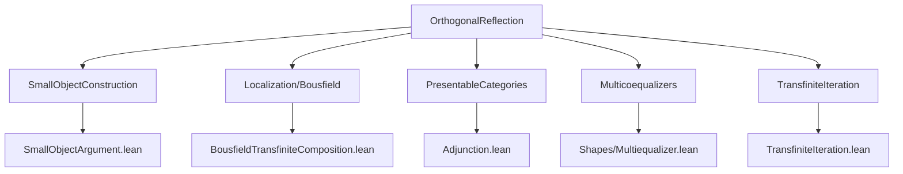

Here is the **technical metadata** extracted from `OrthogonalReflection.lean`, formatted as requested:

---

### 1. **Key Definitions & Theorems**

| Name | Type / Signature | Purpose |
|------|------------------|---------|
| `D₁` | `Σ (f : W.toSet), f.1.left ⟶ Z` | Index type for morphisms `f : X → Y` in `W` equipped with a map `X → Z`. |
| `D₁.obj₁`, `D₁.obj₂` | `D₁ → C` | Extract domain/codomain of the `W`-morphism in a `D₁`-element. |
| `D₁.l`, `D₁.t` | `∐ obj₁ ⟶ Z`, `∐ obj₁ ⟶ ∐ obj₂` | Coproduct maps encoding all `X → Z` and all `f : X → Y` in `W`. |
| `D₁.ιLeft`, `D₁.ιRight` | `X ⟶ ∐ obj₁`, `Y ⟶ ∐ obj₂` | Canonical inclusions into coproducts. |
| `step W Z` | `Pushout (D₁.t) (D₁.l)` | Intermediate object in the construction of `succ W Z`. |
| `toStep W Z` | `Z ⟶ step W Z` | Canonical map from `Z` to the pushout. |
| `D₂` | `Σ (f : W.toSet), (f.right ⟶ step W Z) × (f.right ⟶ step W Z) // f ≫ g₁ = f ≫ g₂` | Index type for pairs of morphisms out of `Y` that become equal after precomposition with `f ∈ W`. |
| `D₂.multispanShape`, `D₂.multispanIndex` | `MultispanShape`, `MultispanIndex` | Diagram shape for multicoequalizer. |
| `succ W Z` | `Multicoequalizer (D₂.multispanIndex)` | Successor object: coequalizes all `W`-local pairs over `step W Z`. |
| `fromStep W Z` | `step W Z ⟶ succ W Z` | Projection to multicoequalizer. |
| `toSucc W Z` | `Z ⟶ succ W Z` | Composite `toStep ≫ fromStep`. |
| `isLocal_isLocal_toSucc` | `W.isLocal.isLocal (toSucc W Z)` | `toSucc W Z` is `W`-local (i.e., orthogonal to all `W`-maps). |
| `isIso_toSucc_iff` | `IsIso (toSucc W Z) ↔ W.isLocal Z` | Characterization of when `toSucc W Z` is an iso: iff `Z` is `W`-local. |
| `succStruct W Z₀` | `SuccStruct C` | Successor structure used for transfinite iteration, starting at `Z₀`. |
| `reflectionObj W Z κ` | `C` | Transfinite iteration of `succStruct` up to ordinal `κ`. |
| `reflection W Z κ` | `Z ⟶ reflectionObj W Z κ` | Canonical map from `Z` to its reflection. |
| `transfiniteCompositionOfShapeReflection` | `W.isLocal.isLocal.TransfiniteCompositionOfShape ...` | Shows `reflection` is a transfinite composition of `W`-local maps. |
| `iterationObjSuccIso` | `(iteration j).obj (succ _) ≅ succ ((iteration j).obj _)` | Identifies successive steps in the iteration. |
| `iteration_map_succ_injectivity`, `iteration_map_succ_surjectivity` | Lemmas about `W`-orthogonality lifting through iteration. |
| `isLocal_reflectionObj` | `W.isLocal (reflectionObj W Z κ)` | The reflection object is `W`-local. |
| `corepresentableBy` | `(W.isLocal.ι ⋙ coyoneda.obj (op Z)).CorepresentableBy ...` | Shows `reflectionObj` corepresents the functor `Hom(-, Z)` restricted to `W.isLocal`. |
| `isRightAdjoint_ι` | `W.isLocal.ι.IsRightAdjoint` | Inclusion `W.isLocal ⥤ C` has a left adjoint (i.e., reflects `W`-localization). |
| `isRightAdjoint_ι_isLocal` | `W.isLocal.ι.IsRightAdjoint` under assumptions | Formal statement of existence of left adjoint (implication (i)→(ii) in Adámek–Rosický Thm 1.39). |
| `isLocallyPresentable_isLocal` | `IsCardinalLocallyPresentable W.isLocal.FullSubcategory κ` | `W.isLocal` is locally presentable under assumptions. |

---

### 2. **Naming Conventions**

- **Prefixes**:
  - `D₁`, `D₂`: indexing types for data in step 1 and step 2 of the construction.
  - `obj₁`, `obj₂`: projections from `D₁`/`D₂` to domain/codomain.
  - `ιLeft`, `ιRight`: coproduct injections.
  - `l`, `t`: maps from coproducts (likely for “labeling” and “transition”).
  - `toStep`, `fromStep`, `toSucc`: canonical maps in the construction chain.
  - `succ`, `reflectionObj`, `reflection`: successor and reflection objects/maps.
  - `iteration`, `iterationObjSuccIso`: iteration-related objects and isos.

- **Suffixes**:
  - `_assoc`, `_obj`, `_map`: for naturality, associativity, or functoriality variants.
  - `_injectivity`, `_surjectivity`: properties of maps with respect to `W`.
  - `_iff`, `_iff_iff`: characterizations of isomorphisms or equivalences.

- **Other patterns**:
  - `isLocal_...`: properties of objects/morphisms being `W`-local.
  - `transfiniteCompositionOfShape...`: for transfinite composition data.
  - `corepresentableBy`: corepresentability of a functor.

---

### 3. **Tactic Stack**

Frequent tactics used in proofs:

- `simp` / `simp only` / `simp [reassoc_of% ...]`: simplification using associativity and definitional equalities.
- `ext`: extensionality for morphisms (especially in `Hom`-sets).
- `obtain ⟨...⟩`: destructuring existential/dependent pairs.
- `rw`, `reassoc_of%`: rewriting using associativity lemmas.
- `refine`, `exact`: proof construction.
- `have`, `set`: intermediate lemma introduction.
- `apply`, `intro`, `cases`: basic natural deduction.
- `infer_instance`: typeclass resolution.
- `dsimp`, `convert`: definitional simplification and conversion.
- `multicoequalizer.condition`, `pushout.condition`, `Sigma.ι_desc`: leveraging universal properties.

---

### 4. **Proof Logic**

The logical flow follows a **two-stage construction**:

1. **Step 1 (attach cells)**:
   - For each `f : X → Y ∈ W` and `X → Z`, attach a copy of `Y` via pushout over coproducts.
   - Result: `toStep : Z → step W Z`.

2. **Step 2 (coequalize local pairs)**:
   - Coequalize all pairs `g₁, g₂ : Y → step W Z` that become equal after precomposing with some `f ∈ W`.
   - Result: `fromStep : step W Z → succ W Z`.

3. **Iterate**:
   - Build a `SuccStruct` from `succ` and `toSucc`.
   - Transfinite iterate up to a regular cardinal `κ`.
   - Prove that the colimit `reflectionObj` is `W`-local and universal.

4. **Universal property**:
   - Show `reflection : Z → reflectionObj` is `W`-local and universal.
   - Use `corepresentableBy` to get adjunction.
   - Conclude local presentability via accessible + cocomplete.

Induction and transfinite induction appear in lemmas like `iteration_map_succ_*`, where properties lift through successor ordinals.

---

### 5. **Imports**

Primary dependencies (from `open import` and `module`):

- `Mathlib.CategoryTheory.Adjunction.PartialAdjoint`
- `Mathlib.CategoryTheory.Limits.Shapes.Multiequalizer`
- `Mathlib.CategoryTheory.Localization.BousfieldTransfiniteComposition`
- `Mathlib.CategoryTheory.MorphismProperty.IsSmall`
- `Mathlib.CategoryTheory.Presentable.Adjunction`
- `Mathlib.CategoryTheory.SmallObject.TransfiniteIteration`

These indicate the module builds on:
- **Adjoint functors** and **localization**,
- **Multicoequalizers** (generalized coequalizers),
- **Bousfield localization** and **transfinite composition**,
- **Small object argument** machinery,
- **Presentable categories** and **cardinal accessibility**.

---

### 6. **Mermaid Diagrams**

#### Dependency Graph (High-Level)



#### Overview of `OrthogonalReflection.lean`

```mermaid
flowchart LR
  W[MorphismProperty W] --> D1[D₁: data for attaching cells]
  D1 --> Coprod1[Coproducts of domains]
  D1 --> Coprod2[Coproducts of codomains]
  Coprod1 --> Pushout[Pushout = step W Z]
  Pushout --> toStep[Z → step W Z]

  W --> D2[D₂: data for coequalizing]
  D2 --> Multispan[Diagram for multicoequalizer]
  Multispan --> Multicoeq[Multicoequalizer = succ W Z]
  Multicoeq --> fromStep[step W Z → succ W Z]

  toStep & fromStep --> toSucc[Z → succ W Z]
  toSucc --> isLocal_toSucc[isLocal (toSucc)]
  toSucc --> isIso_iff[IsIso ↔ W.isLocal Z]

  toSucc --> succStruct[SuccStruct]
  succStruct --> Iteration[Transfinite iteration]
  Iteration --> reflection[Z → reflectionObj]
  reflection --> isLocal_reflection[reflectionObj is W-local]
  reflection --> corepresentableBy[Adjunction]

  corepresentableBy --> isRightAdjoint_ι[ι has left adjoint]
  isRightAdjoint_ι --> isLocallyPresentable_isLocal[W.isLocal is locally presentable]
```

---

Let me know if you'd like a **dependency graph of definitions** (e.g., `succStruct` → `reflectionObj`) or a **proof dependency DAG** for `isRightAdjoint_ι_isLocal`.
