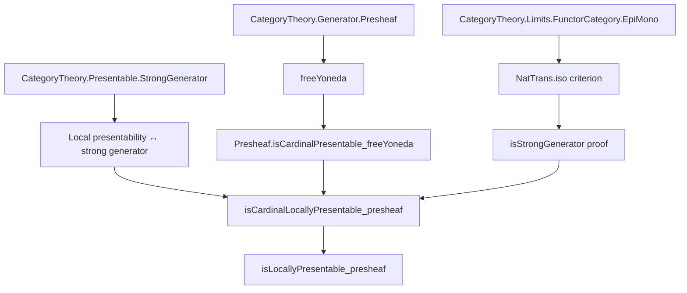

Here is the structured technical metadata extracted from `Presheaf.lean`:

---

### **1. Key Definitions & Theorems**

| Name | Type / Signature | Purpose |
|------|------------------|---------|
| `freeYoneda` | `C → A → (Cᵒᵖ ⥤ A)` | A presheaf construction: for $X \in C$, $M \in A$, defines a presheaf $Y(X, M) := \hom_C(-, X) \otimes M$ (copower of representable by $M$). |
| `uliftYoneda` | `C → (Cᵒᵖ ⥤ Type _)` | The usual Yoneda embedding composed with `ulift`, used to ensure universe levels. |
| `isStrongGenerator` | `ObjectProperty A → Prop → Prop` (lemma) | Shows that if $P$ is a strong generator in $A$, then the family $\{ \text{freeYoneda}(X, M) \mid P(M) \}$ is a strong generator in $\text{Psh}(C) = Cᵒᵖ ⥤ A$. |
| `Presheaf.isCardinalPresentable_freeYoneda` | `IsCardinalPresentable (freeYoneda X M) κ` | Instance: if $M$ is $\kappa$-presentable in $A$, then $\text{freeYoneda}(X, M)$ is $\kappa$-presentable in $\text{Psh}(C)$. |
| `Presheaf.isCardinalPresentable_uliftYoneda` | `IsCardinalPresentable (uliftYoneda X) κ` | Instance: the (ulifted) Yoneda object is $\kappa$-presentable. |
| `Presheaf.isCardinalLocallyPresentable_presheaf` | `IsCardinalLocallyPresentable (Cᵒᵖ ⥤ A) κ` | Main theorem: if $A$ is locally $\kappa$-presentable (and has pullbacks), then $\text{Psh}(C)$ is also locally $\kappa$-presentable. |
| `Presheaf.isLocallyPresentable_presheaf` | `IsLocallyPresentable (Cᵒᵖ ⥤ A)` | Corollary: if $A$ is locally presentable (and has pullbacks), then $\text{Psh}(C)$ is locally presentable. |

---

### **2. Naming Conventions**

- **Prefixes**:
  - `freeYoneda`: denotes the copower of a representable presheaf with an object in $A$.
  - `uliftYoneda`: Yoneda embedding adjusted for universe lifting.
  - `isStrongGenerator`, `isSeparating`, `isCardinalPresentable`: properties of objects/families.
  - `preservesColimitsOfShape_of_natIso`: proof helper using natural isomorphisms to transfer colimit preservation.

- **Suffixes**:
  - `_homEquiv`: indicates a hom-set equivalence (e.g., `freeYonedaHomEquiv`).
  - `_Equiv`: bijection/equivalence of types (e.g., `uliftYonedaEquiv`).
  - `_iso`: isomorphism (e.g., `e.symm` used to transfer properties via isomorphism).

- **Pattern**:
  - `ObjectProperty.ofObj (fun (T : C × (Subtype P)) ↦ ...)` — constructs an object property from a family indexed by $C$ and a subtype.

---

### **3. Tactic Stack**

| Tactic | Usage |
|--------|-------|
| `simp_rw` / `simp` | Simplifying hom-equivalences and universal properties (e.g., `freeYonedaHomEquiv_comp`). |
| `exact` / `refine` | Constructing proofs using known instances or lemmas. |
| `intro` / `rintro` | Introducing variables and hypotheses in structured proofs. |
| `rw` | Rewriting using equivalences, isomorphisms, or definitions (e.g., `isCardinalPresentable_iff`, `isStrongGenerator_iff`). |
| `obtain` / `cases` | Extracting components from existential or conjunction hypotheses. |
| `infer_instance` | Automatically inferring typeclass instances (e.g., `HasColimits`, `SmallCategory`). |
| `convert` / `congr` (implicit via `refine`) | Matching goals to known lemmas. |
| `aesop` (not present here) | Not used — proofs are mostly manual and category-theoretic. |

---

### **4. Proof Logic**

- **Structure**:
  1. **Reduction to strong generators**: Use characterization of local presentability via existence of a strong generator of $\kappa$-presentable objects.
  2. **Construction of generator**: Given strong generator $P$ in $A$, build family $\{ \text{freeYoneda}(X, M) \mid P(M) \}$ in $\text{Psh}(C)$.
  3. **Verification**:
     - *Separating*: Show that if two natural transformations agree on all $\text{freeYoneda}(X, M)$, they are equal (uses `Presheaf.isSeparating`).
     - *Strong*: Show that any morphism inducing epimorphisms on all $\text{freeYoneda}(X, M)$ is an iso (uses surjectivity of `freeYonedaHomEquiv` and $hP₂$).
  4. **Presentability of generators**: Show each $\text{freeYoneda}(X, M)$ is $\kappa$-presentable using:
     - Natural isomorphism `e` between `coyoneda ⋙ freeYoneda` and evaluation + coyoneda.
     - Preservation of colimits under natural isomorphism (`preservesColimitsOfShape_of_natIso`).
  5. **Lifting to full local presentability**: Use equivalence `IsCardinalLocallyPresentable ↔ ∃` strong generator of $\kappa$-presentables.

- **Key lemmas used**:
  - `freeYonedaHomEquiv`: Hom-set equivalence defining `freeYoneda`.
  - `coyoneda.obj ≅ evaluation ⋙ coyoneda`: Yoneda compatibility with evaluation.
  - `preservesColimitsOfShape_of_natIso`: Transfer colimit preservation across natural isomorphisms.

---

### **5. Imports**

| Import | Role |
|--------|------|
| `Mathlib.CategoryTheory.Generator.Presheaf` | Defines `freeYoneda`, `uliftYoneda`, and basic properties. |
| `Mathlib.CategoryTheory.Limits.FunctorCategory.EpiMono` | Provides criteria for epis/monos in functor categories (`NatTrans.isIso_iff_isIso_app`). |
| `Mathlib.CategoryTheory.Presentable.StrongGenerator` | Tools for strong generators and local presentability (`isStrongGenerator_iff`, `IsCardinalLocallyPresentable.iff_exists_isStrongGenerator`). |

---

### **6. Mermaid Diagrams**

#### **Dependency Graph (High-Level)**



#### **Overview of File Logic Flow**

```mermaid
flowchart LR
  Start[Assume: A locally κ-presentable, has pullbacks, C small] --> Defs[Define freeYoneda, uliftYoneda]
  Defs --> Gen[Construct generator: {freeYoneda(X, M) | P(M)}]
  Gen --> Sep[Show separating: Presheaf.isSeparating]
  Gen --> Str[Show strong: use freeYonedaHomEquiv.surjective + hP₂]
  Gen --> Pres[Show κ-presentable: via coyoneda iso + colimit preservation]
  Sep & Str & Pres --> Thm1[IsCardinalLocallyPresentable (Cᵒᵖ ⥤ A) κ]
  Thm1 --> Thm2[IsLocallyPresentable (Cᵒᵖ ⥤ A)]
```

---

Let me know if you'd like a formalized summary in Lean or a diagram in TikZ.
