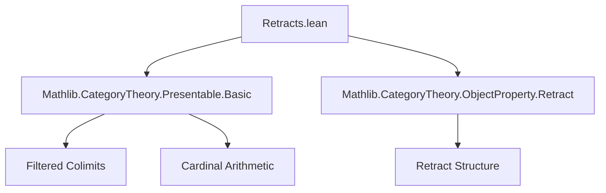
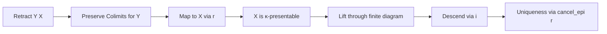
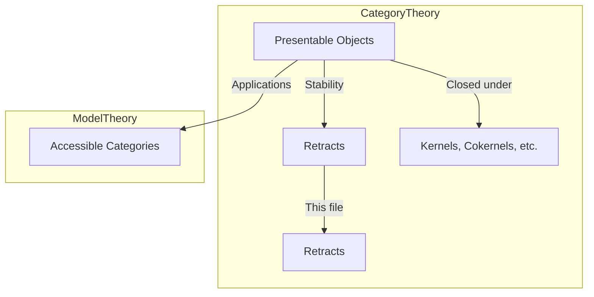

**Technical Brief: `Retracts.lean` — Stability of Presentable Objects Under Retracts**

---

### 1. **Key Definitions & Theorems**

| Name | Type / Signature | Purpose |
|------|------------------|---------|
| `Retract Y X` | `Retract Y X` | A morphism `i : Y ⟶ X` with a retraction `r : X ⟶ Y` (`r ∘ i = id`) — standard categorical retract. |
| `IsCardinalPresentable X κ` | `Prop` | $X$ is *$\kappa$-presentable*: $\Hom(X, -)$ preserves $\kappa$-filtered colimits. |
| `isCardinalPresentable C κ` | `ClassStructure (C → Prop)` | A class structure encoding that *all* objects of `C` are $\kappa$-presentable (used for `Classical.isCardinalPresentable`). |
| `Retract.isCardinalPresentable` | `{X Y : C} → Retract Y X → κ.IsRegular → IsCardinalPresentable X κ → IsCardinalPresentable Y κ` | **Main theorem**: If $X$ is $\kappa$-presentable and $Y$ is a retract of $X$, then $Y$ is $\kappa$-presentable. |
| `isCardinalPresentable_iff` | `IsCardinalPresentable X κ ↔ ...` | Characterization (used implicitly via `rw` in proof). |
| `instance (isCardinalPresentable C κ).IsStableUnderRetracts` | `IsStableUnderRetracts (isCardinalPresentable C κ)` | **Corollary**: The class of $\kappa$-presentable objects is stable under retracts. |

---

### 2. **Naming Conventions**

- **Prefixes**:
  - `isCardinalPresentable`: Predicate naming for object properties (e.g., `IsCardinalPresentable X κ`).
  - `Retract`: Typeclass-like structure for retracts (not a class, but a structure with `i`, `r`, `section` fields).
- **Suffixes**:
  - `_iff`: Equivalence lemmas (e.g., `isCardinalPresentable_iff`).
  - `_of_`: Implication-style lemmas (e.g., `isCardinalPresentable` from `isCardinalPresentable X κ`).
- **Structure fields** (in `Retract`): `i` (inclusion), `r` (retraction), `section` (`r ∘ i = id`).

---

### 3. **Tactic Stack**

| Tactic | Usage |
|--------|-------|
| `rw` | Rewriting definitions (`isCardinalPresentable_iff`) and hypotheses. |
| `simp` / `simp_rw` | Simplifying compositions involving `i`, `r`, and `section`. |
| `have`, `obtain`, `refine` | Constructing intermediate objects/morphisms in colimit preservation proof. |
| `dsimp` | Simplifying definitional equalities in dependent contexts. |
| `exact`, `simpa` | Finishing subgoals using previously obtained data. |
| `cancel_epi` | Cancellation of epimorphisms (here, `r` is epi by section property). |

---

### 4. **Proof Logic**

The proof proceeds in two parts:

#### (a) `Retract.isCardinalPresentable`  
- **Goal**: Show $Y$ preserves $\kappa$-filtered colimits, assuming $X$ does and $Y$ retracts $X$.
- **Strategy**:
  1. Unfold definition: For any $\kappa$-filtered diagram $F : J → C$ with colimit cocone $c$, show $\Hom(Y, c)$ is a colimit in `Type`.
  2. Use the retract: map $\Hom(Y, F(-))$ to $\Hom(X, F(-))$ via precomposition with $r$.
  3. Since $X$ is $\kappa$-presentable, $\Hom(X, c)$ is a colimit — lift morphisms/factors through finite pieces.
  4. Use the section $i$ to descend lifts back to $Y$.
  5. Verify naturality and uniqueness using `cancel_epi h.r`.

#### (b) `instance IsStableUnderRetracts`  
- **Strategy**:
  - Apply `isCardinalPresentable_iff` to reduce to pointwise property.
  - Apply `Retract.isCardinalPresentable` to each object.

---

### 5. **Imports & Dependencies**

| Import | Role |
|--------|------|
| `Mathlib.CategoryTheory.Presentable.Basic` | Defines $\kappa$-presentable objects, filtered colimits, `IsCardinalPresentable`, `isCardinalPresentable_iff`. |
| `Mathlib.CategoryTheory.ObjectProperty.Retract` | Defines `Retract` structure and basic lemmas. |

---

### 6. **Mermaid Diagrams**

#### Dependency Graph (Module-Level)

#### Proof Structure (Main Lemma)

#### Theoretical Context

---

### 7. **Summary**

This module establishes that **$\kappa$-presentable objects are closed under retracts** in a locally $\kappa$-presentable category (or more generally, in any category where $\kappa$-filtered colimits exist and $\kappa$ is regular). The proof leverages the universal property of colimits and the retract structure to transfer presentability from $X$ to $Y$. It is foundational for stability results in accessible and locally presentable categories, especially when constructing subcategories via closure properties.

--- 

*End of Technical Brief.*
