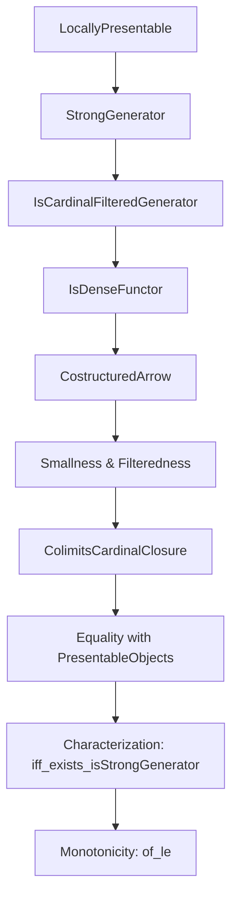
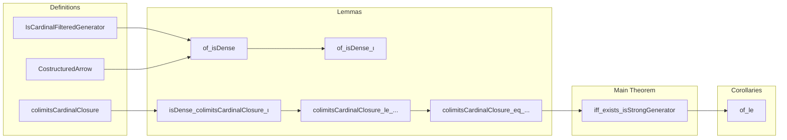

### Technical Brief: `StrongGenerator.lean`

---

#### **1. Key Definitions & Theorems**

| Name | Type / Signature | Purpose |
|------|------------------|---------|
| `IsCardinalFilteredGenerator.of_isDense` | `lemma` | Constructs a `κ`-filtered generator from a dense functor `F : J ⥤ C` under cardinal-presentability and filteredness assumptions on costructured arrows. |
| `IsCardinalFilteredGenerator.of_isDense_ι` | `lemma` | Extends the previous result to object properties `P`, using `P.ι` as the dense functor. |
| `ObjectProperty.isCardinalFiltered_costructuredArrow_colimitsCardinalClosure_ι` | `instance` | Shows that costructured arrows over the `κ`-colimits closure of `P` are `κ`-filtered. |
| `ObjectProperty.isFiltered_costructuredArrow_colimitsCardinalClosure_ι` | `instance` | Derives ordinary filteredness from the previous instance. |
| `ObjectProperty.IsStrongGenerator.isDense_colimitsCardinalClosure_ι` | `lemma` | Proves that the inclusion `ι : (P.colimitsCardinalClosure κ).FullSubcategory ⥤ C` is dense when `P` is a small strong generator of `κ`-presentable objects. |
| `ObjectProperty.colimitsCardinalClosure_le_isCardinalPresentable` | `lemma` | Shows that the `κ`-colimits closure of `P` lies within `κ`-presentable objects if `P` does. |
| `IsStrongGenerator.colimitsCardinalClosure_eq_isCardinalPresentable` | `lemma` | Equality of object properties: the `κ`-colimits closure of a small strong generator of `κ`-presentables equals the full property of `κ`-presentable objects. |
| `IsCardinalLocallyPresentable.iff_exists_isStrongGenerator` | `lemma` | Main characterization: $C$ is locally $\kappa$-presentable iff it has a small strong generator of $\kappa$-presentable objects. |
| `IsCardinalLocallyPresentable.of_le` | `lemma` | Monotonicity: if $C$ is locally $\kappa$-presentable and $\kappa \le \kappa'$, then $C$ is locally $\kappa'$-presentable. |

---

#### **2. Naming Conventions**

- **Prefixes**:
  - `isCardinal...`: Relates to cardinal-presentability or filteredness (e.g., `isCardinalPresentable`, `isCardinalFiltered`).
  - `colimitsCardinalClosure`: Refers to closure under colimits of size $<\kappa$.
  - `costructuredArrow`: Costructured arrow category over a diagram.
  - `IsStrongGenerator`, `IsDense`, `IsFiltered`: Property-based naming.

- **Suffixes**:
  - `_ι`: Denotes the inclusion functor of a full subcategory (e.g., `(P.colimitsCardinalClosure κ).ι`).
  - `_of_...`: Derivation from a hypothesis (e.g., `of_isDense`, `of_equivalence`).
  - `_iff_...`: Characterization lemmas (e.g., `iff_exists_isStrongGenerator`).

---

#### **3. Tactic Stack**

Frequent tactics used in proofs:

| Tactic | Usage |
|--------|-------|
| `rw` / `simp` / `simp_rw` | Rewriting definitions (e.g., `isCardinalPresentable_iff`, density, filteredness). |
| `intro`, `exact`, `assumption` | Basic proof structure. |
| `have`, `obtain`, `let` | Introducing intermediate constructions (e.g., objects, morphisms, colimits). |
| `apply`, `refine` | Applying lemmas with holes (e.g., `refine le_antisymm ?_ ?_`). |
| `convert`, `ext` | Proving equality of morphisms or colimits (e.g., `Cocones.ext`). |
| `equivSmallModel`, `IsFiltered.max`, `IsCardinalPresentable.exists_hom_of_isColimit` | Domain-specific lemmas for smallness and presentability. |
| `aesop`, `ring` | Not present — this file is highly categorical, not arithmetic. |
| `infer_instance` | Filling typeclass arguments (e.g., `Small`, `Fact κ.IsRegular`). |

---

#### **4. Proof Logic**

The logical flow follows a **categorical construction → density → filteredness → generator → equivalence** pattern:

1. **Start with a dense functor or object property** (e.g., `F : J ⥤ C` or `P.ι`).
2. **Assume cardinal-presentability** of objects in the image and **filteredness** of costructured arrows.
3. **Construct a generator** using `IsCardinalFilteredGenerator.of_isDense`.
4. For strong generators:
   - Show that the **colimits closure** under $\kappa$-small diagrams preserves density (`isDense_colimitsCardinalClosure_ι`).
   - Show that this closure coincides with the full property of $\kappa$-presentable objects (`colimitsCardinalClosure_eq_isCardinalPresentable`).
5. **Characterize local presentability** via existence of such a generator (`iff_exists_isStrongGenerator`).
6. **Monotonicity** follows by pulling back the generator along the inequality $\kappa \le \kappa'$.

Induction is not used; instead, the proofs rely on:
- Universal properties of colimits and dense functors.
- Cardinal arithmetic (regularity, smallness).
- Equivalences of categories (e.g., `equivSmallModel`).

---

#### **5. Imports**

| Import | Role |
|--------|------|
| `Mathlib.CategoryTheory.Presentable.LocallyPresentable` | Core definitions of locally presentable categories. |
| `Mathlib.CategoryTheory.ObjectProperty.ColimitsCardinalClosure` | Closure under $\kappa$-small colimits for object properties. |
| `Mathlib.CategoryTheory.ObjectProperty.Equivalence` | Equivalence of object properties (e.g., `≤`, `=`). |
| `Mathlib.CategoryTheory.Functor.KanExtension.Dense` | Density of functors and left Kan extensions. |
| `Mathlib.CategoryTheory.Comma.StructuredArrow.Small` | Smallness of comma/structured arrow categories. |

---

#### **6. Mermaid Diagrams**

##### **Dependency Graph (High-Level)**

##### **Overview of File Structure**

---

#### **7. Theory Context**

This file formalizes a foundational result in **locally presentable category theory**, specifically:

> A cocomplete category $C$ is locally $\kappa$-presentable **iff** it admits a small strong generator of $\kappa$-presentable objects.

This bridges:
- **Model-theoretic** properties (presentability),
- **Categorical** properties (density, filteredness),
- **Set-theoretic** constraints (regular cardinals, smallness).

It is a key step toward:
- Proving that locally presentable categories are complete and cocomplete,
- Developing the theory of accessible functors and adjoint functor theorems,
- Formalizing model structures and homotopy theory in categorical logic.

---

#### **8. Summary**

This module provides a clean, modular formalization of the equivalence between local presentability and existence of strong generators of presentable objects. It leverages:
- Object properties and their closures,
- Costructured arrow categories for density arguments,
- Cardinal filteredness to control size.

The proofs are highly structured, relying on categorical universal properties rather than set-theoretic induction, and are suitable for further development in homotopical algebra and logic.
