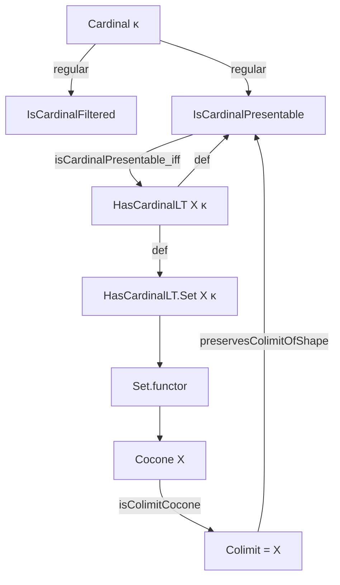
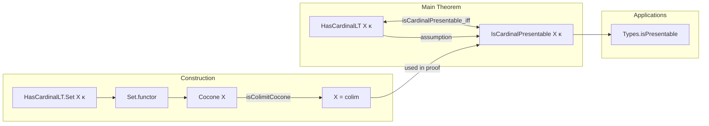

Here's a structured technical brief extracted from `Type.lean`, focusing on formal metadata relevant for building a domain-specific AI agent in Lean 4.

---

### **1. Key Definitions & Theorems**

| Name | Type / Signature | Purpose |
|------|------------------|---------|
| `HasCardinalLT X κ` | `Prop` | States that the cardinality of `X` is strictly less than `κ`. |
| `IsCardinalPresentable X κ` | `Prop` | `X` is *κ*-presentable in `Type u`, i.e., `Hom(X, -)` preserves `κ`-filtered colimits. |
| `isCardinalPresentable` | `hX : HasCardinalLT X κ → [Fact κ.IsRegular] → IsCardinalPresentable X κ` | One direction of the main equivalence: small objects are presentable. |
| `isCardinalPresentable_iff` | `IsCardinalPresentable X κ ↔ HasCardinalLT X κ` | Main theorem: for regular `κ`, presentability ⇔ smallness. |
| `HasCardinalLT.Set X κ` | `Type u` | Preordered type of subsets of `X` of cardinality `< κ`. |
| `Set.functor` | `HasCardinalLT.Set X κ ⥤ Type u` | Embeds the poset of small subsets into `Type u` via inclusion. |
| `Set.cocone` | `Cocone (Set.functor X κ)` | Canonical cocone with apex `X` and inclusions. |
| `Set.isColimitCocone` | `Cardinal.aleph0 ≤ κ → IsColimit (cocone X κ)` | `X` is the colimit of its small subsets when `κ` is infinite. |
| `Types.isPresentable` | `Instance: IsPresentable X` | Every type is presentable (i.e., `κ`-presentable for some regular `κ`). |

---

### **2. Naming Conventions**

- **Prefixes**:
  - `isCardinalFiltered`, `isCardinalPresentable`: indicate structural properties relative to a cardinal.
  - `hasCardinalLT`: predicate for cardinal boundedness.
  - `Set.`: namespace for constructions over small subsets.
- **Suffixes**:
  - `filtered`, `presentable`, `cocone`, `functor`: indicate categorical or set-theoretic nature.
- **Variables**:
  - `X : Type u`, `κ : Cardinal.{u}`: standard placeholders.
  - `ι`, `A`, `hι`: used in subset indexing and proofs.

---

### **3. Tactic Stack**

Frequently used tactics in proofs:

| Tactic | Role |
|--------|------|
| `choose` | Eliminate existential quantifiers (often with `Types.jointly_surjective_of_isColimit`). |
| `ext` | Extensionality for functions/sets. |
| `simp` / `dsimp` | Simplify using definitional equalities and lemmas (e.g., `Subtype.val`, `cocone`). |
| `rw` | Rewrite using equalities (e.g., `← hg`, `← hl x`). |
| `exact`, `refine`, `obtain` | Construct proofs term-by-term or via intermediate steps. |
| `rwa` | Rewrite + assumption (e.g., `rwa [hasCardinalLT_iff_cardinal_mk_lt]`). |
| `tauto` | Tactic for propositional logic (used in monotonicity proofs). |
| `let` + `have` | Local definitions + intermediate lemmas (e.g., `φ (x : X) : j ⟶ ...`). |

---

### **4. Proof Logic**

**General Strategy**:

- **Induction / Colimit Characterization**:
  - Use `Types.FilteredColimit.isColimitOf'` to verify colimit conditions.
  - For preservation of colimits: construct mediating morphisms using filteredness (via `IsCardinalFiltered.max`, `coeq`, etc.).
- **Equivalence Proof (`isCardinalPresentable_iff`)**:
  - **Right-to-left**: Construct mediating maps using filtered colimit data and regularity.
  - **Left-to-right**: Use preservation of colimits by `Hom(X, -)` on a specific colimit (the cocone of small subsets), then deduce `X` is small via surjectivity and coyoneda.
- **Presentability of All Types**:
  - Use `HasCardinalLT.exists_regular_cardinal` to find a regular `κ` bounding `X`, then apply `isCardinalPresentable`.

**Key Logical Flow**:
1. Assume `κ` regular.
2. Show `HasCardinalLT X κ ⇒ IsCardinalPresentable X κ` via explicit colimit preservation.
3. Show converse using coyoneda and the canonical colimit of small subsets.
4. Conclude all types are presentable by choosing a bounding regular cardinal.

---

### **5. Imports**

| Module | Purpose |
|--------|---------|
| `Mathlib.CategoryTheory.Presentable.Basic` | Core definitions: `IsCardinalPresentable`, `IsPresentable`. |
| `Mathlib.CategoryTheory.Limits.Types.Filtered` | Filtered colimits in `Type`, e.g., `Types.FilteredColimit.isColimitOf'`. |
| `Mathlib.CategoryTheory.Types.Set` | Subtype embedding, `Set.functorToTypes`, etc. |

---

### **6. Mermaid Diagrams**

#### **Dependency Graph (Core Concepts)**

#### **Overview of File Structure**

---

### **7. Theory Context**

- **Category**: `Type u` with filtered colimits.
- **Cardinal Arithmetic**: Regular cardinals, unions of `< κ`-sized families remain `< κ`.
- **Categorical Logic**: Small objects = presentable objects in `Type`.
- **Set-Theoretic Foundations**: Uses `Cardinal.mk`, `HasCardinalLT`, and subset constructions.

---

### **8. Summary for AI Agent**

- **Domain**: Category theory in `Type`, especially presentability and filtered colimits.
- **Key Insight**: In `Type`, smallness (cardinality < `κ`) ⇔ presentability (for regular `κ`).
- **Pattern**: Prove colimit preservation by constructing mediating maps using filteredness; use coyoneda + surjectivity for converse.
- **Automation Opportunities**:
  - `simp`-based simplification of subtype inclusions.
  - `choose` + `obtain` patterns for colimit mediating maps.
  - Regularity assumptions often come via `Fact κ.IsRegular`.

Let me know if you'd like a tactic-level trace of `isCardinalPresentable` or a proof sketch in natural language.
