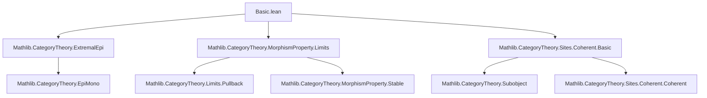
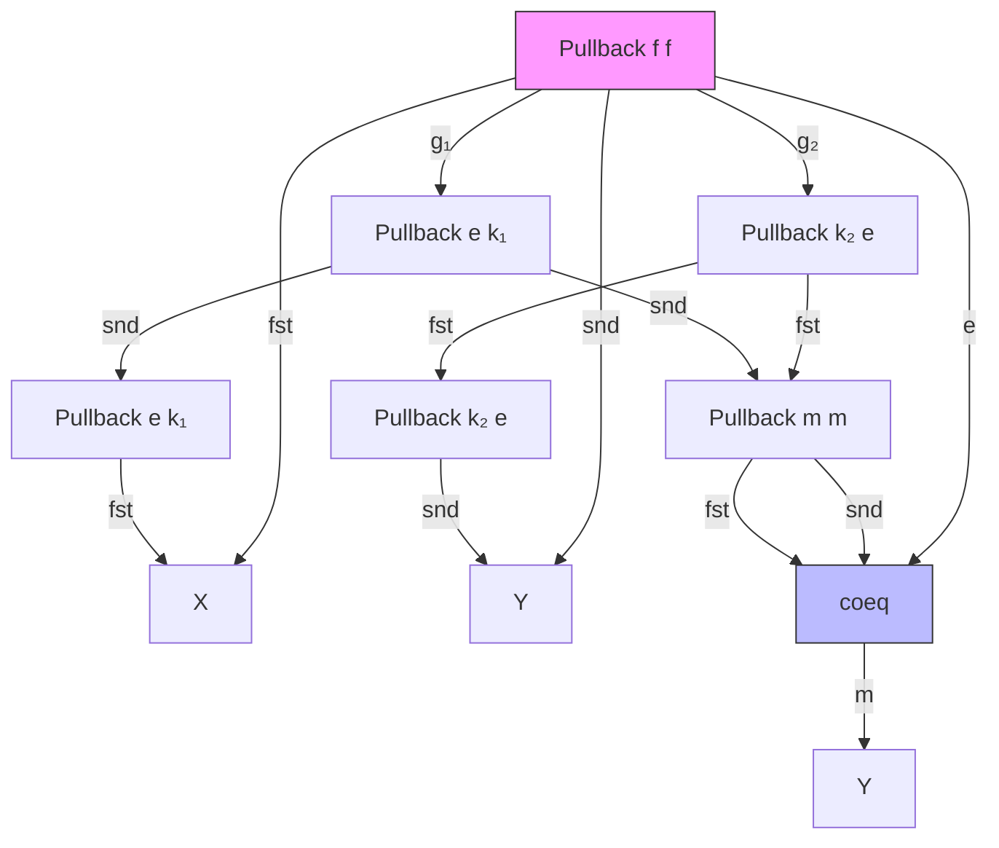

**Technical Brief: `Basic.lean` — Regular Categories in Lean 4**

---

### 1. KEY DEFINITIONS & THEOREMS

| Name | Type / Signature | Purpose |
|------|------------------|---------|
| `Regular` | `class Regular extends HasFiniteLimits C` | Defines a *regular category*: finite limits, kernel pairs have coequalizers, and regular epis are stable under pullback. |
| `hasCoequalizer_of_isKernelPair` | `{f g₁ g₂} → IsKernelPair f g₁ g₂ → HasCoequalizer g₁ g₂` | Ensures every kernel pair admits a coequalizer. |
| `regularEpiIsStableUnderBaseChange` | `MorphismProperty.IsStableUnderBaseChange (.regularEpi C)` | Regular epimorphisms are stable under pullback (base change). |
| `strongEpiMonoFactorisation` | `f : X ⟶ Y ↦ StrongEpiMonoFactorisation f` | Constructs the epi-mono factorization via coequalizer of kernel pair. |
| `frobeniusMorphism` | `frobeniusMorphism f A' B'` | Canonical morphism between subobjects: $(A' \land f^*B') \to (f_!A' \land B')$. |
| `frobeniusStrongEpiMonoFactorisation` | `StrongEpiMonoFactorisation ((A' ∧ f^*B').arrow ≫ f)` | Shows the Frobenius morphism gives a strong epi-mono factorization. |
| `exists_inf_pullback_eq` | `(∃ f) (A' ∧ f^*B') = (∃ f)A' ∧ B'` | **Frobenius reciprocity**: existential quantification distributes over meet when $Q$ is independent of $x$. |
| `regularEpiOfExtremalEpi` | `ExtremalEpi f → RegularEpi f` | In regular categories, extremal epis are regular. |
| `isRegularEpi_of_extremalEpi` | `[ExtremalEpi f] → IsRegularEpi f` | Instance version of above. |
| `hasStrongEpiMonoFactorisations` | `HasStrongEpiMonoFactorisations C` | Every morphism has a strong epi-mono factorization. |

---

### 2. NAMING CONVENTIONS

- **Prefixes**:
  - `is_`: Predicate on morphisms/objects (e.g., `IsRegularEpi`, `IsPullback`, `IsKernelPair`).
  - `regularEpi_`: Properties of regular epis (e.g., `regularEpiIsStableUnderBaseChange`).
  - `frobenius_`: Related to Frobenius reciprocity (e.g., `frobeniusMorphism`, `frobeniusStrongEpiMonoFactorisation`).
  - `strongEpiMono_`: Factorization-related (e.g., `strongEpiMonoFactorisation`).
- **Suffixes**:
  - `_of_`: Construction from a hypothesis (e.g., `regularEpiOfExtremalEpi`).
  - `_factorisation`: Factorization constructions (e.g., `strongEpiMonoFactorisation`).
  - `_isPullback`: Proof that a square is a pullback.
- **Abbreviations**:
  - `e` for the *epi* part of a factorization.
  - `m` for the *mono* part.
  - `π`, `ι`, `desc`, `lift`, `fst`, `snd`: Standard pullback/coequalizer morphisms.

---

### 3. TACTIC STACK

| Tactic | Frequency | Role |
|--------|-----------|------|
| `infer_instance` | Very high | Solves typeclass goals (e.g., `IsRegularEpi`, `HasPullback`). |
| `simp` / `simp only` | High | Simplifies using definitions, especially of pullbacks, coequalizers, subobjects. |
| `rw` | High | Rewriting using equalities (e.g., `fac`, `frobeniusMorphism`). |
| `apply` | Medium | Applying lemmas/instances (e.g., stability of regular epis). |
| `convert` | Medium | Matching up goals modulo definitional equality. |
| `cat_disch` | Medium | Category-theoretic discharge (likely custom tactic for diagram chasing). |
| `refine` | Medium | Constructing proofs with holes (e.g., `of_right`, `of_bot`, `paste_horiz`). |
| `dsimp` | Low | Simplifying definitional equalities in typeclass instances. |
| `all_goals` | Low | Applying tactics uniformly across goals. |

---

### 4. PROOF LOGIC

- **Inductive/constructive style**: Proofs are mostly *constructive* and *diagrammatic*.
- **Common pattern**:
  1. **Define objects/morphisms** (e.g., `let m := ...`, `let e := ...`).
  2. **Establish universal properties** (e.g., `IsPullback`, `IsKernelPair`) using `refine` + `of_hasPullback`, `of_right`, `paste_horiz`.
  3. **Use stability properties** (e.g., `regularEpiIsStableUnderBaseChange.of_isPullback`).
  4. **Apply cancellation or factorization lemmas** (e.g., `cancel_epi`, `eq_of_comm`, `isoExt`).
- **Diagram chasing**: Heavy use of pasting lemmas for pullbacks (`paste_horiz`, `of_right`, `of_bot`).
- **Subobject calculus**: Leverages `Subobject`, `pullback`, `inf`, `exists` (as left adjoint to pullback), and image factorizations.

---

### 5. IMPORTS & DEPENDENCIES

| Module | Purpose |
|--------|---------|
| `Mathlib.CategoryTheory.ExtremalEpi` | Extremal epimorphisms, their properties. |
| `Mathlib.CategoryTheory.MorphismProperty.Limits` | Stability properties of morphism classes under limits (e.g., base change). |
| `Mathlib.CategoryTheory.Sites.Coherent.Basic` | Coherent sites, subobject lattices, existential quantification as left adjoint. |

**Core dependencies**:
- `CategoryTheory.Limits` (via `Limits` open)
- `Subobject` (for internal logic, pullbacks, meets, existential quantifier)
- `MorphismProperty` (for stability under pullback)

---

### 6. MERMAID DIAGRAMS

#### Dependency Graph (Top-Level)



#### Overview of `Basic.lean`

```mermaid
flowchart LR
  subgraph Definitions
    R[Regular Category] --> RP[Regular Epis Stable]
    R --> KPC[Kernel Pairs → Coequalizers]
    R --> FL[Finite Limits]
  end

  subgraph Results
    SE[Strong Epi-Mono Factorisation] --> SEI[IsRegularEpi e]
    SE --> M[Mono m]
    FR[Frobenius Reciprocity] --> FE[∃(P ∧ Q) = (∃P) ∧ Q]
    FR --> FM[frobeniusMorphism]
    FM --> FSE[frobeniusStrongEpiMonoFactorisation]
  end

  subgraph Tools
    PE[Pullback] --> SE
    CE[Coequalizer] --> SE
    SO[Subobject] --> FR
    IA[Image Factorisation] --> FR
  end

  R --> SE
  R --> FR
```

#### Diagram in `strongEpiMonoFactorisation` Proof



> Where `e = π`, `m = desc`, and the top-left square is a pullback (by pasting), making `g₁` a base change of a regular epi, hence regular epi.

---

### 7. INTERNAL LOGIC INTERPRETATION

- **Subobject lattice** `Subobject C X` is a Heyting algebra.
- `Subobject.pullback f` = inverse image $f^*$.
- `«exists» f` = left adjoint to $f^*$, denoted $f_!$.
- **Frobenius reciprocity**:
  $$
  f_!(A' \land f^*B') \cong f_!A' \land B'
  $$
  corresponds to:
  $$
  \exists x \in X,\ (P(x) \land Q) \iff (\exists x \in X,\ P(x)) \land Q
  $$
  where $Q$ does not depend on $x$.

---

### 8. FUTURE WORK (as stated)

- Show every **topos** is regular.
- Interpret **regular logic** (existential + conjunction + truth) in regular categories.

--- 

✅ **Summary**: This file formalizes the foundational theory of regular categories in Lean 4, establishing strong epi-mono factorization and Frobenius reciprocity — key steps toward internal logic and semantics of regular logic.
