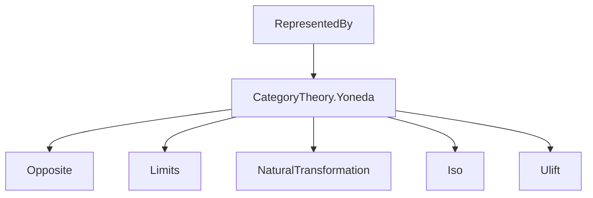
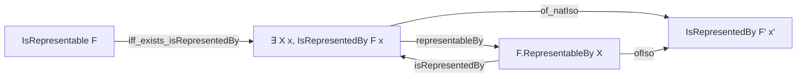

### Technical Brief: `RepresentedBy.lean`

---

#### **1. Key Definitions & Theorems**

| Name | Type / Signature | Purpose |
|------|------------------|---------|
| `IsRepresentedBy` | `structure IsRepresentedBy (F : Cᵒᵖ ⥤ Type w) {X : C} (x : F.obj (op X)) : Prop` | Predicate asserting that a presheaf `F` is represented by object `X` with universal element `x`, i.e., the Yoneda-induced nat. trans. `yoneda.obj X ⟶ F` is an iso. |
| `IsRepresentedBy.map_bijective` | `∀ {Y}, Function.Bijective (f ↦ F.map f.op x)` | Explicit characterization: for all `Y`, precomposition with `f : Y ⟶ X` yields a bijection to `F.obj Y`. |
| `IsRepresentedBy.iff_isIso_uliftYonedaEquiv` | `F.IsRepresentedBy x ↔ IsIso ((uliftYonedaEquiv ...).symm ⟨x⟩)` | Equivalence between `IsRepresentedBy` and isomorphism of the element under the ulifted Yoneda equivalence. |
| `IsRepresentedBy.uliftYonedaIso` | `uliftYoneda.obj X ≅ F ⋙ uliftFunctor.{v}` | Constructed iso from `h : F.IsRepresentedBy x`. |
| `IsRepresentedBy.representableBy` | `F.RepresentableBy X` | Converts `IsRepresentedBy` to `RepresentableBy` via universe lifting equivalence. |
| `IsRepresentedBy.representableBy_homEquiv_apply` | `h.representableBy.homEquiv f = F.map f.op x` | Describes how the representing natural isomorphism acts on morphisms. |
| `RepresentableBy.isRepresentedBy` | `F.RepresentableBy X → F.IsRepresentedBy (R.homEquiv (𝟙 X))` | From `RepresentableBy` to `IsRepresentedBy`, using the image of identity. |
| `IsRepresentedBy.iff_exists_representableBy` | `F.IsRepresentedBy x ↔ ∃ R, R.homEquiv (𝟙 X) = x` | Links `IsRepresentedBy` to existence of a representing structure. |
| `IsRepresentedBy.of_natIso` | `F.IsRepresentedBy x → F ≅ F' → F'.IsRepresentedBy (e.hom.app (op X) x)` | Stability under natural isomorphism of presheaves. |
| `IsRepresentedBy.iff_natIso` | `F'.IsRepresentedBy (e.hom.app (op X) x) ↔ F.IsRepresentedBy x` | Bidirectional version of stability under nat. iso. |
| `IsRepresentedBy.of_isoObj` | `F.IsRepresentedBy x → Y ≅ X → F.IsRepresentedBy (F.map e.hom.op x)` | Stability under isomorphism of representing objects. |
| `IsRepresentedBy.iff_of_isoObj` | `F.IsRepresentedBy (F.map e.hom.op x) ↔ F.IsRepresentedBy x` | Bidirectional version of stability under iso of objects. |
| `IsRepresentedBy.of_isRepresentable` | `[F.IsRepresentable] → F.IsRepresentedBy F.reprx` | Every representable functor satisfies `IsRepresentedBy` at its universal element. |
| `IsRepresentable.iff_exists_isRepresentedBy` | `F.IsRepresentable ↔ ∃ X x, F.IsRepresentedBy x` | Connects global representability to existence of a representing pair. |

---

#### **2. Naming Conventions**

- **Prefixes**:
  - `isRepresentedBy_`: for lemmas about the predicate `IsRepresentedBy`.
  - `representableBy_`: for constructions/lemmas about `RepresentableBy`.
  - `of_`, `iff_`: for implications and stability lemmas (e.g., `of_natIso`, `iff_natIso`).
- **Suffixes**:
  - `_apply`: for lemmas about application of homEquiv or maps.
  - `_homEquiv_apply`: specific to action of `homEquiv`.
  - `_iso`: for constructions yielding isomorphisms (e.g., `uliftYonedaIso`).
- **Structure naming**:
  - `IsRepresentedBy`: predicate structure.
  - `RepresentableBy`: bundled structure (natural iso).
  - `IsRepresentable`: predicate asserting existence.

---

#### **3. Tactic Stack**

Frequent tactics used in proofs:

- `rw [...]`: rewriting using equivalences and definitions.
- `simp [uliftYonedaEquiv, ← homEquiv_eq]`: simplification with Yoneda and homEquiv.
- `convert ...; ext; simp [...]`: constructing isomorphisms and proving extensionality.
- `exact ...`, `refine ...`, `use ...`: for constructing witnesses in existential goals.
- `rwa [...]`: rewrite + assumption.
- `symm`, `convert`, `rfl`: basic equality reasoning.
- `haveI : ...` / `asIso`: for introducing isomorphism instances.

No heavy automation like `aesop` or `linarith` is used — proofs are mostly structural and rely on Yoneda lemmas.

---

#### **4. Proof Logic**

- **Induction**: Not used (no inductive types involved).
- **Main proof pattern**:
  1. **Rewrite** using `isRepresentedBy_iff` or `iff_exists_representableBy`.
  2. **Reduce** to checking isomorphism or bijectivity via Yoneda.
  3. **Lift universes** using `uliftYonedaEquiv` and `uliftFunctor`.
  4. **Transfer structure** along isomorphisms (`of_natIso`, `of_isoObj`) using `simp` and extensionality.
- **Key insight**: The predicate `IsRepresentedBy` is defined pointwise (via bijectivity), but proofs often go through the ulifted Yoneda equivalence to leverage `IsIso` machinery.

---

#### **5. Imports**

- `Mathlib.CategoryTheory.Yoneda`: Core Yoneda embedding, `yoneda`, `yoneda.obj`, natural transformations, etc.
- `Opposite`: for `op`, `opposite`, `Cᵒᵖ`.
- `uliftYoneda`, `uliftFunctor`, `RepresentableBy`, `FunctorToTypes.map_comp_apply`: from `Mathlib.CategoryTheory.Yoneda` and related files.

---

#### **6. Mermaid Diagrams**

##### **Dependency Graph (Module-Level)**



##### **Conceptual Overview of Theory Flow**

```mermaid
flowchart LR
  A[Yoneda Embedding yoneda.obj X] -->|induced nat. trans. by x| B[Natural Trans yoneda.obj X ⇒ F]
  B -->|is iso?| C[IsRepresentedBy F x]
  C -->|iff| D[∀ Y, (Y ⟶ X) ≅ F.obj Y]
  C -->|constructs| E[uliftYoneda.obj X ≅ F ⋙ uliftFunctor]
  C -->|converts| F[F.RepresentableBy X]
  F -->|recovers| C
  C -->|stability| G[Natural Isomorphism F ≅ F']
  C -->|stability| H[Object Iso Y ≅ X]
```

##### **Relationship to Other Representability Notions**



---

#### **7. Summary**

This file formalizes the *pointwise* predicate `IsRepresentedBy`, which is more flexible than `RepresentableBy` for reasoning about universal elements without bundling the entire natural isomorphism. It connects this predicate to:
- the Yoneda embedding,
- universe lifting (`uliftYoneda`),
- representability via `RepresentableBy`,
- and stability under natural and object isomorphisms.

It serves as a foundational bridge between the *element-based* and *structure-based* views of representability in category theory.

--- 

Let me know if you'd like a dualized version (`IsCorepresentedBy`) formalized or a formal proof outline for a specific lemma.
