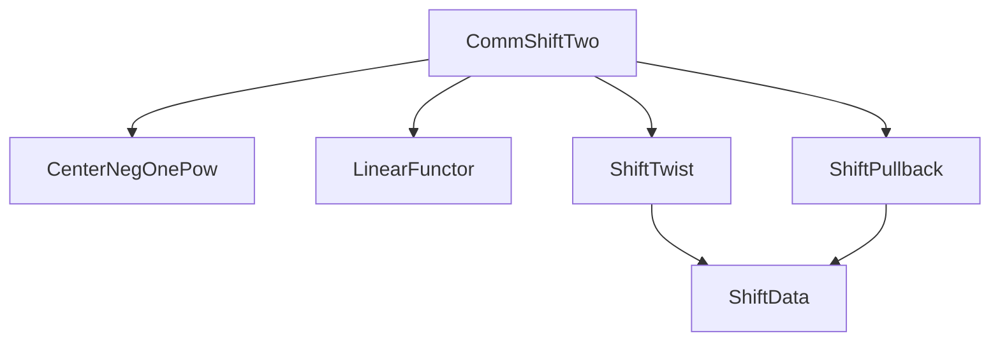
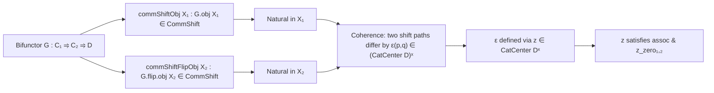

Here is a structured technical brief extracted from `CommShiftTwo.lean`, focusing on formal metadata relevant for building a domain-specific AI agent in Lean 4:

---

### **1. Key Definitions & Theorems**

| Name | Type / Class | Purpose |
|------|--------------|---------|
| `CommShift₂Setup` | `structure` | Encodes coherence data for bifunctors commuting with shifts in two variables over an additive monoid `M`. Extends `TwistShiftData` for the pulled-back shift along `+ : M × M → M`, with extra invertible central elements `ε m n` and axioms `z_zero₁`, `z_zero₂`. |
| `CommShift₂Setup.int` | `noncomputable def` | Standard instance for `M = ℤ`, where `z m n = (-1)^(m.1 * n.2)` and `ε p q = (-1)^(p * q)`. Requires `Preadditive D` and additivity of shift functors. |
| `Functor.CommShift₂` | `class` | Asserts that a bifunctor `G : C₁ ⥤ C₂ ⥤ D` commutes with shifts in both variables *coherently*, i.e., the two ways to shift in `p` then `q` (or `q` then `p`) differ by `h.ε p q ∈ (CatCenter D)ˣ`. |
| `Functor.CommShift₂Int` | `abbrev` | Specialization of `CommShift₂` to `M = ℤ`, using `CommShift₂Setup.int`. |
| `NatTrans.CommShift₂` | `class` | Compatibility of a natural transformation `τ : G₁ ⇒ G₂` with the bifunctorial shift structures. |
| `NatTrans.CommShift₂Int` | `abbrev` | Same as above for `ℤ`-shifts. |
| `precomp₁`, `precomp₂` | `instance` | Closure of `CommShift₂` under precomposition with shift-compatible functors in either variable. |

**Notable lemma (implicit):**  
The coherence condition in `Functor.CommShift₂.comm` expresses that the following diagram commutes up to `h.ε m n`:

$$
\begin{tikzcd}
(G(X_1[p]))(X_2) \arrow[r] \arrow[d] & ((G(X_1))[p])(X_2) \arrow[d] \\
(G(X_1))(X_2[q]) \arrow[r] & ((G(X_1))[p])(X_2[q]) \arrow[d] \\
& ((G(X_1))[p+q])(X_2) \arrow[dl, "\text{shiftComm}^{-1}"] \\
((G(X_1))(X_2))[p+q]
\end{tikzcd}
\quad \text{vs.} \quad
\begin{tikzcd}
(G(X_1))(X_2[q]) \arrow[r] \arrow[d] & ((G(X_1))(X_2))[q] \arrow[d] \\
(G(X_1[p]))(X_2[q]) \arrow[r] & ((G(X_1[p]))(X_2))[q] \arrow[d] \\
& ((G(X_1[p]))(X_2[q])) \arrow[dl, "\text{shiftComm}^{-1}"] \\
((G(X_1))(X_2))[p+q]
\end{tikzcd}
$$

The two paths differ by post-composition with $(h.\varepsilon\ m\ n).\text{val}.\text{app}\ ((G\ X_1)\ X_2)$.

---

### **2. Naming Conventions**

- **Prefixes:**
  - `CommShift₂`: Indicates bifunctorial shift commutation.
  - `commShift₂_`: For lemmas/instances about the coherence condition (e.g., `commShift₂_comm`).
  - `commShift_app`, `commShift_flipApp`: For natural transformation compatibility.
- **Suffixes:**
  - `_int`: For the ℤ-specific version (e.g., `CommShift₂Int`, `CommShift₂Int` for natural transformations).
  - `_obj`, `_map`: For functoriality in each variable (e.g., `commShiftObj`, `commShift_map`).
- **Structure fields:**
  - `z`, `ε`, `hε`, `assoc`, `commShift`: Standard for `TwistShiftData`-based structures.
  - `precomp₁`, `precomp₂`: For precomposition lemmas.

---

### **3. Tactic Stack**

Frequent tactics used in proofs and instance synthesis:

| Tactic | Role |
|--------|------|
| `aesop` | Solves simple algebraic identities (e.g., `z_zero₁`, `z_zero₂`, `hε`). |
| `simp only [...]` | Simplifies using definitional equalities and lemmas like `map_id`, `comp_app`, `shift_app`. |
| `dsimp` | Simplifies definitions (e.g., unfolding `commShiftIso`). |
| `rw [...]` | Rewrites using coherence axioms or `hε`. |
| `simp [this]`, `congr 3`, `refine ...` | Used in `precomp₁`, `precomp₂` to propagate coherence via whiskering and naturality. |
| `infer_instance` | Automatic synthesis of `CommShift` structures for functors/natural transformations. |
| `cat_disch` | In `commShift`, discharges categorical diagrammatic obligations. |

---

### **4. Proof Logic**

- **Structure of proofs:**
  - **Inductive/definitional**: Most instances (`precomp₁`, `precomp₂`, `𝟙`, `comp`) are built by:
    1. Invoking `infer_instance` for component structures.
    2. Reducing to the base case using `simp` and naturality.
    3. Applying the coherence law for `G` (via `G.commShift₂_comm`) and manipulating with `shift_app`, `shift_app_comm`, `assoc`.
  - **Diagram chasing**: The core `comm` axiom is verified by:
    - Starting from one composite path.
    - Using naturality of `commShiftIso` (via `NatTrans.shift_app`, `shift_app_comm`).
    - Inserting `shiftComm` and central elements `ε`.
    - Applying `hε` to rewrite in terms of `z`.
  - **Algebraic simplification**: For `CommShift₂Setup.int`, proofs reduce to integer arithmetic (e.g., `(-1)^(m₁+m₂) = (-1)^{m₁}(-1)^{m₂}`), handled by `zpow_add`, `lia`.

---

### **5. Imports & Dependencies**

| Import | Purpose |
|--------|---------|
| `Mathlib.CategoryTheory.Center.NegOnePow` | Central elements generated by $(-1)^n$, used in `CommShift₂Setup.int`. |
| `Mathlib.CategoryTheory.Linear.LinearFunctor` | Likely for preadditivity assumptions (`Preadditive D`). |
| `Mathlib.CategoryTheory.Shift.Twist` | Defines `TwistShiftData`, foundational for `CommShift₂Setup`. |
| `Mathlib.CategoryTheory.Shift.Pullback` | Provides `PullbackShift`, used to define the $M × M$-shift on $D$. |

**Key ambient assumptions:**
- `Category*`: A category with shift by `M`.
- `Preadditive D`: Ensures `CatCenter D` is an abelian group and `(-1)^n` makes sense.
- `[∀ n, (shiftFunctor n).Additive]`: Ensures shift functors preserve addition in hom-sets.

---

### **6. Mermaid Diagrams**

#### **Dependency Graph (Module-Level)**



#### **Conceptual Overview of `CommShift₂`**



#### **Shift Compatibility for Natural Transformations**

```mermaid
graph LR
  τ["τ : G₁ ⇒ G₂"] -->|commShift_app X₁| "τ.app X₁ ∈ CommShift"
  τ -->|commShift_flipApp X₂| "τ.flipApp X₂ ∈ CommShift"
```

---

### **7. TODO & Future Work**

- **Uncurrying equivalence**: Show that `G : C₁ ⥤ C₂ ⥤ D` satisfies `CommShift₂Int` iff its uncurried version $C₁ × C₂ → D$ commutes with the $\mathbb{Z} × \mathbb{Z}$-shift (with product shift on $C₁ × C₂$ and twisted shift on $D$).
- **Composition with shift-compatible functors**: Prove closure under postcomposition $G ⋙ H$ when $H : D ⥤ D'$ is shift-compatible and setups on $D$, $D'$ are compatible.

---

This metadata captures the core formal structure, naming patterns, and proof methodology of `CommShiftTwo.lean`, suitable for guiding an AI agent in formal reasoning about bifunctorial shift compatibility.
