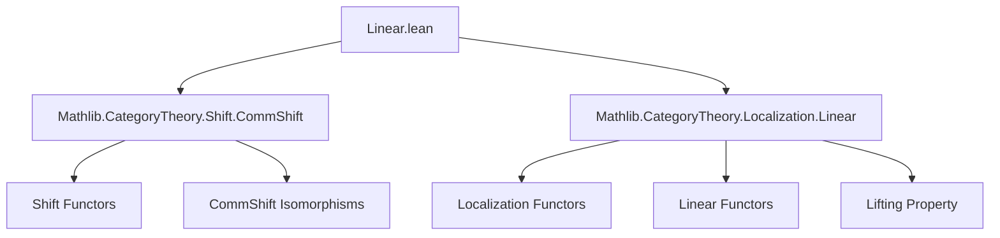

### Technical Brief: `Linear.lean` — Localization of Linearity for Shift Functors

---

#### **1. Key Definitions & Theorems**

| Name | Type / Signature | Purpose |
|------|------------------|---------|
| `shiftFunctor C n` | `C ⥤ C` | The shift functor on a category `C` indexed by `n : M`, where `M` is the shift grading monoid. |
| `L.Linear R` | `Prop` | Predicate asserting that the functor `L : C ⥤ D` is `R`-linear (i.e., preserves addition and scalar multiplication in hom-sets). |
| `shiftFunctor C n).Linear R` | `Prop` | Predicate that the shift functor on `C` is `R`-linear. |
| `L.CommShiftIso n` | `shiftFunctor D n ⋙ L ≅ L ⋙ shiftFunctor C n` | Natural isomorphism expressing that `L` commutes with shift up to isomorphism. |
| `linear_of_localization` | `lemma` | Main technical result: if `L` is a localization functor (w.r.t. `W`), `L` is `R`-linear, `C`’s shifts are `R`-linear, and `L` commutes with shifts, then `D`’s shifts are `R`-linear. |
| `instance [HasShift W.Localization M] …` | `instance` | Shows that the localization category `W.Localization` inherits `R`-linearity of shift functors under suitable assumptions. |
| `instance (n : M) [W.HasLocalization] …` | `instance` | Variant for the alternative localization construction `W.Localization'`. |

---

#### **2. Naming Conventions**

- **Prefixes**:
  - `linear_`: predicates or instances asserting `R`-linearity (e.g., `linear_of_localization`, `L.Linear R`).
  - `commShift_`: related to commutation of functors with shift (e.g., `L.CommShift M`, `L.commShiftIso`).
- **Suffixes**:
  - `_Iso`: natural isomorphisms (e.g., `commShiftIso`).
  - `_Functor`: shift functors (e.g., `shiftFunctor`).
- **Quantifier patterns**:
  - `∀ (n : M), (shiftFunctor C n).Linear R`: uniform linearity of all shifts.

---

#### **3. Tactic Stack**

- `rw [...]`: rewriting using equivalences/characterizations (e.g., `Localization.functor_linear_iff`).
- `infer_instance`: automatically fills in typeclass goals (e.g., linearity of shift functors).
- `have : ... := ⟨...⟩`: constructing witnesses for propositional typeclasses (e.g., `Localization.Lifting`).
- `intro`, `apply`, `exact`: standard proof scripting (implicit in `by` block).
- No heavy automation (`aesop`, `ring`, `simp_rw`) is used — the proof is mostly structural and typeclass-driven.

---

#### **4. Proof Logic**

The proof proceeds as follows:

1. **Assumptions**:
   - `L : C ⥤ D` is a localization w.r.t. `W`.
   - `L` is `R`-linear.
   - All shift functors on `C` are `R`-linear.
   - `L` commutes with shifts: `L.commShiftIso n` gives `shiftFunctor D n ⋙ L ≅ L ⋙ shiftFunctor C n`.

2. **Goal**: Show `(shiftFunctor D n).Linear R`.

3. **Strategy**:
   - Use the universal property of localization: to show a functor `D ⥤ D` is `R`-linear, it suffices to show its pullback along `L` is `R`-linear, *provided* the lift exists.
   - Construct a `Localization.Lifting` from `shiftFunctor C n ⋙ L` to `shiftFunctor D n` using the isomorphism `L.commShiftIso n`.
   - Apply `Localization.functor_linear_iff`, which reduces the problem to checking linearity of the composite `shiftFunctor C n ⋙ L`, which holds by assumption (`shiftFunctor C n` is linear and `L` is linear).

4. **Instances**:
   - The main lemma is applied to `W.Q : C ⥤ W.Localization` and `W.Q' : C ⥤ W.Localization'`, yielding the two instance lemmas.

---

#### **5. Imports**

| Import | Role |
|--------|------|
| `Mathlib.CategoryTheory.Shift.CommShift` | Defines `HasShift`, `CommShift`, `commShiftIso`, etc. — the infrastructure for shift functors and their commutation with functors. |
| `Mathlib.CategoryTheory.Localization.Linear` | Defines `IsLocalization`, `Linear` functors, `Localization.Lifting`, and `functor_linear_iff`. |

These imports indicate the module sits at the intersection of:
- **Shifted/graded category theory** (e.g., triangulated or graded structures),
- **Localization of categories** (e.g., derived/localization in homological algebra),
- **Enriched category theory** (`R`-linearity = enrichment over `R`-Mod).

---

#### **8. Mermaid Diagrams**

##### **Dependency Graph (Module-Level)**



##### **Theoretical Overview (Conceptual Flow)**

```mermaid
flowchart LR
  C[Category C] -->|R-linear shift| S_C[(shiftFunctor C n).Linear R]
  D[Category D] -->|?| S_D[(shiftFunctor D n).Linear R]
  L[L : C ⥤ D] -->|IsLocalization W| C
  L -->|Linear R| D
  L -->|CommShift M| S_C
  L -->|commShiftIso| S_D
  S_C & L.Linear R & L.CommShift M -->|linear_of_localization| S_D
```

##### **Instance Propagation**

```mermaid
flowchart LR
  W[Localization Data W] -->|HasLocalization| Q[W.Q : C ⥤ W.Localization]
  Q -->|linear_of_localization| Inst1[(shiftFunctor W.Localization n).Linear R]
  W -->|HasLocalization'| Q'[W.Q' : C ⥤ W.Localization']
  Q' -->|linear_of_localization| Inst2[(shiftFunctor W.Localization' n).Linear R]
```

---

### Summary

This module formalizes a **stability property** of `R`-linearity under localization: if a localization functor `L` is itself `R`-linear and commutes with shifts (up to iso), and the source category’s shifts are `R`-linear, then the target category’s shifts inherit `R`-linearity. This is foundational for constructing derived or localized categories (e.g., in homological algebra) where shift functors (e.g., cohomological degree shifts) must respect the module enrichment.
