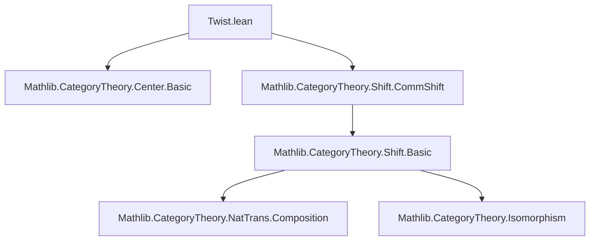
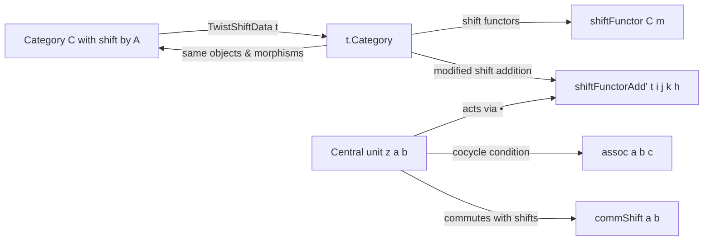

### Technical Brief: `Twist.lean`

---

#### **1. Key Definitions & Theorems**

| Name | Type / Signature | Purpose |
|------|------------------|---------|
| `TwistShiftData` | `structure` | Encodes a *twisting cochain* `z : A × A → (CatCenter C)ˣ` satisfying cocycle-like conditions (`z_zero_zero`, `assoc`) and compatibility with shifts (`commShift`). |
| `z` | `z : A → A → (CatCenter C)ˣ` | The core twisting data: invertible central elements used to modify shift isomorphisms. |
| `z_zero_zero` | `z 0 0 = 1` | Normalization condition at `(0,0)`. |
| `assoc` | `z (a + b) c * z a b = z a (b + c) * z b c` | 2-cocycle condition for additive monoid `A`. |
| `commShift` | `NatTrans.CommShift (z a b).val A` | Ensures `z a b` commutes with the shift functors (i.e., is natural w.r.t. shifts). |
| `z_zero_right`, `z_zero_left` | `z a 0 = 1`, `z 0 b = 1` | Derived normalization lemmas (simplified from `assoc`). |
| `shiftIso` | `shiftFunctor t.Category m ≅ shiftFunctor C m` | Identity isomorphism showing shift functors are unchanged as functors. |
| `shiftMkCore` | `ShiftMkCore t.Category A` | Constructs a valid shift structure on the twisted category using `z`. |
| `hasShift` | `HasShift t.Category A` | Instance derived from `shiftMkCore`. |
| `shiftFunctor_map` | Describes how `shiftFunctor t.Category m` acts on morphisms via conjugation by `shiftIso`. |
| `shiftFunctorZero_hom_app`, `shiftFunctorZero_inv_app` | Describe unitors in the twisted shift structure. |
| `shiftFunctorAdd'_hom_app`, `shiftFunctorAdd'_inv_app` | Explicit formulas for modified shift addition isomorphisms in terms of `z`. |

---

#### **2. Naming Conventions**

- **Prefixes**:
  - `z_`: for components of the twisting data (e.g., `z_zero_zero`, `z_zero_right`).
  - `shift_`: for constructions related to shifted structures (e.g., `shiftIso`, `shiftMkCore`, `shiftFunctor_map`).
  - `assoc_`, `commShift_`: for structural properties of `z`.
- **Suffixes**:
  - `_app`: for component-wise definitions at an object `X`.
  - `_hom_app`, `_inv_app`: for components of hom/inv parts of natural isomorphisms.
  - `'` (prime): used in `shift_z_app`, `shiftFunctorAdd'` to denote twisted variants.
- **Operators**:
  - `•` (smul): used for central elements acting on morphisms (e.g., `t.z a b • f`).
  - `⟦c⟧'`: notation for shift action on morphisms (via `shiftFunctor`).

---

#### **3. Tactic Stack**

- **`cat_disch`**: Primary tactic for category-theoretic simplification and discharge of trivial proofs.
- **`simp` / `simpa`**: Heavily used for simplifying expressions involving `z`, units, and shift naturality.
- **`rw`**: Rewriting using naturality, associativity, and cocycle identities.
- **`congr`**: To reduce equality of morphisms to equality of components.
- **`dsimp`**: For definitional simplification before rewriting.
- **`infer_instance`**: To synthesize instances (e.g., `hasShiftMk`).
- **`change`**: To adjust goal shape for `simp` to apply.

---

#### **4. Proof Logic**

- **Structure**: The development follows a *constructive pattern*:
  1. Define twisting data `z` satisfying algebraic (cocycle) and categorical (commutation) axioms.
  2. Derive auxiliary lemmas (`z_zero_right`, `z_zero_left`, `shift_z_app`) using `assoc` and `simp`.
  3. Construct a new shift structure (`shiftMkCore`) on a type synonym `t.Category` (identical underlying category `C`).
  4. Prove that the new structure satisfies all shift axioms (unitors, associators) using:
     - Naturality of `z a b` (via `commShift` and `shift_z_app`)
     - Cocycle identity (`assoc`)
     - Properties of central units (`Units.val_mul`, `CatCenter.smul_iso_hom_eq`)
  5. Derive explicit formulas for morphism mappings and components of modified shift isomorphisms.

- **Induction**: Not used directly; proofs rely on *algebraic manipulation* of central units and naturality.

---

#### **5. Imports & Dependencies**

- **Core dependencies**:
  ```lean
  Mathlib.CategoryTheory.Center.Basic
  Mathlib.CategoryTheory.Shift.CommShift
  ```
- **Implicit dependencies** (via `CategoryTheory.Shift` ecosystem):
  - `Mathlib.CategoryTheory.Shift.Basic`
  - `Mathlib.CategoryTheory.NatTrans.Composition`
  - `Mathlib.CategoryTheory.Isomorphism`
  - `Mathlib.CategoryTheory.Preadditive` (indirectly, via `CatCenter` and `smul_iso`)

---

#### **6. Mermaid Diagrams**

##### **Dependency Graph (Module-Level)**



##### **Conceptual Overview of `TwistShiftData` Construction**



##### **Proof Structure Overview**

```mermaid
flowchart TD
  start[Define z : A×A → (CatCenter C)ˣ] --> check1[z_zero_zero]
  check1 --> check2[assoc a b c]
  check2 --> check3[commShift a b]
  check3 --> build[Construct shiftMkCore]
  build --> verify_unit[Verify zero unitors]
  verify_unit --> verify_assoc[Verify associator]
  verify_assoc --> conclude[t.Category has HasShift]
  conclude --> derive[Derive shiftFunctorAdd'_hom_app, etc.]
```

---

#### **7. Summary**

This file formalizes a *twisting construction* for categories equipped with a shift by an additive monoid. The twisting data `z` acts as a 2-cocycle with values in the unit group of the center, modifying the shift addition isomorphisms while preserving all shift axioms. The construction is purely categorical and does not require preadditivity, though in practice `z` often encodes sign conventions (e.g., in homological algebra). The proofs rely on careful manipulation of central units and naturality, with heavy use of `simp` and `cat_disch`.
