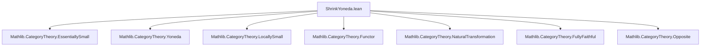

**Technical Brief: `ShrinkYoneda.lean`**

---

### 1. **Key Definitions & Theorems**

| Name | Type / Signature | Purpose |
|------|------------------|---------|
| `FunctorToTypes.Small.{w} F` | `∀ (X : C), Small.{w} (F.obj X)` | Defines when a functor `F : C ⥤ Type w'` is *$w$-small*, i.e., all component types are $w$-small. |
| `FunctorToTypes.shrink.{w} F` | `C ⥤ Type w` | Shrinks a $w$-small functor to a functor into `Type w`, using `Shrink.{w}` on each component. |
| `FunctorToTypes.shrinkMap.{w} τ` | `shrink F ⟶ shrink G` | Induced natural transformation between shrunk functors via conjugation with `equivShrink`. |
| `shrinkYoneda.{w}` | `C ⥤ Cᵒᵖ ⥤ Type w` | The *shrunken Yoneda embedding*: for each object $X$, assigns `shrink (yoneda.obj X)`; for morphisms, uses `shrinkMap`. |
| `shrinkYonedaObjObjEquiv.{w}` | `((shrinkYoneda.obj X).obj Y) ≃ (Y.unop ⟶ X)` | Equivalence between the value of the shrunken Yoneda at $(X,Y)$ and hom-sets in $C$. |
| `shrinkYonedaEquiv.{w}` | `(shrinkYoneda.obj X ⟶ P) ≃ P.obj (op X)` | Yoneda lemma for the shrunken embedding: natural transformations from `shrinkYoneda X` to $P$ correspond to elements of $P(X)$. |
| `fullyFaithfulShrinkYoneda` | `(shrinkYoneda.{w} C).FullyFaithful` | Proves that `shrinkYoneda` is fully faithful. |
| `map_shrinkYonedaEquiv`, `shrinkYonedaEquiv_shrinkYoneda_map`, `shrinkYonedaEquiv_comp`, `shrinkYonedaEquiv_naturality`, `shrinkYonedaEquiv_symm_map` | Lemmas about interaction of `shrinkYonedaEquiv` with composition, mapping, etc. | Technical lemmas supporting the Yoneda lemma and fully faithfulness proof. |

---

### 2. **Naming Conventions**

- **Prefixes**:
  - `shrinkYoneda*`: core definitions and lemmas for the shrunken Yoneda embedding.
  - `FunctorToTypes.*`: utilities for handling functors to `Type`, especially regarding smallness.
  - `shrink*`: operations on functors to `Type` that reduce universe level.
- **Suffixes**:
  - `Equiv`: indicates an equivalence (often a Yoneda-style bijection).
  - `Map`: natural transformation induced by a morphism or map.
  - `ObjObj`: refers to double application: `obj X . obj Y`.
- **Universe annotations**: `.{w}` is consistently used to track universe levels.

---

### 3. **Tactic Stack**

- `simp`: heavily used, especially with `shrinkYoneda`, `shrinkYonedaEquiv`, `shrinkYonedaObjObjEquiv`.
- `ext`: extensionality for natural transformations and functions.
- `rw`, `rfl`, `congr_fun`: for rewriting and congruence reasoning.
- `obtain ⟨f, rfl⟩ := ...`: surjectivity arguments (e.g., from `equivShrink`).
- `cat_disch`: category-theoretic discharge tactic (likely from `Mathlib.CategoryTheory.Category.Basic`).
- `simpa [shrinkYoneda] using ...`: simplifies using target lemmas.
- `by dsimp; infer_instance`: for instance resolution after simplification.

---

### 4. **Proof Logic**

- **Structure**: Proofs follow a standard Yoneda-style pattern:
  1. Define an equivalence (e.g., `shrinkYonedaEquiv`) via evaluation at identity.
  2. Prove inverse properties (`left_inv`, `right_inv`) using naturality and properties of `equivShrink`.
  3. Derive consequences (e.g., fully faithfulness) by showing that hom-sets match via the equivalence.
- **Induction/Case analysis**: Not used directly; instead, proofs rely on:
  - Surjectivity/injectivity of `equivShrink`.
  - Naturality squares.
  - Simplification with `simps` and `@[simps]` attributes.
- **Universe management**: Critical; all constructions are universe-polymorphic and carefully track `w`, `w'`, `v`, `u`.

---

### 5. **Imports**

- `Mathlib.CategoryTheory.EssentiallySmall`: provides `Small`, `Shrink`, `equivShrink`, and related machinery.
- Implicit imports (via `CategoryTheory` namespace):
  - `Mathlib.CategoryTheory.Functor`
  - `Mathlib.CategoryTheory.NaturalTransformation`
  - `Mathlib.CategoryTheory.Yoneda` (via `yoneda`)
  - `Mathlib.CategoryTheory.LocallySmall`
  - `Mathlib.CategoryTheory.FullyFaithful`
  - `Mathlib.CategoryTheory.Opposite`

---

### 6. **Mermaid Diagrams**

#### **Dependency Graph (Module-Level)**



#### **Conceptual Overview of `shrinkYoneda`**

```mermaid
graph LR
  C[Category C] -->|shrinkYoneda| D[Functors Cᵒᵖ ⥤ Type w]
  subgraph C_obj
    X[X : C]
  end
  subgraph D_obj
    SX[shrinkYoneda.obj X : Cᵒᵖ ⥤ Type w]
  end
  X -->|obj| SX
  SX -->|eval at op Y| Hom[Y.unop ⟶ X]
  SX -->|nat. trans. to P| P.obj (op X)
```

#### **Yoneda Lemma for `shrinkYoneda`**

```mermaid
graph LR
  Nat[ NatTrans (shrinkYoneda.obj X, P) ] -- shrinkYonedaEquiv --> Eval[P.obj (op X)]
  Eval -- shrinkYonedaEquiv.symm --> Nat
```

---

### 7. **Summary**

This file formalizes the *shrunken* Yoneda embedding for locally small categories, ensuring the codomain stays within a fixed universe `w`. It leverages `Shrink` and `equivShrink` to reduce universe levels, and proves a full Yoneda lemma for this variant. The construction is fully faithful, and all key equivalences are explicitly constructed with proofs of invertibility and naturality. The file is typical of modern Lean category theory: heavily reliant on simplification, universe management, and categorical structure.
