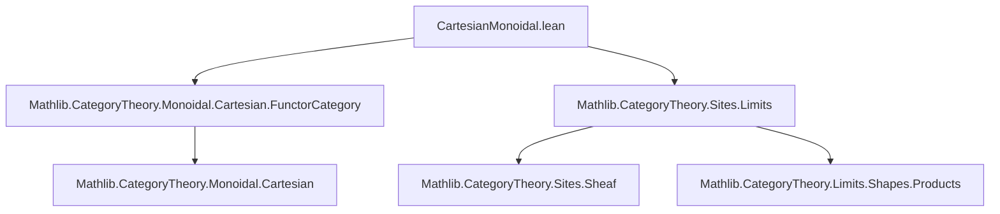

### Technical Brief: `CartesianMonoidal.lean`

---

#### **1. Key Definitions & Theorems**

| Name | Type / Purpose |
|------|----------------|
| `tensorProd_isSheaf` | `lemma`: Shows that the tensor product (i.e., categorical product in `A`) of two sheaves (viewed as presheaves) is again a sheaf. Used to construct binary products in `Sheaf J A`. |
| `tensorUnit_isSheaf` | `lemma`: Shows that the terminal object (unit for Cartesian monoidal structure) in presheaves is a sheaf. Used to construct the terminal object in `Sheaf J A`. |
| `cartesianMonoidalCategory` | `noncomputable instance`: Constructs a `CartesianMonoidalCategory` structure on `Sheaf J A`, given one on `A`. Built via `ofChosenFiniteProducts`, using the above lemmas to verify sheaf conditions on limits. |
| `sheafToPresheafMonoidal` | `noncomputable instance`: Shows that the forgetful functor `sheafToPresheaf J A : Sheaf J A ⥤ Cᵒᵖ ⥤ A` is *strictly* monoidal (w.r.t. Cartesian structures). |
| `cartesianMonoidalCategoryFst_val`, `cartesianMonoidalCategorySnd_val`, `cartesianMonoidalCategoryLift_val`, etc. | `[simp]` lemmas: Describe how the Cartesian structure on sheaves behaves under the underlying presheaf functor (`val`). Crucial for simplification and reasoning about morphisms. |

---

#### **2. Naming Conventions**

- **Prefixes**:
  - `tensor_`: Refers to the monoidal product (i.e., product in `A`) lifted to presheaves/sheaves.
  - `cartesianMonoidalCategory_`: Names projections and mediating morphisms in the Cartesian structure on sheaves.
  - `sheafToPresheaf_`: Refers to structure maps of the monoidal functor `sheafToPresheaf`.
- **Suffixes**:
  - `_val`: Indicates equality of underlying presheaf components (e.g., `(fst X Y).val = fst X.val Y.val`).
  - `_isSheaf`: Verifies sheaf condition for a presheaf constructed from monoidal operations.

---

#### **3. Tactic Stack**

- `apply isSheaf_of_isLimit`: Central tactic to prove sheafness by reducing to limit preservation.
- `exact (IsLimit.postcomposeInvEquiv _ _).invFun _`: Used to transport limit cones along equivalences.
- `simp` / `simpa`: Heavily used in simplification of morphism equalities, especially after applying `Sheaf.hom_ext`.
- `Sheaf.hom_ext`: Standard extensionality principle for sheaf morphisms; used repeatedly to reduce to presheaf level.
- `CartesianMonoidalCategory.hom_ext`: Used to prove equality of morphisms in `A` by projecting via `fst`/`snd`.
- `intro` / `rintro` / `cases`: Standard for destructuring hypotheses/cones.
- `ring` / `aesop`: Not present — this file is heavily limit- and sheaf-theoretic, not algebraic.

---

#### **4. Proof Logic**

The core proof strategy is:

1. **Construct candidate finite products** in `Sheaf J A`:
   - Terminal object: `asEmptyCone { val := 𝟙_, cond := tensorUnit_isSheaf }`.
   - Binary products: `BinaryFan.mk` with cone apex `X.val ⊗ Y.val`, verified to be a sheaf via `tensorProd_isSheaf`.

2. **Verify sheaf condition** for these cones:
   - Use `isSheaf_of_isLimit`, reducing to showing that the underlying presheaf cone is a limit cone.
   - Leverage `tensorProductIsBinaryProduct` (from `Monoidal.Cartesian`) to know that `⊗` is the product in `A`, hence its lift is a limit cone in presheaves.

3. **Check limit universal property**:
   - `isLimit.lift`, `fac`, `uniq`: Defined pointwise on underlying presheaves, then uniqueness/factorization follows from sheaf extensionality (`Sheaf.hom_ext`) and `CartesianMonoidalCategory.hom_ext`.

4. **Monoidality of `sheafToPresheaf`**:
   - Proven by constructing a strict monoidal structure: all structure maps are identities, verified via `rfl`.

---

#### **5. Imports**

| Import | Role |
|--------|------|
| `Mathlib.CategoryTheory.Monoidal.Cartesian.FunctorCategory` | Provides `tensorProductIsBinaryProduct`, `CartesianMonoidalCategory` infrastructure, and functorial Cartesian monoidal structures. |
| `Mathlib.CategoryTheory.Sites.Limits` | Supplies `isSheaf_of_isLimit`, `Sheaf` definitions, and limit-related sheaf theory. |

---

#### **6. Mermaid Diagrams**

##### **Dependency Graph (File-Level)**



##### **Overview of Theoretical Flow**

```mermaid
flowchart LR
  A[CartesianMonoidalCategory A] --> B[Presheaf C A = Cᵒᵖ ⥤ A]
  B --> C[Sheaf J A]
  C -->|sheafToPresheaf| B
  B -->|⊗, 𝟙_|D[Binary products & terminal obj. in Presheaf]
  D -->|tensorProd_isSheaf, tensorUnit_isSheaf| C
  C -->|cartesianMonoidalCategory| E[CartesianMonoidalCategory (Sheaf J A)]
  C -->|sheafToPresheafMonoidal| B
```

##### **Sheaf Construction via Limits**

```mermaid
flowchart LR
  X.val ⊗ Y.val[Underlying tensor in A] -->|preserves limits| X.val ⊗ Y.val[As presheaf]
  X.val ⊗ Y.val -->|tensorProd_isSheaf| {X ⊗ Y : Sheaf J A}
  𝟙_ A -->|tensorUnit_isSheaf| {𝟙_ : Sheaf J A}
  subgraph SheafStructure
    X ⊗ Y
    𝟙_
  end
  SheafStructure -->|ofChosenFiniteProducts| CartesianStructure[CartesianMonoidalCategory (Sheaf J A)]
```

---

#### **7. Summary**

This file establishes that the category of `A`-valued sheaves on a site `C` inherits a Cartesian monoidal structure from `A`, provided `A` is Cartesian monoidal. The construction is explicit and constructive (via `ofChosenFiniteProducts`), and the forgetful functor from sheaves to presheaves is shown to be *strictly* monoidal. The proofs rely heavily on sheaf-theoretic limit characterizations and extensionality principles for sheaf morphisms.
