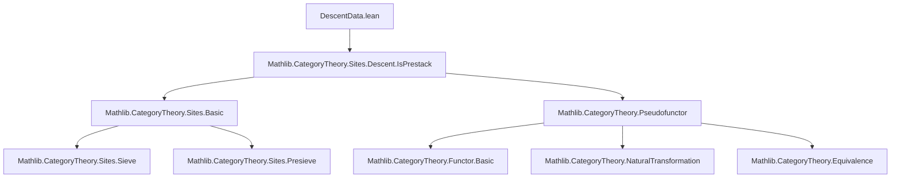
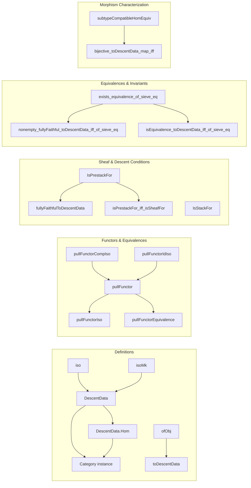

Here is the structured technical metadata extracted from `DescentData.lean`:

---

### **1. Key Definitions & Theorems**

| Name | Type / Structure | Purpose |
|------|------------------|---------|
| `DescentData` | `structure` | Objects: families of objects over `X i` with compatibility isomorphisms after pullback; morphisms: natural transformations commuting with these isomorphisms. |
| `DescentData.Hom` | `structure` | Morphisms between descent data: families of morphisms compatible with descent isomorphisms. |
| `DescentData.category` | `instance` | Equips `F.DescentData f` with a category structure. |
| `DescentData.ofObj` | `def` | Constructs descent data from a global object `M : F.obj (op S)` via pullback along `f i`. |
| `DescentData.iso` | `def` | Shows `D.hom q f₁ f₂` is an isomorphism. |
| `DescentData.isoMk` | `def` | Constructor for isomorphisms in `DescentData`. |
| `DescentData.toDescentData` | `def` | Functor `F.obj (op S) ⥤ F.DescentData f`, sending `M ↦ ofObj M`. |
| `DescentData.pullFunctor` | `def` | Induced functor `F.DescentData f ⥤ F.DescentData f'` under compatible diagrams. |
| `DescentData.pullFunctorIso` | `NatIso` | Independence of auxiliary data up to natural isomorphism. |
| `DescentData.pullFunctorEquivalence` | `def` | Equivalence `F.DescentData f ≌ F.DescentData f'` when `f, f'` differ by isomorphism or sieve-equivalence. |
| `DescentData.exists_equivalence_of_sieve_eq` | `lemma` | If `Sieve.ofArrows f = Sieve.ofArrows f'`, then descent categories are equivalent. |
| `DescentData.nonempty_fullyFaithful_toDescentData_iff_of_sieve_eq` | `lemma` | Fully faithfulness of `toDescentData` is invariant under sieve equivalence. |
| `DescentData.isEquivalence_toDescentData_iff_of_sieve_eq` | `lemma` | Equivalence property of `toDescentData` is invariant under sieve equivalence. |
| `DescentData.subtypeCompatibleHomEquiv` | `def` | Equivalence between compatible families of sections and morphisms in descent category. |
| `IsPrestackFor` | `structure` | Predicate: `F.toDescentData` for `R` is fully faithful. |
| `IsStackFor` | `structure` | Predicate: `F.toDescentData` for `R` is an equivalence. |
| `fullyFaithfulToDescentData` | `noncomputable def` | If `f` is a covering family, then `toDescentData f` is fully faithful (under `F.IsPrestack J`). |
| `isPrestackFor_iff_isSheafFor` | `lemma` | `F.IsPrestackFor R.arrows` iff `F.presheafHom M N` is a sheaf for `R`. |
| `IsPrestack.of_isPrestackFor` | `lemma` | If `F` satisfies `IsPrestackFor` for all covering sieves, then `F` is a prestack. |

---

### **2. Naming Conventions**

- **Prefixes**:
  - `is_`: predicates (e.g., `IsPrestackFor`, `IsStackFor`)
  - `pull_`: pullback-induced constructions (`pullFunctor`, `pullFunctorObj`, `pullFunctorObjHom`)
  - `of_`: constructions from global data (`ofObj`, `ofArrows`)
  - `subtype_`: equivalences involving subtypes (`subtypeCompatibleHomEquiv`)
- **Suffixes**:
  - `_hom`: hom-component of a structure/def (`hom`, `pullFunctorObjHom`)
  - `_iso`: isomorphisms/natural isomorphisms (`pullFunctorIso`, `pullFunctorIdIso`, `toDescentDataCompPullFunctorIso`)
  - `_equivalence`: equivalences of categories (`pullFunctorEquivalence`)
  - `_comp`: composition-related (`pullFunctorCompIso`)
- **Other**:
  - `comm`: commutativity condition in `Hom` and `DescentData`
  - `ext`: extensionality lemmas (`hom_ext`, `subtypeCompatibleHomEquiv_toCompatible_presheafHomObjHomEquiv`)

---

### **3. Tactic Stack**

Frequent tactics used in proofs:

| Tactic | Usage |
|--------|-------|
| `simp` / `dsimp` | Simplification of pullbacks, naturality, identities |
| `rw` / `rwa` | Rewriting using definitions, especially `mapComp'`, `pullHom`, `hom_comp`, `hom_self` |
| `ext` | Extensionality for morphisms/structures |
| `apply`, `exact`, `intro`, `cases` | Basic proof structure |
| `congr` / `congr'` | Congruence for equalities of functors/natural transformations |
| `convert` / `congr_arg` | Partial equality with proof obligations |
| `have`, `suffices`, `by_cases` | Intermediate lemmas |
| `cancel_mono`, `cancel_epi` | Cancellation in monic/epic contexts |
| `reassoc` / `reassoc_of%` | Reassociation of compositions (custom attribute) |
| `grind` / `cat_disch` | Custom tactics for category-theoretic discharge (likely from `Mathlib.CategoryTheory.Sites.Basic`) |
| `aesop` / `tauto` | Not present in this file (lean 4 style avoids heavy automation here) |

---

### **4. Proof Logic**

- **Inductive/structural reasoning** on families of morphisms and their pullbacks.
- **Naturality and coherence** are central: proofs often reduce to verifying naturality squares commute using `hom_comp`, `hom_self`, and `pullHom_hom`.
- **Equivalence proofs** (`pullFunctorEquivalence`, `pullFunctorIso`, etc.) proceed by:
  1. Defining functors (`pullFunctorObj`, `pullFunctor`).
  2. Constructing unit/counit isomorphisms via `isoMk`.
  3. Verifying triangle identities using coherence lemmas (`mapComp'₀₁₃`, `mapComp'₀₂₃`, etc.).
- **Sheaf-theoretic characterizations** (`isPrestackFor_iff_isSheafFor`) use:
  - `subtypeCompatibleHomEquiv` to translate descent morphisms to compatible sections.
  - Sheaf condition ↔ bijectivity of descent map.
- **Sieve invariance** proofs rely on:
  - `exists_equivalence_of_sieve_eq` (constructing equivalence via choice of factorizations).
  - Invariance lemmas (`nonempty_fullyFaithful_toDescentData_iff_of_sieve_eq`, `isEquivalence_toDescentData_iff_of_sieve_eq`).

---

### **5. Imports**

- `Mathlib.CategoryTheory.Sites.Descent.IsPrestack`  
  → Provides foundational definitions: `Presieve`, `Sieve`, `IsPrestack`, `IsStack`, `Presieve.IsSheafFor`, etc.

- `LocallyDiscreteOpToCat` (via `open LocallyDiscreteOpToCat`)  
  → Used to interpret `LocallyDiscrete Cᵒᵖ` as a category for pseudofunctor targets.

- `Opposite`  
  → For `op : C ⟶ Cᵒᵖ`.

- `CategoryTheory` universe polymorphism (`universe t t' t'' v' v u' u`)  
  → Standard for category-theoretic developments.

---

### **6. Mermaid Diagrams**

#### **Dependency Graph (Top-Level)**

#### **Overview of File Structure**

---

Let me know if you'd like a **module dependency graph**, **proof dependency DAG**, or **formalization roadmap** for future extensions (e.g., multiple variants of `DescentData`).
