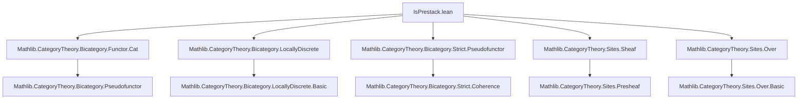

### Technical Brief: `IsPrestack.lean`

---

#### **1. Key Definitions & Theorems**

| Name | Type / Signature | Purpose |
|------|------------------|---------|
| `pullHom` | `φ : (F.map f₁.op.toLoc).obj M₁ ⟶ (F.map f₂.op.toLoc).obj M₂ → (F.map gf₁.op.toLoc).obj M₁ ⟶ (F.map gf₂.op.toLoc).obj M₂` | Pullback of morphisms along composite arrows, respecting pseudofunctoriality constraints (`hgf₁`, `hgf₂`). Implements the action of restriction along morphisms in `Over S`. |
| `map_eq_pullHom` | Lemma | Relates the direct action of `F.map g` on `φ` to `pullHom`, showing it factors through invertible coherence isomorphisms. |
| `pullHom_id` | Lemma | Identity compatibility: pulling back along identity gives back the original morphism. |
| `pullHom_pullHom` | Lemma | Associativity of pullback: pulling back along `g` then `g'` equals pulling back along `g' ≫ g`. |
| `presheafHom` | `F.presheafHom M N : (Over S)ᵒᵖ ⥤ Type v'` | Presheaf of morphisms: sends `p : X → S` to $\mathrm{Hom}(p^*M, p^*N)$. Core object encoding descent data for morphisms. |
| `presheafHomObjHomEquiv` | `(M ⟶ N) ≃ (F.presheafHom M N).obj (op (Over.mk (𝟙 S)))` | Identifies global morphisms with sections over the identity object — coherence with pseudofunctor identity laws. |
| `overMapCompPresheafHomIso` | `NatIso` | Compatibility of `presheafHom` with base change: restriction along `q : S' → S` corresponds to pulling back objects along `q`. |
| `IsPrestack` | `class` | Property: for all `M, N`, `F.presheafHom M N` is a sheaf w.r.t. `J`. Encodes *descent of morphisms* — the defining condition for a prestack. |
| `sheafHom` | `F.sheafHom M N : Sheaf (J.over S) (Type v')` | If `F` is a prestack, this is the sheafification of `presheafHom`, i.e., the actual sheaf of morphisms. |

---

#### **2. Naming Conventions**

- **Prefixes**:
  - `pullHom`: indicates pullback of a hom along a morphism.
  - `presheafHom`: presheaf version of hom-objects.
  - `sheafHom`: sheaf version (only defined under `IsPrestack`).
- **Suffixes**:
  - `Equiv`, `Iso`, `Hom`: standard for equivalences, isomorphisms, hom-objects.
  - `comp`: indicates compatibility with composition (e.g., `overMapCompPresheafHomIso`).
- **Structure**:
  - `F.mapComp'`, `F.mapId`: pseudofunctor coherence isomorphisms.
  - `.toLoc`, `.op`: conversion between `LocallyDiscrete Cᵒᵖ` and `Cᵒᵖ`.

---

#### **3. Tactic Stack**

| Tactic | Usage Frequency | Purpose |
|--------|-----------------|---------|
| `aesop` | High | Solves trivial category-theoretic equalities (e.g., `by aesop` in `hgf₁`, `hgf₂` fields). |
| `simp` | High | Simplifies using `simps`, coherence lemmas (`mapComp'_comp_id_hom_app`, etc.). |
| `rw` | Medium | Rewrites using naturality, associativity, and pseudofunctor laws. |
| `dsimp` | Medium | Simplifies definitions (e.g., in `pullHom_pullHom`). |
| `ext` | Low | Extensionality for natural transformations / morphisms. |
| `rintro` | Medium | Intro pattern for dependent hypotheses. |
| `exact`, `assumption` | Implicit | Used internally by `aesop`. |

---

#### **4. Proof Logic**

- **Structure**: Proofs are largely *coherence-based* and *naturality-driven*.
- **Typical Flow**:
  1. **Unfold definitions** (`dsimp [pullHom]`).
  2. **Apply pseudofunctor laws** (`Functor.map_comp`, `F.mapComp'_inv_whiskerRight_mapComp'₀₂₃_inv_app`, etc.).
  3. **Use invertibility of coherence isomorphisms** (`Iso.inv_hom_id`, `Iso.hom_inv_id`).
  4. **Simplify using simp lemmas** (`mapComp'_comp_id_hom_app`, `Cat.Hom₂.id_app`, etc.).
- **Induction**: Not used — all arguments are *strict categorical coherence*.
- **Key Lemma Patterns**:
  - `pullHom_pullHom` → associativity of restriction.
  - `map_eq_pullHom` → factorization of `F.map g` through coherence.
  - `overMapCompPresheafHomIso` → naturality of `presheafHom` in base.

---

#### **5. Imports & Dependencies**

| Module | Role |
|--------|------|
| `Mathlib.CategoryTheory.Bicategory.Functor.Cat` | Pseudofunctors into `Cat`. |
| `Mathlib.CategoryTheory.Bicategory.LocallyDiscrete` | Encodes `LocallyDiscrete Cᵒᵖ` — discrete homs, used for pseudofunctor domain. |
| `Mathlib.CategoryTheory.Bicategory.Strict.Pseudofunctor` | Formalizes pseudofunctors and their coherence data (`mapComp'`, `mapId`, etc.). |
| `Mathlib.CategoryTheory.Sites.Sheaf` | Sheaves on a site; used in `IsPrestack` definition. |
| `Mathlib.CategoryTheory.Sites.Over` | Slice/over categories as sites (`J.over S`). |

---

#### **6. Mermaid Diagrams**

##### **Dependency Graph (Module-Level)**



##### **Conceptual Overview (File-Level)**

```mermaid
flowchart LR
  subgraph Domain
    C[Category C] --> J[Grothendieck Topology J]
    C --> F[Pseudofunctor F : LocallyDiscrete Cᵒᵖ ⥤ Cat]
  end

  subgraph Construction
    F --> M[M, N ∈ F(S)]
    M --> presheafHom[F.presheafHom M N : (Over S)ᵒᵖ ⥤ Type]
    presheafHom --> pullHom[Pullback maps pullHom]
    presheafHom --> presheafHomObjHomEquiv[Equiv with global homs]
    presheafHom --> overMapCompPresheafHomIso[Base-change compatibility]
  end

  subgraph Property
    presheafHom -->|IsPrestack J| IsSheaf[Each presheafHom is a sheaf]
    IsSheaf --> sheafHom[F.sheafHom M N : Sheaf (J.over S)]
  end

  style Domain fill:#f9f,stroke:#333
  style Construction fill:#bbf,stroke:#333
  style Property fill:#bfb,stroke:#333
```

---

#### **7. Theory Context & Role**

- **Position in Theory**: This file formalizes the *morphism descent* condition for pseudofunctors — the first half of the stack condition (the second being effective descent).
- **Relation to Literature**:
  - Aligns with Giraud’s *Cohomologie non abélienne*: prestack = descent of morphisms.
  - Differs from Laumon–Moret-Bailly by not requiring morphism categories to be groupoids.
- **Future Use**:
  - `IsPrestack` is a prerequisite for defining `IsStack` (effective descent).
  - `presheafHom` and `sheafHom` are foundational for internal homs in fibered categories.
  - Used in cohomological descent, moduli problems, and descent theory in algebraic geometry.

--- 

Let me know if you'd like a formalization roadmap (e.g., next steps: `IsStack`, descent data, effective descent).
