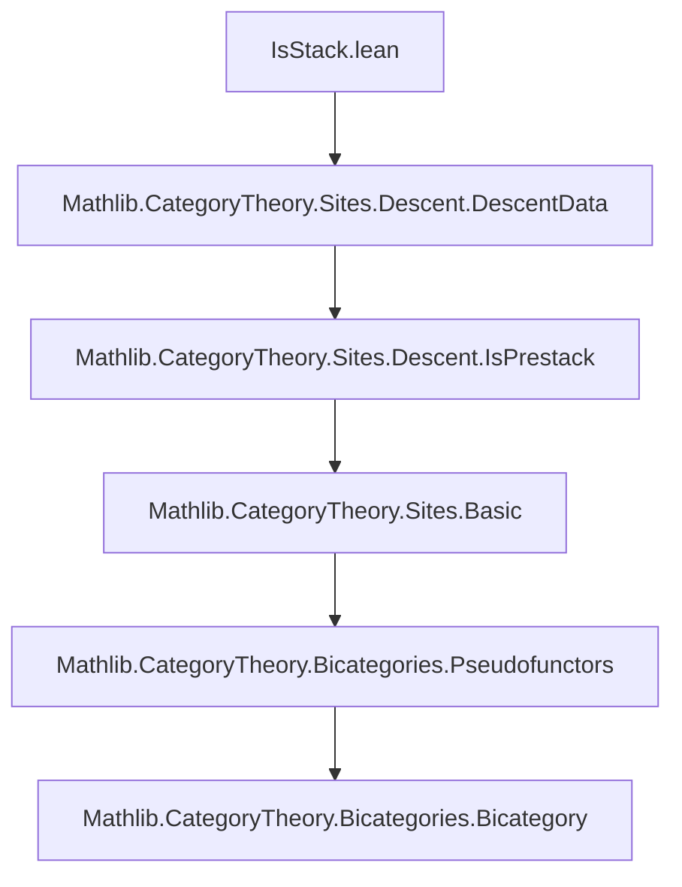
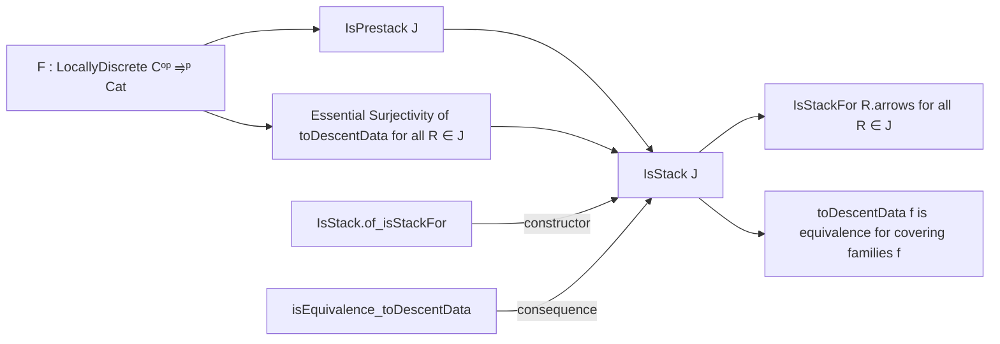
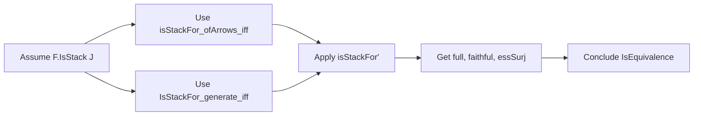

### Technical Brief: `IsStack.lean`

---

#### **1. Key Definitions & Theorems**

| Name | Type / Class | Purpose |
|------|--------------|---------|
| `IsStack` | `class IsStack (F : LocallyDiscrete Cᵒᵖ ⥤ᵖ Cat.{v', u'}) (J : GrothendieckTopology C) : Prop` | Defines that a pseudofunctor `F` is a *stack* for a Grothendieck topology `J`: i.e., it satisfies *effective descent*. Extends `IsPrestack`, requiring that for every covering sieve `R ∈ J(S)`, the comparison functor `F.toDescentData R.arrows` is essentially surjective. |
| `essSurj_of_sieve` | `∀ {S} {R : Sieve S}, R ∈ J S → (F.toDescentData R.arrows).EssSurj` | Core axiom of `IsStack`: essential surjectivity of the descent comparison functor for covering sieves. |
| `isStackFor'` | `lemma` | Shows that if `F` is a stack, then it satisfies `IsStackFor` for *sieves* (not just presieves). |
| `isStackFor` | `lemma` | Extends `isStackFor'` to presieves: if the *generated sieve* is covering, then `F` satisfies descent for the presieve. |
| `isEquivalence_toDescentData` | `lemma` | Under `IsStack`, the comparison functor `F.toDescentData f` for a family of arrows `f : ∀ i, X i ⟶ S` with covering sieve `Sieve.ofArrows _ f ∈ J S` is an *equivalence of categories*. |
| `IsStack.of_isStackFor` | `lemma` (constructor) | Provides a way to prove `F.IsStack J` by assuming that `F.toDescentData` is an equivalence (via `IsStackFor`) for all covering sieves. |

---

#### **2. Naming Conventions**

- **Prefixes**:
  - `isStackFor`: predicate for descent along a (pre)sieve.
  - `essSurj_of_sieve`: emphasizes *essential surjectivity* for sieves.
  - `toDescentData`: standard notation for the comparison functor from `F(S)` to descent data.
- **Suffixes**:
  - `'_` variants (e.g., `isStackFor'`) often indicate refinements or variants for sieves vs presieves.
  - `of_` in constructors (`of_isStackFor`) indicates a way to build the class from hypotheses.

---

#### **3. Tactic Stack**

Frequent tactics used in proofs:
- `rw` — rewriting using equivalences/definitions (`isStackFor_iff`, `← ...`).
- `simpa` — simplifying using a lemma and closing the goal.
- `infer_instance` — inferring class instances (e.g., `IsPrestack`).
- `have` / `exact` — building intermediate lemmas and concluding proofs.
- `by simpa using ...` — common pattern to derive `IsStackFor` from `IsStackFor'`.

No heavy automation (`aesop`, `ring`, `linarith`) — proofs are mostly structural and rely on categorical lemmas.

---

#### **4. Proof Logic**

- **Structure of proofs**:
  1. **Unfold definitions** (`rw`, `← ...`) to reduce to known criteria (e.g., `isStackFor_iff`).
  2. **Extract components** of `IsStack` (e.g., `isPrestack`, `essSurj_of_sieve`) via `have`.
  3. **Combine properties**:
     - `IsStack` ⇒ `IsPrestack` + essential surjectivity ⇒ full, faithful, essentially surjective ⇒ equivalence.
  4. **Constructors** (`of_isStackFor`) reverse the implication: assume descent equivalence for all covering sieves ⇒ `IsStack`.

- **Induction**: Not used — proofs are categorical and rely on universal properties and functoriality.

---

#### **5. Imports**

- `Mathlib.CategoryTheory.Sites.Descent.DescentData`  
  → Provides `toDescentData`, `IsStackFor`, `EssSurj`, etc.

This module builds on descent theory for pseudofunctors into `Cat`, extending `IsPrestack` with *effectiveness*.

---

#### **8. Mermaid Diagrams**

##### **Dependency Graph (Module-Level)**

##### **Conceptual Overview of `IsStack`**

##### **Proof Flow for `isEquivalence_toDescentData`**

---

This file formalizes the *effectiveness* condition in descent theory: a stack is a pseudofunctor where descent data is not just representable (as in `IsPrestack`) but *effectively* so — i.e., every descent datum arises (essentially uniquely) from an object in the base category.
