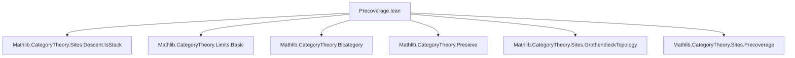
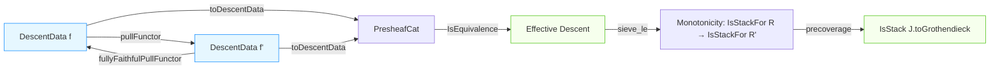

Here is the structured technical brief for `Precoverage.lean`, extracted with precision and aligned with Lean 4 formalization conventions.

---

### **1. Key Definitions & Theorems**

| Name | Type / Signature | Purpose |
|------|------------------|---------|
| `pullFunctor` | `F.DescentData f ⥤ F.DescentData f'` | Pullback functor induced by a morphism of covering families `f' → f`. |
| `faithful_pullFunctor` | `Faithful (pullFunctor F ...)` | Shows `pullFunctor` is faithful when `f'` is a covering family and `F` is a prestack. |
| `full_pullFunctor` | `Full (pullFunctor F ...)` | Shows `pullFunctor` is full under same hypotheses. |
| `fullyFaithfulPullFunctor` | `FullyFaithful (pullFunctor F ...)` | Consequence: `pullFunctor` is fully faithful. |
| `hom` | `D₁.obj i ⟶ D₂.obj i` | Glued morphism from descent data over `f'` to descent data over `f`, using prestack property. |
| `mor` | `(F.presheafHom ...).obj ...` | Local section over a sieve element, used to define `hom` via amalgamation. |
| `familyOfElements` | `Presieve.FamilyOfElements ...` | Family of local sections compatible over the sieve `sieve f f' i`. |
| `isEquivalence_toDescentData_of_sieve_le` | `(F.toDescentData f').IsEquivalence → (F.toDescentData f).IsEquivalence` | If descent is effective for `f'`, and `f'` refines `f`, then descent is effective for `f`. |
| `IsStackFor.of_le` | `R ≤ R' → F.IsStackFor R → F.IsStackFor R'` | Monotonicity of being a stack: if `R` is covered and `F` is a stack for `R`, then it is for any larger presieve `R'`. |
| `IsStackFor.of_le'` | `R ≤ R' → F.IsStackFor R.arrows → F.IsStackFor R'.arrows` | Variant for sieves instead of presieves. |
| `IsPrestack.of_precoverage` | `(∀ R ∈ J.coverings, F.IsPrestackFor R) → F.IsPrestack J.toGrothendieck` | To check `F` is a prestack for the *Grothendieck topology* generated by `J`, it suffices to check it on the *precoverage* `J`, assuming `J` satisfies extra stability axioms. |
| `IsStack.of_precoverage` | `(∀ R ∈ J.coverings, F.IsStackFor R) → F.IsStack J.toGrothendieck` | Same as above but for stacks. |

---

### **2. Naming Conventions**

- **Prefixes**:
  - `is_`: Predicate definitions (e.g., `IsPrestack`, `IsStackFor`, `IsStack`).
  - `pull_`: Functors/morphisms induced by pullback (e.g., `pullFunctor`, `pullHom`).
  - `mor`, `familyOfElements`, `hom`: Local → global constructions in descent theory.
- **Suffixes**:
  - `_functor`, `_hom`, `_obj`: Distinguish functors, morphisms, objects.
  - `_mem`, `_fac`, `_eq`: For lemmas about membership, factorization, or equality.
  - `_le`, `_le'`: Variants for presieves vs sieves.
- **Other patterns**:
  - `ofArrows`: Refers to presieves generated by families of arrows.
  - `over_`, `Sieve.overEquiv`: Over-category sieve equivalences.
  - `amalgamate`: Gluing operation in sheaf theory.

---

### **3. Tactic Stack**

| Tactic | Frequency | Role |
|--------|-----------|------|
| `cat_disch` | Very high | Solves trivial categorical equalities (e.g., diagram chasing). |
| `simp` / `simp only` | Very high | Simplification using definitional equalities, functoriality, naturality. |
| `rw` | High | Rewriting using lemmas, definitions, and isomorphisms. |
| `ext` | Medium | Extensionality for morphisms, functions, presheaf homs. |
| `obtain` / `cases` | Medium | Extracting witnesses from existential hypotheses. |
| `refine` | Medium | Constructing proofs term-by-term with holes. |
| `dsimp` | Medium | Definitional simplification (often before `simp`). |
| `grind` | Low | Custom tactic (likely for associativity/identity normalization). |
| `convert` | Low | Upgrading equalities modulo definitional equality. |
| `apply` / `exact` | Low | Direct proof steps. |

---

### **4. Proof Logic**

The logical flow is **descent-theoretic**, with the following recurring pattern:

1. **Refinement Setup**: Given two covering families `f`, `f'` with `Sieve.ofArrows f' ≤ Sieve.ofArrows f`.
2. **Sieve Construction**: Define `sieve f f' i` as the pullback sieve on `Over (X i)`.
3. **Covering Property**: Use stability axioms (`J.pullback_stable`) to show `sieve f f' i ∈ J.over`.
4. **Local Construction**: Define `mor`, `familyOfElements`, prove compatibility.
5. **Gluing**: Use `IsPrestack.isSheaf` (via `amalgamate`) to define global `hom`.
6. **Verification**: Check that `hom` satisfies descent compatibility (`comm`) and functoriality.
7. **Full Faithfulness**: Combine `faithful_pullFunctor` and `full_pullFunctor`.
8. **Monotonicity**: Use full faithfulness + essential surjectivity (via equivalence assumption) to deduce `IsEquivalence` for refined families.
9. **Precoverage Reduction**: Use stability axioms (`HasIsos`, `IsStableUnderBaseChange`, `IsStableUnderComposition`) to reduce checking prestack/stack conditions from the generated topology to the original precoverage.

Induction is *not* used; the arguments are **diagrammatic and categorical**, relying heavily on:
- Sheaf condition (amalgamation of sections),
- Pullback stability of covering sieves,
- Equivalence of descent data under refinement.

---

### **5. Imports**

| Import | Role |
|--------|------|
| `Mathlib.CategoryTheory.Sites.Descent.IsStack` | Core descent theory: `IsStackFor`, `DescentData`, `toDescentData`, etc. |
| `Mathlib.CategoryTheory.Limits.Basic` (via `Limits`) | Pullbacks, over-categories, sieves. |
| `Mathlib.CategoryTheory.Bicategory` (via `Bicategory`) | Pseudofunctors, natural isomorphisms, whiskering. |
| `Mathlib.CategoryTheory.Presieve` (via `Presieve`) | Presieves, sieves, sheaf conditions. |
| `Mathlib.CategoryTheory.Sites.GrothendieckTopology` (via `GrothendieckTopology`) | Topologies, covering sieves, stability axioms. |
| `Mathlib.CategoryTheory.Sites.Precoverage` (implicit) | Precoverages, their generated topologies. |

---

### **6. Mermaid Diagrams**

#### **Dependency Graph (Module-Level)**

#### **Overview of Theory Flow**

#### **Key Logical Implication Chain**

```mermaid
flowchart LR
  J[Precoverage J] -->|Stability Axioms| K[Topo J.toGrothendieck]
  K -->|Def| L[Covering Sieves]
  L -->|Refinement| M[Sieve f' ≤ Sieve f]
  M -->|faithful + full| N[PullFunctor FullyFaithful]
  N -->|+ ess surj| O[IsEquivalence f ⇒ IsEquivalence f']
  O -->|IsStackFor.of_le| P[Monotonicity of Stack Property]
  P -->|precoverage check| Q[IsStack J.toGrothendieck]
```

---

Let me know if you'd like a **formalization roadmap** or **proof sketch templates** for key lemmas.
