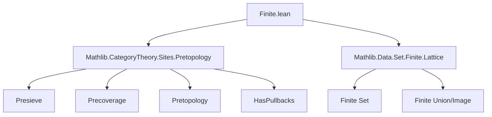
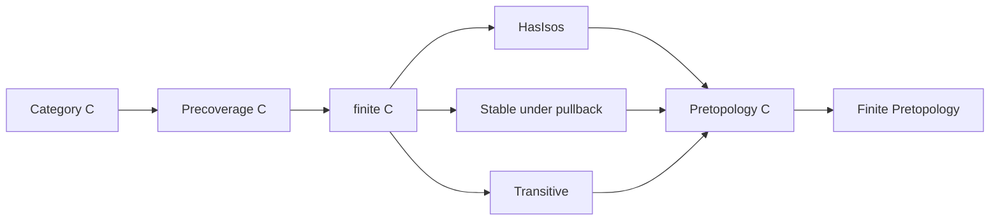
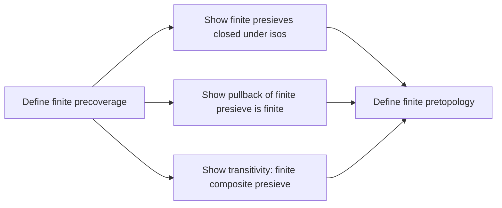

**Technical Brief: `Finite.lean` — The Finite Pretopology**

---

### 1. KEY DEFINITIONS & THEOREMS

| Name | Type / Signature | Purpose |
|------|------------------|---------|
| `Precoverage.finite` | `C : Type u → [Category C] → Precoverage C` | Defines the *finite precoverage*: assigns to each object $X$ the collection of presieves $s$ on $X$ such that the total space $\sum_{f \in s} \mathrm{dom}(f)$ is finite. |
| `Pretopology.finite` | `C : Type u → [Category C] → [HasPullbacks C] → Pretopology C` | Lifts `Precoverage.finite` to a *pretopology* by verifying the required axioms (contains isos, stable under pullback, transitive). |
| `mem_finite_iff` | `s ∈ finite C X ↔ s.uncurry.Finite` | Characterizes membership in the finite precoverage via finiteness of the uncurried domain. |
| `ofArrows_mem_finite` (Precoverage) | `[Finite ι] ⇒ (Y : ι → C) → (f : ∀ i, Y i ⟶ X) ⇒ ofArrows Y f ∈ finite C X` | Shows that any presieve generated by a finite family of arrows lies in the finite precoverage. |
| `ofArrows_mem_finite` (Pretopology) | Same as above, but for `(finite C).coverings X` | Same as above, now interpreted in the pretopology. |
| `Precoverage.finite.HasIsos` | Instance | Proves that the finite precoverage contains all isomorphisms (via `mem_coverings_of_isIso`). |

---

### 2. NAMING CONVENTIONS

- **Prefixes**:
  - `finite_`: used for definitions and lemmas related to the finite precoverage/pretopology.
  - `ofArrows_`: for presieves generated by families of arrows.
- **Suffixes**:
  - `_iff`: for biconditional characterizations (`mem_finite_iff`).
  - `_mem_`: for membership lemmas (`ofArrows_mem_finite`).
- **Module-level**:
  - `public import` used to expose dependencies (`Mathlib.CategoryTheory.Sites.Pretopology`, `Mathlib.Data.Set.Finite.Lattice`).

---

### 3. TACTIC STACK

- `simp`: heavily used for simplification, especially with `@[simp]` lemmas and `simpa`.
- `by simpa using …`: to discharge goals by rewriting using a hypothesis and applying a lemma.
- `by simp`: for trivial instance proofs (e.g., `HasIsos`).
- `by aesop` is *not* used — the proofs are mostly direct `simpa`/`simp` + `image`/`biUnion'` reasoning.

---

### 4. PROOF LOGIC

- **Structure**: Definitions are given first; proofs of pretopology axioms follow.
- **Method**:
  - **Finiteness**: Proofs rely on `Set.finite_range`, `image`, and `biUnion'` to propagate finiteness.
  - **Axiom verification**:
    - *Contains isos*: `by simp` (uses `mem_coverings_of_isIso` from the `HasIsos` instance).
    - *Stability under pullback*: `hs.image _` — pullback of a finite presieve is finite because pullback preserves finite indexing sets.
    - *Transitivity*: `hs.biUnion' (fun _ _ ↦ (ht _ _).image _)` — composition of finite families remains finite via finite union of finite sets.
- **No induction** or case analysis is needed — all arguments are algebraic/set-theoretic.

---

### 5. IMPORTS & DEPENDENCIES

| Import | Role |
|--------|------|
| `Mathlib.CategoryTheory.Sites.Pretopology` | Provides `Precoverage`, `Pretopology`, `Presieve`, `ofArrows`, `HasPullbacks`, etc. |
| `Mathlib.Data.Set.Finite.Lattice` | Supplies lattice-theoretic facts about finite sets (e.g., finite unions, images, ranges). |

---

### 6. MERMAID DIAGRAMS

#### Dependency Graph (Module-Level)

#### Overview of Theory Flow

#### Proof Structure (High-Level)

---

### 7. SUMMARY

This file formalizes the *finite pretopology* on a category: a Grothendieck pretopology where covering families are precisely those with finitely many arrows. It leverages the `Presieve.uncurry` construction to reduce finiteness to a set-theoretic condition, and verifies the pretopology axioms using basic properties of finite sets (images, unions). The formalization is concise, modular, and aligns with Lean’s category-theoretic library conventions.
