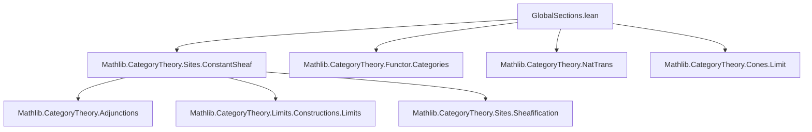
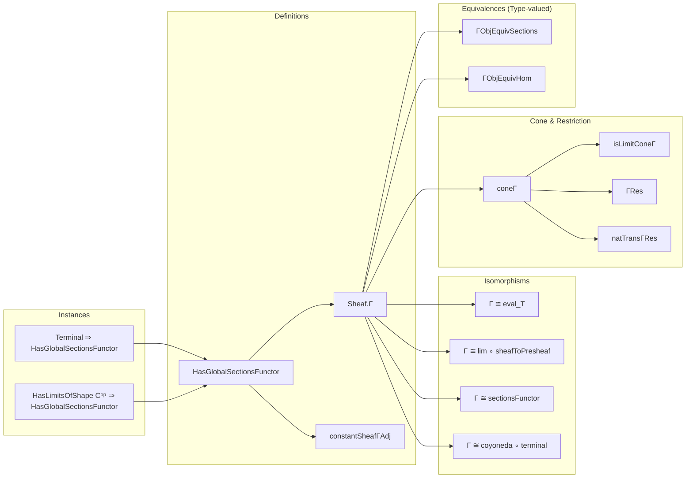

### Technical Brief: Global Sections of Sheaves (`GlobalSections.lean`)

---

#### **1. Key Definitions & Theorems**

| Name | Type / Signature | Purpose |
|------|------------------|---------|
| `HasGlobalSectionsFunctor J A` | `Type u₂ → [Category A] → Prop` | Typeclass asserting existence of a right adjoint to `constantSheaf J A`. |
| `Sheaf.Γ J A` | `[HasGlobalSectionsFunctor J A] ⇒ Sheaf J A ⥤ A` | The global sections functor, defined as the right adjoint of `constantSheaf J A`. |
| `constantSheafΓAdj J A` | `[HasGlobalSectionsFunctor J A] ⇒ constantSheaf J A ⊣ Γ J A` | The adjunction witnessing `constantSheaf J A ⊣ Γ J A`. |
| `Sheaf.ΓNatIsoSheafSections [HasTerminal C]` | `Γ J A ≅ sheafSections J A ⋙ eval (op T)` | Isomorphism between global sections and evaluation at terminal object `T`. |
| `Sheaf.ΓNatIsoLim [HasLimitsOfShape Cᵒᵖ A]` | `Γ J A ≅ sheafToPresheaf J A ⋙ lim` | Isomorphism between global sections and limit of underlying presheaf. |
| `Sheaf.isLimitConeΓ F` | `IsLimit (coneΓ F)` | Global sections form a limiting cone even without full limits in `A`. |
| `Sheaf.ΓRes F U` | `(Γ J A).obj F ⟶ F.val.obj U` | Restriction map from global sections to sections over `U`. |
| `Sheaf.natTransΓRes U` | `Γ J A ⟶ sheafSections J A ⋙ eval U` | Natural transformation from global sections to sections over `U`. |
| `Sheaf.ΓObjEquivSections F` | `(Γ J (Type w)).obj F ≃ F.val.sections` | Equivalence between global sections and presheaf sections for sheaves of types. |
| `Sheaf.ΓNatIsoSectionsFunctor` | `Γ J (Type max u v) ≅ sheafToPresheaf ⋙ Functor.sectionsFunctor` | Natural isomorphism for sheaves of types. |
| `Sheaf.ΓObjEquivHom F X [Unique X]` | `(Γ J (Type w)).obj F ≃ ((constantSheaf J (Type w)).obj X ⟶ F)` | Equivalence between global sections and morphisms from constant sheaf on singleton. |
| `Sheaf.ΓNatIsoCoyoneda X [Unique X]` | `Γ J (Type max u v) ≅ coyoneda.obj (op ((constantSheaf J _).obj X))` | Isomorphism with coyoneda embedding of terminal sheaf. |

---

#### **2. Naming Conventions**

- **Prefixes**:
  - `Γ`: denotes global sections (e.g., `ΓRes`, `ΓHomEquiv`, `ΓObjEquivSections`).
  - `constantSheaf`: for constructions involving the constant sheaf functor.
  - `sheafSections`: for section functors.
  - `coneΓ`: for cones built from global sections.

- **Suffixes**:
  - `Equiv`: for equivalences (not necessarily natural).
  - `HomEquiv`: for hom-set equivalences induced by adjunctions.
  - `NatIso`: for natural isomorphisms.
  - `Res`: for restriction maps.
  - `naturality[_left|_right|_left_symm|_right_symm]`: naturality lemmas for hom equivalences.

- **Adjectives**:
  - `ObjEquiv`: object-level equivalence (not yet a natural isomorphism).
  - `isLimit`: property of a cone being terminal.

---

#### **3. Tactic Stack**

- **Core tactics**:
  - `intro`, `exact`, `refine`, `apply`, `rw`, `simp`, `ext`, `congr`, `funext`
- **Category theory-specific**:
  - `infer_instance`, `unfold`, `dsimp`, `change`, `convert`, `congrArg`
  - `simp [coneΓ, ← ΓHomEquiv_naturality_left_symm]`
  - `exact (Adjunction.homEquiv_naturality_*)`
- **Hom-equivalence reasoning**:
  - `((constantSheafΓAdj ...).homEquiv _ _).symm.trans ...`
  - `congrArg _ (homEquiv_naturality_*)`
- **Universe management**:
  - `max u v`, `u₂`, `v₂`, `w` used consistently.

---

#### **4. Proof Logic**

- **Structure**:
  - **Existence**: Prove `HasGlobalSectionsFunctor` via instances (terminal object, limits).
  - **Construction**: Define `Γ` as `rightAdjoint`, then derive properties via adjunctions.
  - **Isomorphisms**: Use `rightAdjointUniq` to show uniqueness of right adjoints ⇒ natural isomorphisms.
  - **Cone properties**: Define `coneΓ`, prove `IsLimit` using universal property via `ΓHomEquiv`.
  - **Equivalences for `Type`-valued sheaves**: Chain equivalences:
    - `PUnit`-based function equivalence → `ΓHomEquiv` → sections/hom equivalences.

- **Common pattern**:
  ```lean
  -- Prove naturality of ΓHomEquiv
  have h := (constantSheafΓAdj ...).homEquiv_naturality_*
  have h' := (sheafificationAdjunction ...).homEquiv_naturality_*
  exact (congrArg _ h').trans h
  ```

---

#### **5. Imports**

- `Mathlib.CategoryTheory.Sites.ConstantSheaf`: foundational definitions of constant sheaf, sheafification, adjunctions.
- `CategoryTheory`: core category theory (functors, natural transformations, limits, adjunctions).
- `Limits`: limit/colimit constructions.
- `Sheaf`, `Opposite`, `GrothendieckTopology`: sheaf theory infrastructure.

---

#### **6. Mermaid Diagrams**

##### **Dependency Graph (Module-Level)**



##### **Conceptual Overview (Theory Flow)**

```mermaid
graph LR
  subgraph "Adjunctions"
    A[constantSheaf J A] -->|⊣| B[Γ J A]
    C[constantSheaf J A] -->|⊣| D[eval_T]
    E[sheafToPresheaf] -->|⊣| F[sheafification]
    G[const] -->|⊣| H[lim]
  end

  subgraph "Isomorphisms"
    B -->|≅| D
    B -->|≅| (G ⋙ H)
    B -->|≅| (sheafToPresheaf ⋙ sectionsFunctor)  %% for Type-valued
    B -->|≅| coyoneda ∘ terminalSheaf
  end

  subgraph "Cone Structure"
    B --> coneΓ -->|IsLimit| F.val
  end
```

##### **Module-Level Overview**



---

#### **7. Universe Constraints & Generalizations**

- **Current**: `Type max u v` for sheaves of types.
- **TODO**: Generalize to `Type max u v w` by relaxing constraints in `instHasSheafifyOfHasFiniteLimits`.
- **Motivation**: Allow sheaves valued in larger universes (e.g., `Type u`, `Type v`, `Type w` independently).

---

#### **8. Summary**

This file formalizes the **global sections functor** in sheaf theory, emphasizing its adjointness to the constant sheaf functor and its realizations as:
- evaluation at terminal objects,
- limits of underlying presheaves,
- presheaf sections,
- hom from terminal sheaf (coyoneda).

It leverages Lean’s category theory infrastructure to unify these perspectives via adjunctions, natural isomorphisms, and cone properties — all while maintaining explicit naturality and universality conditions.
