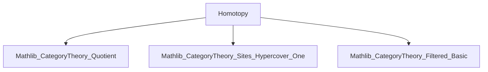

Here is the structured technical brief extracted from `Homotopy.lean`:

---

### **1. Key Definitions & Theorems**

| Name | Type / Signature | Purpose |
|------|------------------|---------|
| `Homotopy` | `Homotopy (f g : E.Hom F) : Type u` | A homotopy between two refinement morphisms `f, g : E → F` is a family of morphisms `a i : E.X i → F.Y (H i)` factoring the pair `(f.h₀ i, g.h₀ i)` through a chosen component `H i` of the pullback cover. |
| `cylinderX` | `cylinderX f g k : C` | The covering object over index `i` and component `k : F.I₁ (f.s₀ i, g.s₀ i)` — constructed as a pullback. |
| `cylinder` (in `PreOneHypercover`) | `PreOneHypercover S` | A pre-1-hypercover whose morphisms to `E` make `f` and `g` homotopic; serves as a homotopy “cylinder object”. |
| `cylinderHom` | `(cylinder f g).Hom E` | The canonical refinement morphism from the cylinder to `E`. |
| `cylinderHomotopy` | `Homotopy ((cylinderHom f g).comp f) ((cylinderHom f g).comp g)` | The explicit homotopy witnessing that `cylinderHom ≫ f` and `cylinderHom ≫ g` are homotopic. |
| `homotopicRel` | `HomRel (J.OneHypercover S)` | A binary relation on refinement morphisms: `f ~ g` iff there exists a homotopy `Homotopy f g`. *Not* an equivalence relation in general. |
| `HOneHypercover` | `abbrev J.HOneHypercover S := Quotient (homotopicRel)` | The category of `1`-hypercovers over `S` with morphisms quotiented by homotopy. |
| `toHOneHypercover` | `J.OneHypercover S ⥤ J.HOneHypercover S` | The canonical projection functor. |
| `Homotopy.map_eq_map` | `H : Homotopy f g ⇒ (toHOneHypercover J S).map f = (toHOneHypercover J S).map g` | Homotopic morphisms become equal in the quotient category. |
| `exists_nonempty_homotopy` | `∃ W, h : W.Hom E, Nonempty (Homotopy (h ≫ f) (h ≫ g))` | For any `f, g : E → F`, there exists a refinement `h : W → E` such that `h ≫ f` and `h ≫ g` are homotopic. |
| `isCofiltered_of_hasPullbacks` | `HasPullbacks C ⇒ IsCofiltered (J.HOneHypercover S)` | If `C` has pullbacks, then the homotopy category of `1`-hypercovers is cofiltered. |

---

### **2. Naming Conventions**

- **Prefixes**:
  - `Homotopy.`: for homotopy data and lemmas.
  - `cylinder`: for constructions modeling homotopy cylinders.
  - `toHOneHypercover`: projection from actual hypercovers to homotopy quotient.
  - `isCofiltered_of_`: conditional instance derivation.

- **Suffixes**:
  - `_cylinder`: for cylinder-related definitions/lemmas.
  - `_cylinderHom`: for the canonical map from cylinder to source.
  - `_Homotopy`: for homotopy witnesses.
  - `_map_eq_map`: for equality in quotient induced by homotopy.

- **Structure fields**:
  - `H`, `a`, `wl`, `wr`: index map, component morphism, and witness equations.

---

### **3. Tactic Stack**

Frequently used tactics in proofs:
- `simp` (with `reassoc`, `←`, `rw`, `simp only`, `simp_rw`)
- `apply pullback.hom_ext` / `pullback.lift` / `pullback.condition`
- `nth_rw n [eq]`: to rewrite at a specific occurrence.
- `obtain ⟨…⟩ := …`: destructuring existential or product types.
- `exact`, `convert`, `refine`, `rw [← Functor.map_comp]`
- `have : … := …; nth_rw …`: intermediate lemma introduction.

---

### **4. Proof Logic**

- **Homotopy construction**: Given `f, g : E → F`, define `cylinder f g` as a pre-1-hypercover whose objects are pairs `(i, k)` where `i ∈ E.I₀` and `k` indexes a component in the pullback cover over `(f(i), g(i))`. Its structure maps factor through pullbacks.
- **Homotopy witness**: The homotopy `cylinderHomotopy` uses the second projection from the pullback defining `cylinderX` to witness the required commutativity.
- **Cofilteredness proof**:
  - Use pullbacks in `C` to define binary products in `HOneHypercover`.
  - For parallel arrows `f, g`, lift them to representatives in `J.OneHypercover`, apply `exists_nonempty_homotopy` to get `h : W → E` with homotopy `H`, then use `Homotopy.map_eq_map` to show `(toHOneHypercover).map h` equalizes `f, g` in the quotient.
- **Key logical pattern**:  
  `lift → apply homotopy lemma → quotient equality`.

---

### **5. Imports**

- `Mathlib.CategoryTheory.Quotient`: for defining quotient categories via `HomRel`.
- `Mathlib.CategoryTheory.Sites.Hypercover.One`: for `PreOneHypercover`, `OneHypercover`, and their structure.
- `Mathlib.CategoryTheory.Filtered.Basic`: for `IsCofiltered`.

---

### **6. Mermaid Diagrams**

#### **Dependency Graph (Module-Level)**



#### **Overview of Theory Flow**

```mermaid
graph TD
  A[PreOneHypercover S] -->|refinements| B[E.Hom F]
  B -->|Homotopy f g| C[Homotopy data]
  C -->|cylinder f g| D[PreOneHypercover S]
  D -->|cylinderHom| A
  D -->|cylinderHomotopy| C
  C -->|Quotient| E[J.HOneHypercover S]
  E -->|isCofiltered| F[IsCofiltered (J.HOneHypercover S)]
  F -->|if C has pullbacks| G[HasPullbacks C]
```

#### **Categorical Structure Summary**

- **Before quotient**: `J.OneHypercover S` is a category with refinement morphisms.
- **After quotient**: `J.HOneHypercover S = Quotient(Homotopy)`.
- **Key property**: Homotopy identifies morphisms that induce same map on multiequalizers (`Homotopy.mapMultiforkOfIsLimit_eq`).
- **Categorical consequence**: If `C` has pullbacks, then `J.HOneHypercover S` is cofiltered (`isCofiltered_of_hasPullbacks`), enabling colimit arguments (e.g., in sheaf cohomology or descent).

---

Let me know if you'd like a formalized dependency graph in `leanpkg.toml` style or a visualization of the cylinder construction.
