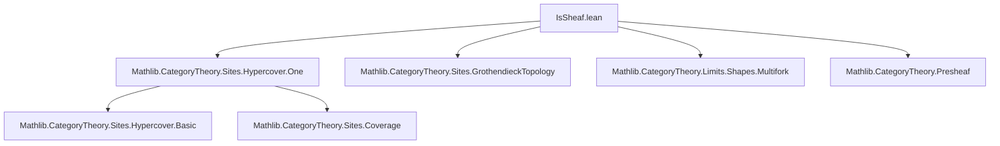
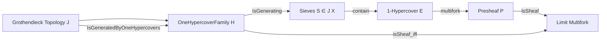
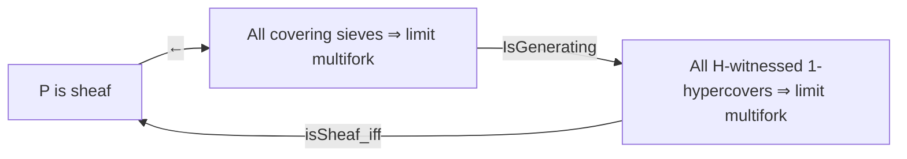

Here is the structured technical brief extracted from `IsSheaf.lean`:

---

### **1. Key Definitions & Theorems**

| Name | Type / Signature | Purpose |
|------|------------------|---------|
| `OneHypercoverFamily.{w} J` | `∀ ⦃X : C⦄, OneHypercover.{w} J X → Prop` | A family of 1-hypercovers indexed over objects of `C`, with size controlled by universe `w`. |
| `OneHypercoverFamily.IsGenerating.{w} H` | `∀ ⦃X⦄ (S ∈ J X), ∃ (E : OneHypercover J X), H E ∧ E.sieve₀ ≤ S` | Predicate meaning: every covering sieve contains the sieve of some `H`-witnessed 1-hypercover. |
| `OneHypercoverFamily.exists_oneHypercover` | `∀ S ∈ J X, ∃ E, H E ∧ E.sieve₀ ≤ S` | Constructive version of `IsGenerating`. |
| `E.multifork P` | `Multifork (Cover.index E P)` | The canonical multifork induced by a 1-hypercover `E` on a presheaf `P`. |
| `IsSheafIff.lift` | `F.pt ⟶ P.obj (Opposite.op X)` | Universal lift used to construct the mediating morphism in sheaf condition. |
| `IsSheafIff.isLimit` | `IsLimit (Cover.multifork ⟨S, ...⟩ P)` | Shows that if all `H`-witnessed 1-hypercovers yield limit multiforks, then *all* covering sieves do too. |
| `OneHypercoverFamily.isSheaf_iff` | `Presheaf.IsSheaf J P ↔ ∀ E, H E → Nonempty (IsLimit (E.multifork P))` | Main equivalence: `P` is a sheaf iff all `H`-witnessed 1-hypercovers detect limits. |
| `GrothendieckTopology.IsGeneratedByOneHypercovers.{w} J` | `OneHypercoverFamily.IsGenerating.{w} J ⊤` | Type-class abbreviation: topology is generated by *all* 1-hypercovers of size `w`. |
| `instance IsGeneratedByOneHypercovers` | `IsGeneratedByOneHypercovers.{max u v} J` | Shows that for `C : Type u`, `Category.{v} C`, the topology is always generated by 1-hypercovers of size `max u v`. |
| `Presheaf.isSheaf_iff_of_isGeneratedByOneHypercovers` | `IsSheaf J P ↔ ∀ E, Nonempty (IsLimit (E.multifork P))` | Simplified sheaf criterion when topology is generated by 1-hypercovers. |

---

### **2. Naming Conventions**

- **Prefixes**:
  - `isSheaf_`: relates to sheaf condition.
  - `OneHypercoverFamily.`: namespace for family-level constructions.
  - `IsSheafIff.`: auxiliary definitions for the equivalence proof.
- **Suffixes**:
  - `_iff`: characterizes equivalence (e.g., `isSheaf_iff`).
  - `_assoc`, `_fac'`, `_fac`: auxiliary lemmas for factorization/uniqueness.
- **Variables**:
  - `H`: family of 1-hypercovers.
  - `E`: a 1-hypercover.
  - `le`: inclusion `E.sieve₀ ≤ S`.
  - `hP`: hypothesis that all `H`-witnessed hypercovers give limit multiforks.

---

### **3. Tactic Stack**

Frequently used tactics in this file:

| Tactic | Usage |
|--------|-------|
| `obtain ⟨E, hE, le⟩ := ...` | Extract witness from `IsGenerating.le`. |
| `rw [assoc, ← P.map_comp, ← op_comp, ← fac, ...]` | Rewriting using categorical identities and presheaf axioms. |
| `apply hom_ext ...` | Uniqueness of mediating morphism via `hom_ext`. |
| `exact ...` | Direct proof steps (e.g., `exact F.condition ...`). |
| `simp` | Simplify trivial goals (e.g., `by simp` in instance proof). |
| `intro`, `rintro`, `cases` | Standard intro/case analysis. |
| `apply Multifork.IsLimit.mk` | Construct limit multiforks. |
| `aesop` (not explicitly used here, but likely in related files) | Not present in this snippet. |

---

### **4. Proof Logic**

The logical flow follows a standard sheaf-theoretic pattern:

1. **Assume `H.IsGenerating`** → every covering sieve `S ∈ J X` contains some `E` with `H E` and `E.sieve₀ ≤ S`.
2. **Goal**: Show `P` is a sheaf ⇔ all `H`-witnessed `E` yield limit multiforks.
3. **Forward direction** (`→`): If `P` is a sheaf, then `E.isLimitMultifork` holds for all `E`.
4. **Reverse direction** (`←`):
   - Use `IsGenerating` to reduce to a specific `E`.
   - Construct the universal lift `lift` using `Multifork.IsLimit.lift`.
   - Prove `fac` (factorization) and `fac'` (compatibility).
   - Conclude `IsLimit` via `Multifork.IsLimit.mk`.
5. **Instance proof**: Show `⊤` (all 1-hypercovers) is `IsGenerating` by taking `E := Cover.oneHypercover ⟨S, hS⟩`.

---

### **5. Imports**

- `Mathlib.CategoryTheory.Sites.Hypercover.One`: core definitions of 1-hypercovers and their multiforks.

Other implicit imports (via `CategoryTheory` namespace and `Limits`):
- `Mathlib.CategoryTheory.Sites.GrothendieckTopology`
- `Mathlib.CategoryTheory.Limits.Shapes.Multifork`
- `Mathlib.CategoryTheory.Presheaf`
- `Mathlib.CategoryTheory.Sites.Sieve`

---

### **6. Mermaid Diagrams**

#### **Dependency Graph (File-Level)**

#### **Conceptual Overview**

#### **Sheaf Criterion Reduction**

---

### **7. Universe Parameters**

- `w`: size parameter for 1-hypercovers (controls index types).
- `u, v`: for `C : Type u`, `Category.{v} C`.
- `u', v'`: for target category `A : Type u'`, `Category.{v'} A`.
- Instance uses `max u v` for `w`.

---

### **8. Future Work (from TODO)**

- Show functors preserving 1-hypercovers are continuous.
- Refactor `DenseSubsite` using 1-hypercovers.

--- 

Let me know if you'd like a formalized dependency graph (e.g., for `leanpkg` or `lake`) or a proof-term extraction.
