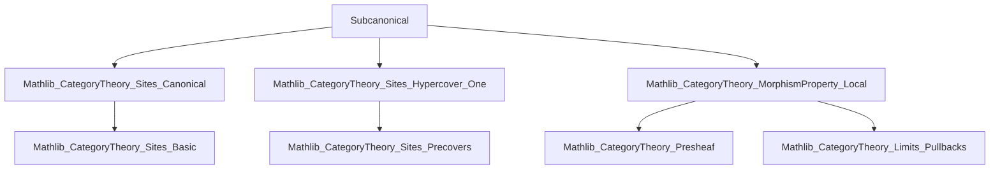
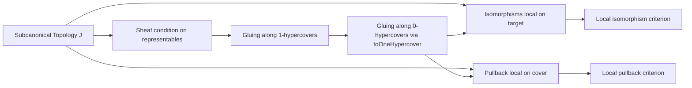

### Technical Brief: `Subcanonical.lean`

---

#### **1. Key Definitions & Theorems**

| Name | Type / Signature | Purpose |
|------|------------------|---------|
| `glueMorphisms` (for `1`-hypercovers) | `J.OneHypercover S → (∀ i, E.X i ⟶ T) → (∀ k, E.p₁ k ≫ f i = E.p₂ k ≫ f j) → S ⟶ T` | Glues a compatible family of morphisms along a `1`-hypercover, using sheafiness of representables under subcanonical topologies. |
| `f_glueMorphisms` | `E.f i ≫ glueMorphisms f h = f i` | Universal property: projecting the glued morphism along the cover component recovers the original component morphism. |
| `hom_ext` (for `0`-hypercovers) | `(∀ i, 𝒰.f i ≫ f = 𝒰.f i ≫ g) → f = g` | Monomorphism-like extension property: morphisms agreeing on a `0`-hypercover are equal. |
| `glueMorphisms` (for `0`-hypercovers) | `𝒰.HasPullbacks → (∀ i, 𝒰.X i ⟶ T) → (compatibility over pullbacks) → S ⟶ T` | Special case of `glueMorphisms` for `0`-hypercovers (i.e., covers), using the canonical embedding into `1`-hypercovers. |
| `isomorphisms C).IsLocalAtTarget J` | Instance | Isomorphisms are local on the target for subcanonical precoverage `J`. |
| `isPullback_of_forall_isPullback` | `(∀ i, IsPullback(...)) → IsPullback(...)` | Pullback property can be checked locally on a cover for subcanonical topologies. |

---

#### **2. Naming Conventions**

- **Prefixes**:
  - `glueMorphisms`: Gluing morphisms along hypercovers.
  - `f_...`: Projection/compatibility lemmas (e.g., `f_glueMorphisms`).
  - `hom_ext`: Hom-extension/uniqueness lemmas.
- **Suffixes**:
  - `_of_...`: Construction from local data (`isPullback_of_forall_isPullback`).
  - `IsLocalAtTarget`: Property of being local on target (used in `MorphismProperty`).
- **Type-based**:
  - `ZeroHypercover`, `OneHypercover`: Indexing hypercover degree.
  - `Precoverage`, `GrothendieckTopology`: Level of coverage structure.

---

#### **3. Tactic Stack**

Frequently used tactics in proofs:
- `simp` / `simp_rw`: Simplification using sheaf conditions, pullback universal properties.
- `rw`: Rewriting using `pullback.condition`, `pullback.condition_assoc`.
- `exact`, `refine`: For constructing morphisms and proving equalities.
- `cat_disch`: Category-theoretic discharge tactic (likely custom or imported from `Mathlib.CategoryTheory.Sites`).
- `infer_instance`: For typeclass resolution (e.g., `HasPullbacks`, `Subcanonical`).
- `ext`: Extensionality for morphisms (used in `hom_ext` proofs).
- `simpa`: Simplify and discharge goal using assumptions.

---

#### **4. Proof Logic**

- **Sheaf-theoretic reasoning**: All constructions rely on the fact that representable presheaves are sheaves for subcanonical topologies (`Subcanonical.isSheaf_of_isRepresentable`).
- **Hypercover descent**:
  - `1`-hypercover gluing uses `amalgamate` from sheaf theory.
  - `0`-hypercover gluing reduces to `1`-hypercover via `toOneHypercover`.
- **Local-to-global principles**:
  - Uniqueness (`hom_ext`) via separatedness.
  - Existence (`glueMorphisms`) via sheaf condition.
- **Pullback/local isomorphism arguments**:
  - Use `IsLocalAtTarget.iff_of_zeroHypercover` to reduce to zero-hypercover case.
  - Paste pullbacks vertically/horizontally using `IsPullback.paste_vert_iff`.

---

#### **5. Imports**

| Module | Role |
|--------|------|
| `Mathlib.CategoryTheory.Sites.Canonical` | Defines canonical topology and subcanonicality. |
| `Mathlib.CategoryTheory.Sites.Hypercover.One` | `1`-hypercovers, amalgamation maps, `amalgamate`. |
| `Mathlib.CategoryTheory.MorphismProperty.Local` | Local properties of morphisms (`IsLocalAtTarget`, `isomorphisms`, `IsPullback`). |
| `Limits` (via `open Limits`) | Pullbacks, limits, universal properties. |
| `yoneda` | Representable presheaves, used in sheaf condition. |

---

#### **6. Mermaid Diagrams**

##### **Dependency Graph (Module-Level)**

##### **Overview of File Logic Flow**

---

#### **7. Summary**

This file formalizes descent theory for subcanonical Grothendieck topologies, focusing on:
- **Morphism gluing** along hypercovers (0- and 1-hypercovers),
- **Uniqueness** of glued morphisms,
- **Local character** of isomorphisms and pullbacks.

It leverages the sheaf condition for representables (defining subcanonicality) and standard categorical constructions (pullbacks, limits). The API is designed for practical use in descent arguments, especially in contexts like descent of objects/morphisms in fibered categories or stacks.

--- 

Let me know if you'd like a formalized dependency graph for the *proof terms* or a visualization of the `glueMorphisms` construction.
