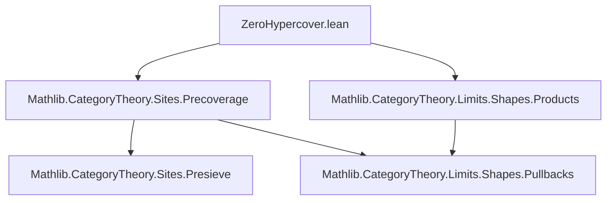

### Technical Brief: `ZeroHypercover` in Lean 4 (Mathlib)

---

#### **1. Key Definitions & Theorems**

| Name | Type / Structure | Purpose |
|------|------------------|---------|
| `PreZeroHypercover S` | `structure` | Categorical data for a covering family over `S`: index type `I₀`, family of objects `X i`, and structure morphisms `f i : X i ⟶ S`. |
| `presieve₀ E` | `Presieve S` | Presieve generated by the morphisms `f i`. |
| `sieve₀ E` | `Sieve S` | Sieve generated by `f i`. |
| `singleton f` | `PreZeroHypercover T` | Single-morphism cover (indexed by `PUnit`). |
| `pullback₁ f E`, `pullback₂ f E` | `PreZeroHypercover S` | Pullbacks of a cover along `f : S ⟶ T`, using `pullback.fst` or `pullback.snd`. |
| `pullbackCoverOfLeft E f g`, `pullbackCoverOfRight E f g` | `PreZeroHypercover (pullback f g)` | Covers of a pullback induced by a cover of one leg. |
| `bind E F` | `PreZeroHypercover T` | Refinement: replace each `X i` by a cover `F i` of `X i`. |
| `restrictIndex E f`, `reindex E e` | `PreZeroHypercover T` | Restrict or reindex the indexing type. |
| `inter E F` | `PreZeroHypercover T` | Pairwise pullback intersection of two covers. |
| `sum E F` | `PreZeroHypercover T` | Disjoint union of covers (coproduct indexing). |
| `add E f` | `PreZeroHypercover S` | Add a single morphism `f : T ⟶ S` to a cover. |
| `sigmaOfIsColimit E hc` | `PreZeroHypercover S` | Collapse a cover to a single object using a colimit cocone. |
| `Hom E F` | `structure` | Morphism of pre-`0`-hypercovers: family of maps `E.X i ⟶ F.X (s₀ i)` commuting with structure maps. |
| `isoMk` | `E ≅ F` | Isomorphism constructor for pre-`0`-hypercovers via equivalence of indexing types and component isos. |
| `map F E` | `PreZeroHypercover (F.obj S)` | Functorial image of a cover under `F : C ⥤ D`. |
| `Presieve.preZeroHypercover R` | `PreZeroHypercover S` | Cover indexed by morphisms in a presieve `R`. |
| `shrink E` | `PreZeroHypercover S` | Deduplication of a cover (indexing by morphisms in `presieve₀ E`). |
| `toShrink E`, `fromShrink E` | `Hom` | Refinement maps between `E` and its deduplication. |
| `ZeroHypercover J S` | `structure` | `PreZeroHypercover S` whose presieve is in the coverage `J S`. |
| `ZeroHypercover.singleton f hf` | `J.ZeroHypercover T` | Single-morphism cover when `f` is covering. |
| `pullback₁`, `pullback₂`, `bind`, `inter`, `sum`, `add`, `reindex` for `ZeroHypercover` | `J.ZeroHypercover` | Lifted versions for actual hypercovers (require stability axioms of `J`). |
| `Small E` | `class` | `E` is `w'`-small if some restriction to `ι : Type w'` remains covering. |
| `mem_iff_exists_zeroHypercover` | `↔` | Characterization: `R ∈ J X` iff `R` is the presieve of some `0`-hypercover. |
| `presieve₀_mem_of_iso`, `presieve₀_mem_iff_of_iso` | `→` | Coverage respects isomorphisms of covers. |

---

#### **2. Naming Conventions**

- **Prefixes**:
  - `presieve₀_`, `sieve₀_`: associated presieve/sieve of a `PreZeroHypercover`.
  - `pullback₁`, `pullback₂`: two canonical pullback constructions.
  - `pullbackCoverOfLeft`, `pullbackCoverOfRight`: covers induced on pullbacks.
  - `inter`, `sum`, `bind`, `add`, `restrictIndex`, `reindex`, `shrink`: operations on covers.
  - `singleton`, `sigmaOfIsColimit`: canonical or collapsed covers.
- **Suffixes**:
  - `_Hom`, `_isoMk`: morphism/iso constructors.
  - `_ofArrows`, `_ofIsColimit`: constructions from arrows or colimits.
- **Prefixes for `ZeroHypercover`**:
  - `mem₀`, `toPreZeroHypercover`: projection to underlying pre-cover.
  - `Small.Index`, `Small.restrictFun`: components of smallness data.

---

#### **3. Tactic Stack**

Frequently used tactics in proofs:
- `simp` / `simp only` / `simp_rw`: simplification of `presieve₀`, `sieve₀`, `hom`, `inv`, `sum`, `pullback`, etc.
- `ext`: extensionality for structures (e.g., `PreZeroHypercover`, `Hom`).
- `cases`, `obtain ⟨i, rfl⟩`: destruct existential or equivalence data.
- `apply`, `exact`, `intro`: basic proof steps.
- `rw [← ...]`, `convert`, `refine`: rewriting and unification.
- `cat_disch`: category-theoretic discharge (likely custom).
- `ring`, `aesop`: for algebraic or propositional reasoning (less frequent).
- `grind_pattern`: custom pattern for simplification.

---

#### **4. Proof Logic**

- **Inductive/constructive style**: Most definitions are *explicit constructions* (e.g., `bind`, `inter`, `shrink`) with `@[simps]` to ensure projections compute.
- **Isomorphism-based reasoning**: Many lemmas use `isoMk` and `Hom.ext'` to prove equality of morphisms via indexing and component equalities.
- **Presieve/sieve control**: Proofs often reduce to showing inclusion or equality of presieves (e.g., `presieve₀_sum`, `presieve₀_add`, `presieve₀_pullback₁`).
- **Stability axioms**: For `ZeroHypercover` constructions (`pullback₁`, `bind`, `inter`, `sum`, `add`), proofs require assumptions like `J.IsStableUnderBaseChange`, `J.IsStableUnderComposition`, `J.RespectsIso`.
- **Smallness arguments**: Use `Small.exists_restrictIndex_mem` to extract a small indexing type; often rely on `restrictIndexOfSmall`.
- **Isomorphism invariance**: Key lemma `presieve₀_mem_of_iso` shows coverage membership is preserved under isomorphism of covers.

---

#### **5. Imports**

```lean
public import Mathlib.CategoryTheory.Sites.Precoverage
public import Mathlib.CategoryTheory.Limits.Shapes.Products
```

- **Core dependencies**:
  - `Precoverage`: defines coverages (pretopologies) and their properties (stability under pullback, composition, sup, etc.).
  - `Products`: provides binary products and pullbacks (via `HasPullback`).
- **Implicit dependencies**:
  - `CategoryTheory.Sites.Presieve`, `Sieve`, `Limits`, `Functor`, `Iso`, `Equivalences`, `Equiv`, `Sum`, `PUnit`, `Unique`, etc.

---

#### **6. Mermaid Diagrams**

##### **Dependency Graph (Module Level)**



##### **Overview of Theory Flow**

```mermaid
graph TD
  PreZeroHypercover[S: PreZeroHypercover S]
  PreZeroHypercover -->|presieve₀| Presieve[Presieve S]
  PreZeroHypercover -->|Hom| Category[Category (PreZeroHypercover S)]

  ZeroHypercover[J: Precoverage C]
  ZeroHypercover -->|mem₀| PreZeroHypercover
  ZeroHypercover -->|Small| Class[Small E]

  Presieve -->|preZeroHypercover| PreZeroHypercover
  PreZeroHypercover -->|shrink| Presieve

  ZeroHypercover -->|pullback₁, bind, inter, sum| ZeroHypercover

  subgraph Stability
    J[Coverage J]
    J -->|IsStableUnderBaseChange| pullback₁
    J -->|IsStableUnderComposition| bind
    J -->|IsStableUnderSup| sum
    J -->|RespectsIso| isoMk
  end
```

##### **Smallness & Deduplication Flow**

```mermaid
graph LR
  E[PreZeroHypercover E] -->|presieve₀| R[Presieve R]
  R -->|preZeroHypercover| E_shrink[E.shrink]
  E -->|toShrink| E_shrink
  E_shrink -->|fromShrink| E
  E -->|restrictIndex f| E_restr[E.restrictIndex f]
  E_restr -->|Small| ∃ι[∃ ι, (E.restrictIndex f).presieve₀ ∈ J]
```

---

#### **7. Summary**

This module formalizes *`0`-hypercovers*—a concrete, index-controlled version of covering families—in a category `C` equipped with a *coverage* `J`. It distinguishes between:
- **Pre-`0`-hypercovers**: raw covering families (no coverage condition).
- **`0`-hypercovers**: those whose presieve lies in `J`.

It provides:
- A rich algebra of constructions (pullbacks, sums, intersections, refinement, deduplication).
- A categorical structure (`Hom`, `Category`, `Iso`) on covers.
- Functoriality and stability properties under coverage axioms.
- A notion of *smallness* for covers, enabling size control (crucial for sheaf theory and descent).

The formalization is highly structured, with heavy use of `@[simps]`, `@[ext]`, and `grind_pattern` to ensure usability and computational behavior. It serves as the foundation for higher hypercovers and sheaf cohomology in the *sites* hierarchy.
