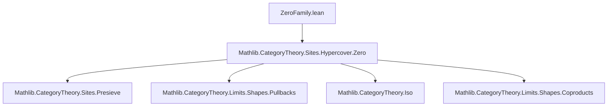
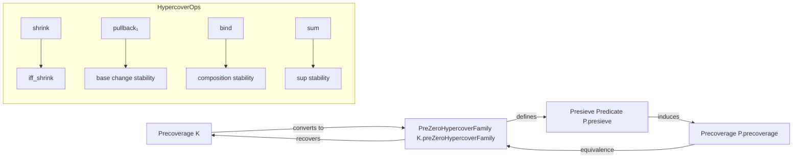

**Technical Brief: `ZeroFamily.lean`**

---

### 1. KEY DEFINITIONS & THEOREMS

| Name | Type / Signature | Purpose |
|------|------------------|---------|
| `PreZeroHypercoverFamily` | `structure` | A family of properties on pre-`0`-hypercovers over each object, invariant under deduplication (`shrink`). |
| `PreZeroHypercoverFamily.property` | `∀ {X}, PreZeroHypercover X → Prop` | The predicate on pre-`0`-hypercovers defining the family. |
| `PreZeroHypercoverFamily.iff_shrink` | `property E ↔ property E.shrink` | Invariance under deduplication (shrink equivalence). |
| `PreZeroHypercoverFamily.presieve` | `inductive` | Inductive predicate on presieves induced by the family: `P E → presieve P E.presieve₀`. |
| `PreZeroHypercoverFamily.precoverage` | `def` | Converts a pre-`0`-hypercover family to a precoverage: `coverings X R := P.presieve R`. |
| `PreZeroHypercoverFamily.mem_precoverage_iff` | `lemma` | Characterizes membership in the induced precoverage: `R ∈ P.precoverage X ↔ ∃ E, P E ∧ R = E.presieve₀`. |
| `PreZeroHypercover.presieve₀_mem_precoverage_iff` | `lemma` | Simplifies checking membership for presieves of the form `E.presieve₀`. |
| `Precoverage.preZeroHypercoverFamily` | `def` | Converts a precoverage to a pre-`0`-hypercover family: `property X E := E.presieve₀ ∈ K X`. |
| `Precoverage.equivPreZeroHypercoverFamily` | `def` (equiv) | Equivalence between precoverages and pre-`0`-hypercover families. |
| `Precoverage.HasIsos.of_preZeroHypercoverFamily` | `lemma` | Sufficient condition for a precoverage (from a family) to contain all isomorphisms. |
| `Precoverage.IsStableUnderBaseChange.of_preZeroHypercoverFamily_of_isClosedUnderIsomorphisms` | `lemma` | Base-change stability criterion via pullbacks of hypercovers. |
| `Precoverage.IsStableUnderComposition.of_preZeroHypercoverFamily` | `lemma` | Composition stability via `bind` of hypercovers. |
| `Precoverage.IsStableUnderSup.of_preZeroHypercoverFamily` | `lemma` | Supremum stability via `sum` of hypercovers. |

---

### 2. NAMING CONVENTIONS

- **Prefixes**:
  - `PreZeroHypercoverFamily.` — for family-related definitions/lemmas.
  - `PreZeroHypercover.` — for hypercover-specific operations (`presieve₀`, `shrink`, `pullback₁`, `bind`, `sum`).
  - `Precoverage.` — for precoverage conversions and properties.

- **Suffixes**:
  - `_iff` — logical equivalence lemmas (e.g., `mem_precoverage_iff`).
  - `of_…` — sufficient conditions derived from structural assumptions (e.g., `of_preZeroHypercoverFamily`).
  - `mem_…` — membership criteria (e.g., `mem_precoverage_iff`).

- **Functional style**:
  - `property`, `presieve`, `precoverage` — core data constructors.
  - `iff_shrink`, `prop_iff_of_iso` — logical invariance lemmas.

---

### 3. TACTIC STACK

Frequently used tactics in proofs:

- `simp` — especially for simplifying `presieve₀`, `shrink`, and `pullback₁`.
- `rw` — rewriting using equivalences and definitions.
- `refine` — constructing proofs via intermediate steps (e.g., `refine .mk _ h`).
- `obtain ⟨E, rfl⟩ := …` — destructuring existential quantifiers.
- `rwa` — `rw` + `assumption` (used in `shrink_eq_shrink_of_presieve₀_eq_presieve₀`).
- `ext` — extensionality for proving equality of structures/functions.
- `cat_disch` — category-theoretic discharge tactic (likely custom).
- `change` — changing goal to an equivalent form.

---

### 4. PROOF LOGIC

The logical flow in proofs follows a **structural translation pattern**:

1. **Reduction to hypercovers**: Use `R.exists_eq_preZeroHypercover` to replace arbitrary presieves with `E.presieve₀`.
2. **Apply family condition**: Translate membership in `P.precoverage` to `P E` via `presieve₀_mem_precoverage_iff`.
3. **Use invariance**: Apply `iff_shrink` or `prop_iff_of_iso` to reduce to normalized or isomorphic forms.
4. **Leverage hypercover operations**:
   - `pullback₁` for base change,
   - `bind` for composition,
   - `sum` for suprema.
5. **Conclude via equivalence**: Use `Precoverage.equivPreZeroHypercoverFamily` to switch between precoverages and families.

Induction is not used; instead, proofs rely on **categorical constructions** and **universal properties** (pullbacks, coproducts, isomorphisms).

---

### 5. IMPORTS

- `Mathlib.CategoryTheory.Sites.Hypercover.Zero` — core definitions of `PreZeroHypercover`, `shrink`, `pullback₁`, `bind`, `sum`, etc.

This module builds on the theory of *zero-hypercovers* (a degenerate case of hypercovers where all higher simplices are identities), used to encode *precoverages* in terms of simpler combinatorial data.

---

### 6. MERMAID DIAGRAMS

#### Dependency Graph (Module-Level)



#### Overview of Theory Flow



#### Core Equivalence

```mermaid
graph LR
  Precoverage C <-->|Precoverage.equivPreZeroHypercoverFamily| PreZeroHypercoverFamily C
```

---

This module formalizes a foundational equivalence in sheaf theory and descent: **precoverages ↔ invariant properties on pre-`0`-hypercovers**, enabling more flexible verification of coverage conditions in categorical sites.
