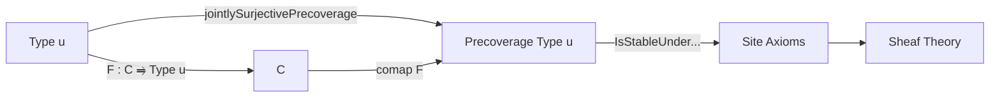

### Technical Brief: `JointlySurjective.lean`

---

#### **1. Key Definitions & Theorems**

| Name | Type / Signature | Purpose |
|------|------------------|---------|
| `jointlySurjectivePrecoverage` | `Precoverage (Type u)` | Defines a precoverage on `Type u` where a presieve `R` is a covering iff every element of `X` lies in the image of some arrow in `R`. |
| `mem_jointlySurjectivePrecoverage_iff` | `R ∈ jointlySurjectivePrecoverage X ↔ ∀ x, ∃ (Y, g), R g ∧ x ∈ range g` | Characterizes membership in the precoverage. |
| `singleton_mem_jointlySurjectivePrecoverage_iff` | `Presieve.singleton f ∈ jointlySurjectivePrecoverage Y ↔ Function.Surjective f` | Connects singleton presieves to surjectivity. |
| `ofArrows_mem_jointlySurjectivePrecoverage_iff` | `Presieve.ofArrows Y f ∈ jointlySurjectivePrecoverage X ↔ ∀ x, ∃ i, x ∈ range (f i)` | Characterizes finite-family presieves (indexed by `ι`) as jointly surjective. |
| `jointlySurjectivePrecoverage.HasIsos` | Instance | Shows that isomorphisms are coverings (since they’re surjective). |
| `jointlySurjectivePrecoverage.IsStableUnderComposition` | Instance | Shows stability under composition of coverings (i.e., if `R` covers `X` and `σ` covers each domain of `R`, then the composite covers `X`). |
| `jointlySurjectivePrecoverage.IsStableUnderSup` | Instance | Shows stability under sup (i.e., if `R` covers `X`, then `R ⊔ S` also covers `X`). |
| `Presieve.mem_comap_jointlySurjectivePrecoverage_iff` | `R ∈ comap F X ↔ ∀ x : F.obj X, ∃ (Y, f), R f ∧ x ∈ range (F.map f)` | Describes pullback (comap) of the precoverage along a functor `F : C ⥤ Type u`. |
| `Presieve.ofArrows_mem_comap_jointlySurjectivePrecoverage_iff` | Simplified version of above for `ofArrows`. |
| `isStableUnderBaseChange_comap_jointlySurjectivePrecoverage` | Lemma | Gives sufficient condition (surjectivity of pullback comparison maps) for `comap F jointlySurjectivePrecoverage` to be stable under base change. |
| `Types.jointlySurjectivePrecoverage.IsStableUnderBaseChange` | Instance | Proves that the precoverage on `Type u` itself is stable under base change (via `F = id`). |

---

#### **2. Naming Conventions**

- **Prefixes**:
  - `jointlySurjectivePrecoverage_`: Module-wide prefix for definitions/lemmas about this precoverage.
  - `mem_..._iff`: Membership characterizations (`↔`).
  - `ofArrows_..._iff`: Specialization to presieves generated by families of arrows.
  - `comap_..._iff`: Descriptions of pullbacks along functors.

- **Suffixes**:
  - `_iff`: Logical equivalence (↔) lemmas.
  - `_iff` after `singleton`, `ofArrows`, `comap`: Specific structural cases.

- **Instance names**:
  - `HasIsos`, `IsStableUnderComposition`, `IsStableUnderSup`, `IsStableUnderBaseChange`: Standard Lean Category Theory site axioms.

---

#### **3. Tactic Stack**

Frequently used tactics in proofs:

| Tactic | Usage |
|--------|-------|
| `rw` / `simp_rw` | Rewriting definitions (e.g., `mem_jointlySurjectivePrecoverage_iff`, `ofArrows_mem_...`). |
| `intro` / `obtain` / `use` | Standard existential reasoning and construction. |
| `simp` / `simp only` | Simplifying range, composition, and presieve definitions. |
| `rwa` | Rewrite + apply, especially after `have`-steps. |
| `exact` / `refine` | Finishing proofs with known terms or partial constructions. |
| `cases` (implicit via `obtain ⟨...⟩`) | Decomposing existential hypotheses. |
| `have : ... := by ...` | Intermediate lemmas (e.g., about pullback comparison maps). |
| `apply` / `comp` / `surjective_of_epi` | Proving surjectivity via epi + known surjections. |

No heavy automation (e.g., `aesop`, `linarith`) — proofs are mostly constructive and structural.

---

#### **4. Proof Logic**

- **Structure of proofs**:
  1. **Unfold definitions** using `rw` or `simp`.
  2. **Introduce arbitrary element** (e.g., `intro x`).
  3. **Apply hypothesis** (e.g., `hf x`) to get witness data.
  4. **Construct witness** for conclusion using existing data (e.g., pairing indices, elements).
  5. **Simplify** using `simp` or `rwa` to verify conditions.

- **Common pattern**:
  - For stability under composition/sup/base change:
    - Assume `hf` covers source, `hg` covers each component.
    - For arbitrary `x`, find `i` and `y` such that `x = f i y`.
    - Then find `j`, `z` such that `y = g i j z`.
    - Conclude `x = (f ∘ g) ⟨i,j⟩ z`.

- **Pullback stability**:
  - Uses surjectivity of the *pullback comparison map*:
    $$
    F(X \times_Y Z) \to F(X) \times_{F(Y)} F(Z)
    $$
  - Key step: factor an element `x : F.obj X` through a pullback using surjectivity of comparison map and surjectivity of `F.map g`.

---

#### **5. Imports & Dependencies**

| Import | Purpose |
|--------|---------|
| `Mathlib.CategoryTheory.Sites.Precoverage` | Core definitions: `Precoverage`, `Presieve`, `comap`, `IsStableUnder...`. |
| `Mathlib.CategoryTheory.Limits.Types.Pullbacks` | Pullbacks in `Type u`, pullback comparison maps, universal property. |

No heavy homological algebra or sheaf theory — focuses on *precoverage* structure and *site* axioms.

---

#### **6. Mermaid Diagrams**

##### **Dependency Graph (Module-Level)**

```mermaid
graph TD
  A[JointlySurjective.lean] --> B[Mathlib.CategoryTheory.Sites.Precoverage]
  A --> C[Mathlib.CategoryTheory.Limits.Types.Pullbacks]
  A --> D[Mathlib.CategoryTheory.Sites.Types] % referenced in docstring
```

##### **Conceptual Overview of Theory Flow**



##### **Proof Structure for Base Change Stability**

```mermaid
flowchart LR
  H[Assume H: pullbackComparison surjective] --> I[Goal: comap F jointlySurjectivePrecoverage is stable under base change]
  I --> J[Take pullback square in C]
  J --> K[Apply F to get square in Type u]
  K --> L[Use H to lift element through F(pullback)]
  L --> M[Use jointly surjective property in Type u]
  M --> N[Conclude presieve covers in C]
```

---

#### **7. Summary**

This file formalizes the *jointly surjective precoverage* on `Type u`, verifies it satisfies the standard site axioms (contains isos, stable under composition, sup, and base change), and extends it to arbitrary categories `C` via functors `C ⥤ Type u`. It serves as a foundational building block for Grothendieck topologies on categories of interest (e.g., sheaves on topological spaces, étale sites, etc.). The proofs are constructive and rely on elementary set-theoretic reasoning (range, surjectivity, pullbacks in `Type`).
