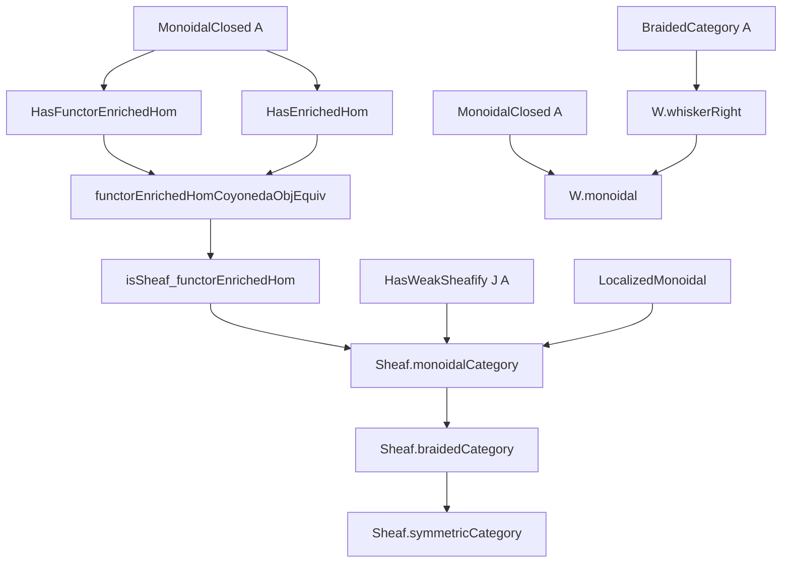
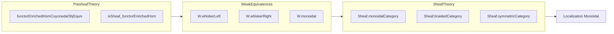

### Technical Brief: `Monoidal.lean` — Monoidal Structures on Sheaves

---

#### **1. Key Definitions & Theorems**

| Name | Type / Signature | Purpose |
|------|------------------|---------|
| `functorEnrichedHomCoyonedaObjEquiv` | `functorEnrichedHom A F G ⋙ coyoneda.obj (op M) ≃ presheafHom (F ⊗ const M) G` | Natural isomorphism linking enriched hom in presheaves with internal hom in sheaves; key for sheafification of internal homs. |
| `functorEnrichedHomCoyonedaObjEquiv_naturality` | Naturality square for the above iso | Ensures coherence of the equivalence under morphisms in `C`. |
| `isSheaf_functorEnrichedHom` | `Presheaf.IsSheaf J (functorEnrichedHom A F G)` under `Presheaf.IsSheaf J G` | Shows that enriched homs of presheaves preserve sheaf condition (when second argument is a sheaf). |
| `W.whiskerLeft` | `J.W g → J.W (F ◁ g)` | Stability of weak equivalences (`J.W`) under left whiskering with presheaves. |
| `W.whiskerRight` | `J.W f → J.W (f ▷ G)` | Stability under right whiskering, assuming braiding. |
| `W.monoidal` | `(J.W (A := A)).IsMonoidal` | Constructs monoidality of the weak equivalence system `J.W` under braiding + enrichment assumptions. |
| `Sheaf.monoidalCategory` | `MonoidalCategory (Sheaf J A)` | Induces monoidal structure on sheaves via localization of presheaves. |
| `Sheaf.braidedCategory` | `BraidedCategory (Sheaf J A)` | Lifts braiding from `A` to sheaves. |
| `Sheaf.symmetricCategory` | `SymmetricCategory (Sheaf J A)` | Lifts symmetry from `A` to sheaves. |
| `Sheaf.presheafToSheaf.Monoidal` / `.Braided` | Instances showing `presheafToSheaf J A` is monoidal / braided | Ensures the localization functor respects monoidal structure. |

---

#### **2. Naming Conventions**

- **Prefixes**:
  - `functorEnrichedHom_`: Relates to internal hom in enriched functor categories.
  - `presheafHom_`: Hom-objects in presheaf category.
  - `isSheaf_`: Sheaf condition verification.
  - `whiskerLeft`, `whiskerRight`: Action of monoidal structure on morphisms.
  - `monoidalCategory`, `braidedCategory`, `symmetricCategory`: Structural instances on `Sheaf J A`.

- **Suffixes**:
  - `_obj_equiv`: Object-level equivalence (often natural in parameters).
  - `_naturality`: Naturality lemma for preceding definition.
  - `_iff`: Logical equivalence (used in `W.arrow_mk_iso_iff`).

- **Notable patterns**:
  - `J.W` refers to the *weak equivalences* for sheafification w.r.t. topology `J` and target `A`.
  - `F ◁ g`, `f ▷ G`: Left/right whiskering in functor category.
  - `β_`, `α_`: Braiding and associator components.

---

#### **3. Tactic Stack**

Frequent tactics used in proofs:

| Tactic | Role |
|--------|------|
| `dsimp`, `simp`, `simp only` | Simplify definitions, especially enriched homs, curry/uncurry, whiskering. |
| `rw [← ...]` | Rewrite using adjunctions or naturality squares (e.g., `curry_natural_left`, `uncurry_natural_right`). |
| `congr 2`, `congr 1` | Equality of morphisms via extensionality (e.g., in `functorEnrichedHomCoyonedaObjEquiv`). |
| `ext` | Extensionality for natural transformations / morphisms of presheaves. |
| `infer_instance` | Automatically infer monoidal/braided/symmetric instances. |
| `convert using 1` | Partial unification, useful when one side is definitionally equal. |
| `exact`, `symm`, `apply` | Standard proof steps for isomorphisms and naturality. |

---

#### **4. Proof Logic**

The logical flow follows a **two-stage strategy**:

1. **Presheaf Level**:
   - Prove that `functorEnrichedHom A F G` preserves sheaf condition (via `isSheaf_functorEnrichedHom`).
   - Use the equivalence `functorEnrichedHomCoyonedaObjEquiv` to reduce to `presheafHom`, which is known to preserve sheaves when the second argument is a sheaf.
   - Naturality ensures coherence for sheafification.

2. **Sheaf Level**:
   - Show `J.W` is monoidal (via `W.monoidal`), using:
     - `whiskerLeft` (for left action),
     - `whiskerRight` (for right action, requiring braiding),
     - `transport_isMonoidal` (to pull back monoidality along dense embeddings).
   - Apply general localization theory (`LocalizedMonoidal`) to transfer monoidal/braided/symmetric structures from presheaves to sheaves.

**Induction is not used**; the proofs rely on:
- Enriched category theory (curry/uncurry, whiskering, adjunctions),
- Sheaf theory (sheaf condition, weak sheafification),
- Localization of monoidal categories.

---

#### **5. Imports**

| Module | Role |
|--------|------|
| `Mathlib.CategoryTheory.Monoidal.Closed.FunctorCategory.Basic` | Enriched homs, curry/uncurry, functor categories. |
| `Mathlib.CategoryTheory.Localization.Monoidal.Braided` | Localization of braided/monoidal categories. |
| `Mathlib.CategoryTheory.Sites.Equivalence` | Sheaf equivalence and descent. |
| `Mathlib.CategoryTheory.Sites.SheafHom` | Hom sheaves, presheaf hom, sheaf condition. |

---

#### **6. Mermaid Diagrams**

##### **Dependency Graph (High-Level)**

##### **Overview of File Structure**

---

#### **7. Summary**

This file constructs monoidal, braided, and symmetric monoidal structures on the category of sheaves `Sheaf J A`, assuming:
- `A` is a **closed braided** (or symmetric) monoidal category,
- `A` has **enriched homs** (`HasFunctorEnrichedHom`, `HasEnrichedHom`),
- `J` admits **weak sheafification** (`HasWeakSheafify J A`),
- `J.W` is **monoidal** (proved via stability under whiskering).

The construction proceeds by:
1. Showing enriched homs of presheaves preserve sheaves,
2. Proving `J.W` is monoidal (using braiding),
3. Transporting structure via localization.

The TODO indicates future work on proving the monoidal structure is *closed*, with internal homs matching the presheaf internal hom.

--- 

Let me know if you'd like a formalized dependency graph in `leanpkg` format or a proof sketch for a specific lemma.
