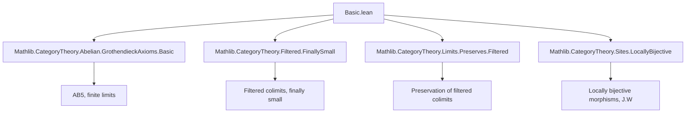

Here is the structured technical brief extracted from `Basic.lean`:

---

### **1. Key Definitions & Theorems**

| Name | Type / Signature | Purpose |
|------|------------------|---------|
| `GrothendieckTopology.Point` | `structure` | A *point* of a site `(C, J)` is a functor `fiber : C ⥤ Type w` such that `fiber.Elements` is cofiltered and initially small, and covering sieves induce jointly surjective maps on fibers. |
| `presheafFiber` | `(Cᵒᵖ ⥤ A) ⥤ A` | The *fiber functor on presheaves* induced by a point `Φ`, defined as a colimit over `Φ.fiber.Elementsᵒᵖ`. |
| `toPresheafFiber` | `P.obj (op X) ⟶ Φ.presheafFiber.obj P` | Canonical map from evaluation at `op X` to the fiber of a presheaf `P`. |
| `presheafFiberDesc` | `Φ.presheafFiber.obj P ⟶ T` | Universal property constructor for morphisms out of the fiber of a presheaf. |
| `sheafFiber` | `Sheaf J A ⥤ A` | The *fiber functor on sheaves*, defined as `sheafToPresheaf J A ⋙ Φ.presheafFiber`. |
| `toPresheafFiber_jointly_surjective` | `∃ (X, x, z), Φ.toPresheafFiber X x P z = p` | Every element in the fiber of a presheaf comes from some evaluation. |
| `toPresheafFiber_eq_iff'` | `Φ.toPresheafFiber X x P z₁ = Φ.toPresheafFiber X x P z₂ ↔ …` | Characterizes equality in the colimit: two elements become equal iff they become equal after mapping along some morphism in the fiber category. |
| `toPresheafFiber_map_surjective` | `Function.Surjective (Φ.presheafFiber.map f)` | If `f` is locally surjective, then its fiber map is surjective. |
| `toPresheafFiber_map_injective` | `Function.Injective (Φ.presheafFiber.map f)` | If `f` is locally injective, then its fiber map is injective. |
| `toPresheafFiber_map_bijective` | `Function.Bijective (Φ.presheafFiber.map f)` | If `f` is locally bijective, then its fiber map is bijective. |
| `W_isInvertedBy_presheafFiber` | `J.W.IsInvertedBy (Φ.presheafFiber)` | If `f ∈ J.W` (i.e., locally bijective), then `Φ.presheafFiber` inverts `f`. |
| `presheafToSheafCompSheafFiber` | `presheafToSheaf J A ⋙ Φ.sheafFiber ≅ Φ.presheafFiber` | Under suitable hypotheses, the sheaf fiber is the localization of the presheaf fiber at `J.W`. |
| `PreservesFiniteLimits` instances | `presheafFiber`, `sheafFiber` | Both fiber functors preserve finite limits under AB5 + finite limits assumptions. |
| `PreservesColimitsOfSize` instances | `presheafFiber`, `sheafFiber` | Both fiber functors preserve colimits of size `w` under AB5 assumptions. |

---

### **2. Naming Conventions**

- **Prefixes**:
  - `is_`: e.g., `isCofiltered`, `initiallySmall`, `IsLocallySurjective`, `IsLocallyInjective`
  - `to_`: e.g., `toPresheafFiber`, `toSheafify`
  - `presheaf_`, `sheaf_`: e.g., `presheafFiber`, `sheafFiber`, `presheafToSheaf`
  - `W_`: e.g., `W_toSheafify`, `W_isInvertedBy_presheafFiber`
  - `jointly_`: e.g., `jointly_surjective`, `jointly_surjective₂`

- **Suffixes**:
  - `_desc`: universal property constructor (e.g., `presheafFiberDesc`)
  - `_natTrans`: natural transformation version (e.g., `toPresheafFiberNatTrans`)
  - `_app`: when referring to components of natural transformations (e.g., `toPresheafFiber_naturality_apply`)
  - `_val`: when referring to underlying values (e.g., `Sheaf.sheafifyCocone_ι_app_val`)

- **Category-theoretic suffixes**:
  - `_op`: opposite category (e.g., `Φ.fiber.Elementsᵒᵖ`)
  - `_comp`: composition of functors (e.g., `presheafToSheafCompSheafFiber`)

---

### **3. Tactic Stack**

Frequently used tactics in proofs:

- `intro`, `exact`, `refine`, `rw`, `simp`, `dsimp`
- `colimit.ι_desc`, `colimit.w`, `colimit.hom_ext`: colimit-specific lemmas
- `cat_disch`: for category-theoretic discharge
- `obtain ⟨…⟩`: destructuring existential quantifiers
- `convert`, `congr'`, `ext`: extensionality and congruence
- `asIso`, `isIso_iff_bijective`, `isIso_iff_of_reflects_iso`: isomorphism reasoning
- `Functor.map_comp`, `NatTrans.naturality_apply`: functoriality and naturality
- `Sheaf.isColimitSheafifyCocone`, `IsColimit.ofIsoColimit`: sheafification colimit reasoning

---

### **4. Proof Logic**

- **Inductive/colimit-based reasoning**: Most proofs rely on the universal property of colimits over `Φ.fiber.Elementsᵒᵖ`.
- **Element-wise arguments**: When `A` is concrete, elements of colimits are handled via `Types.jointly_surjective_of_isColimit` and variants.
- **Covering sieve manipulation**: The `jointly_surjective` axiom is used to lift elements through covering morphisms.
- **Localization perspective**: Proofs that `Φ.presheafFiber` inverts `J.W` rely on:
  - `J.W_iff_isLocallyBijective`
  - `toPresheafFiber_map_bijective`
  - `reflectsIso` for `forget A`
- **Sheaf vs. presheaf comparison**: The isomorphism `presheafToSheafCompSheafFiber ≅ Φ.presheafFiber` is shown by proving that the unit map `P → aP` is inverted by `Φ.presheafFiber`.

---

### **5. Imports**

| Module | Purpose |
|--------|---------|
| `Mathlib.CategoryTheory.Abelian.GrothendieckAxioms.Basic` | AB5, finite limits, Grothendieck axioms |
| `Mathlib.CategoryTheory.Filtered.FinallySmall` | Finally small categories, filtered colimits |
| `Mathlib.CategoryTheory.Limits.Preserves.Filtered` | Preservation of filtered colimits |
| `Mathlib.CategoryTheory.Sites.LocallyBijective` | Locally bijective morphisms, `J.W` |

---

### **6. Mermaid Diagrams**

#### **Dependency Graph (Top-Level)**



#### **Overview of Theory Flow**

```mermaid
graph LR
  C[Category C with Grothendieck topology J] --> J[Point Φ: C ⥤ Type w]
  J --> K[fiber.Elements cofiltered & initially small]
  K --> L[Define presheafFiber := colim ∘ (π^op ⋙ -)]
  L --> M[Universal property: presheafFiberDesc]
  M --> N[Element-wise analysis: jointly surjective, equality criterion]
  N --> O[Local injectivity/surjectivity ⇒ fiber injectivity/surjectivity]
  O --> P[J.W inverted by presheafFiber]
  P --> Q[SheafFiber = presheafFiber ∘ sheafToPresheaf]
  Q --> R[SheafFiber ≅ presheafFiber under localization]
  R --> S[Preservation of finite limits & colimits]
```

---

Let me know if you'd like a formalized dependency graph in Lean or a more detailed proof sketch of any specific lemma.
