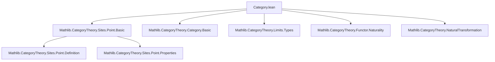

**Technical Brief: Category of Points of a Site (Lean 4 Formalization)**  
*Based on `Category.lean` from the Mathlib repository (author: Joël Riou)*

---

### 1. KEY DEFINITIONS & THEOREMS

| Name | Type / Structure | Purpose |
|------|------------------|---------|
| `Hom` | `structure` | Defines morphisms between points of a site: a morphism `Φ₁ ⟶ Φ₂` is a natural transformation `Φ₂.fiber ⟶ Φ₁.fiber` (contravariant in the fiber functors). |
| `Category (Point.{w} J)` | `instance` | Equips the class of points of a Grothendieck topology `J` on `C` with a category structure using `Hom` as morphisms. |
| `hom_ext` | `lemma` | Extensionality: two point morphisms are equal if their underlying natural transformations on fibers are equal. |
| `id_hom`, `comp_hom` | `@[simp] lemma` | Verifies identity and composition laws for the induced category structure on points. |
| `presheafFiber` | `noncomputable def` | For a presheaf category `A`, induces a natural transformation `Φ₂.presheafFiber ⟶ Φ₁.presheafFiber` from a point morphism `f : Φ₁ ⟶ Φ₂`. |
| `presheafFiber_id`, `presheafFiber_comp` | `@[simp, reassoc] lemma` | Ensures `presheafFiber` is functorial: respects identities and composition. |
| `sheafFiber` | `abbrev` | Induced natural transformation on sheaf fibers: `Φ₂.sheafFiber ⟶ Φ₁.sheafFiber`, defined via whiskering with the presheaf version. |
| `sheafFiber_id`, `sheafFiber_comp` | `@[simp, reassoc] lemma` | Functoriality of `sheafFiber`. |

---

### 2. NAMING CONVENTIONS

- **Prefixes**:
  - `hom_`: for projections from `Hom` structure (e.g., `Hom.hom f`).
  - `presheafFiber_`, `sheafFiber_`: for constructions and properties related to induced transformations on fibers.
- **Suffixes**:
  - `_id`, `_comp`: for identity and composition laws.
  - `_ext`: for extensionality lemmas.
- **Notation**:
  - `f.hom` for the underlying natural transformation.
  - `Φ.fiber`, `Φ.presheafFiber`, `Φ.sheafFiber` for fiber functors associated to a point `Φ`.

---

### 3. TACTIC STACK

- `cat_disch`: Used repeatedly in `@[simp]` proofs to discharge category-theoretic identities (likely a custom tactic for diagram chasing in `CategoryTheory`).
- `rfl`: For definitional equalities (e.g., `id_hom`, `comp_hom`).
- `ext`: Implicitly via `@[ext]` attribute on `Hom` and `hom_ext`.
- `simp_rw` / `simp`: Used in `@[simp]` lemmas (e.g., `presheafFiber_id`, `sheafFiber_comp`).
- `noncomputable def`: Indicates reliance on choice or classical logic (e.g., for sheafification or colimit constructions).

---

### 4. PROOF LOGIC

- **Structure**: The development follows a standard categorical pattern:
  1. Define morphisms (`Hom`) between objects (points).
  2. Prove category axioms via `id`/`comp` definitions and `hom_ext`.
  3. Construct induced transformations on presheaf/sheaf fibers.
  4. Prove functoriality (identity & composition) using `cat_disch`, often aided by `@[simps]` and `@[reassoc]`.
- **Key reasoning**:
  - **Contravariance**: Morphisms of points go *opposite* to fiber maps (`Φ₂.fiber → Φ₁.fiber`), reflecting the contravariance of geometric morphisms.
  - **Whiskering**: `sheafFiber` is defined via `Functor.whiskerLeft`, leveraging existing presheaf constructions.
  - ** naturality**: `presheafFiber` uses `presheafFiberDesc`, which encodes universal property of presheaf fiber as a limit/colimit.

---

### 5. IMPORTS & DEPENDENCIES

- **Core imports**:
  ```lean
  Mathlib.CategoryTheory.Sites.Point.Basic
  ```
- **Implicit dependencies** (via `CategoryTheory`, `Limits`, `Opposite`):
  - `Mathlib.CategoryTheory.Category.Basic`
  - `Mathlib.CategoryTheory.Limits.Types`
  - `Mathlib.CategoryTheory.Functor.Basic`
  - `Mathlib.CategoryTheory.NaturalTransformation`
  - `Mathlib.CategoryTheory.Sites.Presheaf`
  - `Mathlib.CategoryTheory.Sites.Sheaf`
- **Universe polymorphism**: Uses `w v v' u u'` to handle size issues (e.g., `Point.{w} J`, `HasColimitsOfSize.{w, w} A`).

---

### 6. MERMAID DIAGRAMS

#### Dependency Graph (Module-Level)



#### Overview of Theory Flow

```mermaid
flowchart LR
  subgraph Setup
    C[Category C] --> J[Grothendieck Topology J]
    J --> P[Points of J: Point J]
  end

  subgraph Morphisms
    P -->|Hom Φ₁ Φ₂| N[Φ₂.fiber ⇒ Φ₁.fiber]
    N --> Cat[Category structure on Point J]
  end

  subgraph Fiber Functors
    P -->|Φ.presheafFiber| PF[Presheaf Category A]
    P -->|Φ.sheafFiber| SF[Sheaf Category A]
  end

  subgraph Induced Maps
    Hom f: Φ₁⇒Φ₂ -->|presheafFiber f| PF₂ ⇒ PF₁
    f -->|sheafFiber f| SF₂ ⇒ SF₁
  end

  Cat --> InducedMaps
  PF --> InducedMaps
  SF --> InducedMaps
```

---

### 7. REMARKS

- The definition aligns with **SGA 4 IV 3.2**, where morphisms of points are natural transformations between fiber functors *in the opposite direction* — this mirrors the contravariance of geometric morphisms in topos theory.
- The use of `noncomputable` for `presheafFiber` suggests reliance on classical choice or colimit existence (via `HasColimitsOfSize`).
- The `@[simps]` attribute on `presheafFiber` ensures automatic simplification of its components, crucial for usability in larger developments.

--- 

*End of Technical Brief.*
