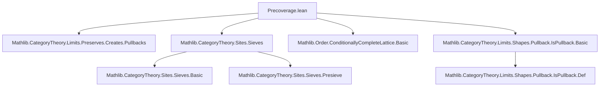
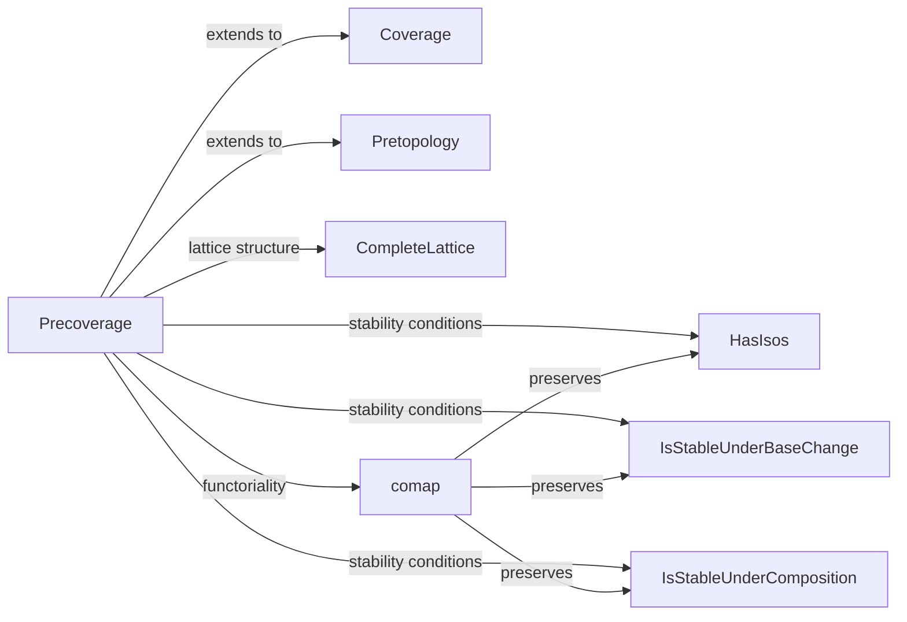

### Technical Brief: `Precoverage.lean`

---

#### **1. Key Definitions & Theorems**

| Name | Type / Class | Purpose |
|------|--------------|---------|
| `Precoverage C` | `structure` | Assigns to each object `X : C` a set of *covering presieves* (`Presieve X`). No axioms required. |
| `HasIsos J` | `class` | Ensures singleton presieves induced by isomorphisms are covering. |
| `IsStableUnderBaseChange J` | `class` | Pullbacks of covering presieves along any morphism are covering. |
| `IsStableUnderComposition J` | `class` | Indexed composition (refinement) of coverings yields a covering. |
| `IsStableUnderSup J` | `class` | Supremum (`⊔`) of two coverings is covering. |
| `HasPullbacks J` | `class` | Every covering presieve has pullbacks along any morphism. |
| `comap F J` | `def` | Pullback of a precoverage along a functor `F : C ⥤ D`. |
| `mem_coverings_of_isIso` | `lemma` | Instantiation of `HasIsos.mem_coverings_of_isIso`. |
| `mem_coverings_of_isPullback` | `lemma` | Instantiation of `IsStableUnderBaseChange.mem_coverings_of_isPullback`. |
| `comp_mem_coverings` | `lemma` | Instantiation of `IsStableUnderComposition.comp_mem_coverings`. |
| `sup_mem_coverings` | `lemma` | Instantiation of `IsStableUnderSup.sup_mem_coverings`. |
| `hasPullbacks_of_mem` | `lemma` | Instantiation of `HasPullbacks.hasPullbacks_of_mem`. |
| `pullbackArrows_mem` | `lemma` | If `R ∈ J Y` and `R` has pullbacks along `f : X → Y`, then `R.pullbackArrows f ∈ J X`. |
| `comap_inf`, `comap_id`, `comap_comp` | `lemma` | Functoriality of `comap` w.r.t. inf, identity, and composition. |
| `instance` for `CompleteLattice (Precoverage C)` | `instance` | Precoverages form a complete lattice under inclusion. |

---

#### **2. Naming Conventions**

- **Prefixes**:
  - `mem_...`: Lemmas showing membership in a covering presieve.
  - `has_...`: Classes asserting existence of certain pullbacks or isomorphisms.
  - `is_...`: Properties like `IsStableUnder...`.
  - `comap`: Pullback of a precoverage along a functor.

- **Suffixes**:
  - `_of_isIso`, `_of_isPullback`, `_of_mem`: Indicate the hypothesis used to derive membership.
  - `_ofArrows`: Refers to presieves generated by families of arrows (`Presieve.ofArrows`).

- **Structure fields**:
  - `coverings : ∀ X, Set (Presieve X)` — core data.

---

#### **3. Tactic Stack**

Frequent tactics used in proofs:

| Tactic | Usage |
|--------|-------|
| `convert_to` | Adjust goal to match a known structure (e.g., `Presieve.ofArrows`). |
| `refine` / `exact` | Construct proofs using existing lemmas or instances. |
| `le_antisymm` | Prove equality of presieves by double inclusion. |
| `cat_disch` | Discharge category-theoretic hypotheses (e.g., commutativity). |
| `simp` / `simp only` | Simplify using `@[simp]` lemmas (e.g., `Presieve.ofArrows.obj_idx`, `mem_comap_iff`). |
| `rw [← ...]` | Rewrite using presieve identities (e.g., `ofArrows_pullback`). |
| `obtain ⟨ι, Z, f, rfl⟩` | Eliminate existential quantifiers via `Presieve.exists_eq_ofArrows`. |
| `convert` | Match goals modulo definitional equality (e.g., indexing type adjustments). |

---

#### **4. Proof Logic**

- **Structure of proofs**:
  - **Indexing tricks**: Many proofs construct auxiliary indexing types (e.g., `Σ i, σ i`, `ι' ⊕ α`) to handle non-injective families of arrows.
  - **Double inclusion**: To prove presieve equality, show mutual inclusion via `le_antisymm`.
  - **Reduction to known lemmas**: Use `convert` + `refine` to reduce to `mem_coverings_of_*` lemmas.
  - **Functoriality**: Prove properties of `comap` by unfolding definitions and applying `simp` + `convert`.

- **Common pattern**:
  ```text
  1. Unfold definitions (e.g., `mem_comap_iff`, `Presieve.map_ofArrows`).
  2. Use `Presieve.exists_eq_ofArrows` to reduce to `ofArrows` form.
  3. Construct indexing families to match hypothesis of stability class.
  4. Apply stability lemma (e.g., `mem_coverings_of_isPullback`).
  5. Reconstruct original presieve via `le_antisymm`.
  ```

---

#### **5. Imports**

| Module | Purpose |
|--------|---------|
| `Mathlib.CategoryTheory.Limits.Preserves.Creates.Pullbacks` | For `CreatesLimitsOfShape`, used in `comap` instance. |
| `Mathlib.CategoryTheory.Sites.Sieves` | Defines `Presieve`, `Sieve`, and related operations. |
| `Mathlib.Order.ConditionallyCompleteLattice.Basic` | For lattice-theoretic constructions (e.g., `CompleteLattice`). |
| `Mathlib.CategoryTheory.Limits.Shapes.Pullback.IsPullback.Basic` | For `IsPullback`, used in stability under base change. |

---

#### **6. Mermaid Diagrams**

##### **Dependency Graph (Module-Level)**



##### **Overview of Theory Flow**



##### **Lattice Structure of Precoverages**

```mermaid
graph TD
  Precoverage -->|partial order| ≤
  Precoverage -->|infimum| ⊓
  Precoverage -->|supremum| ⊔
  Precoverage -->|sInf| ⨅
  Precoverage -->|sSup| ⨆
  Precoverage -->|top| ⊤
  Precoverage -->|bottom| ⊥
  Precoverage -->|complete lattice| CompleteLattice
```

---

#### **7. Summary**

This file formalizes the foundational theory of **precoverages** in category theory — a flexible notion of “covering families” without axiomatic constraints. It introduces:

- A **complete lattice** structure on precoverages.
- **Stability properties** (isomorphisms, base change, composition, suprema, pullbacks).
- **Functorial behavior** via `comap`, with proofs that stability properties are preserved under pullback along functors.
- Technical lemmas (`mem_coverings_of_*`) that enable reasoning about covering presieves generated by families of arrows.

It serves as the base for richer structures like **coverages** and **pretopologies**, defined in subsequent files.

--- 

Let me know if you'd like a formalization roadmap or a comparison with `Coverage`/`Pretopology`.
